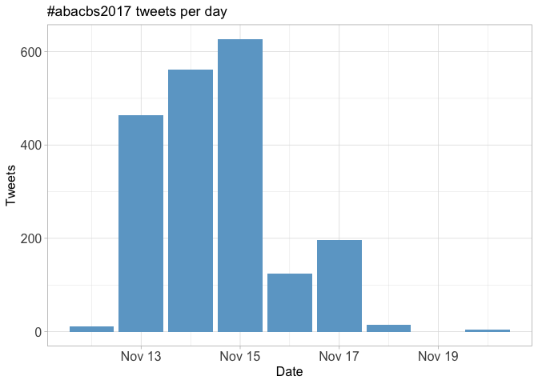
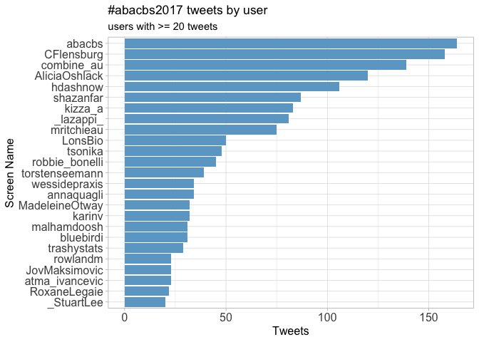
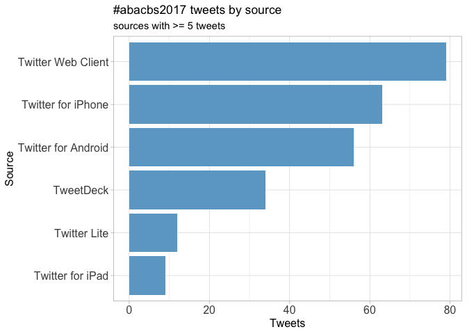
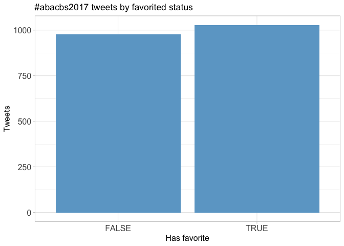
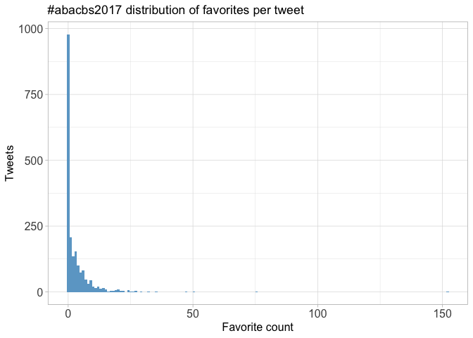
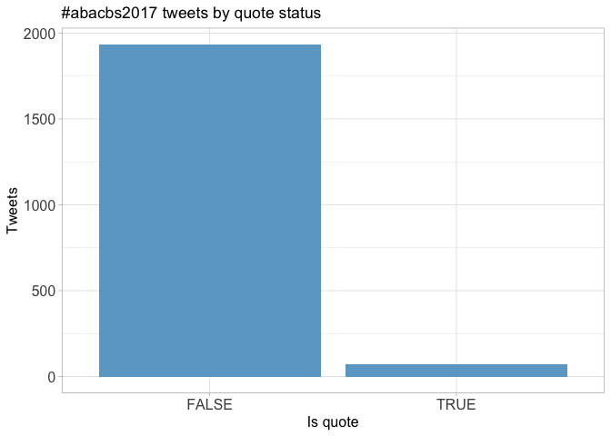
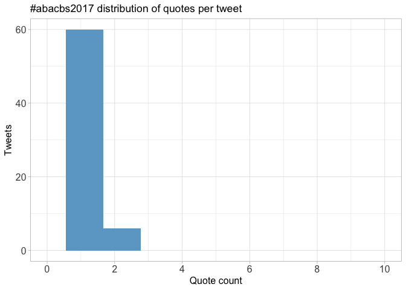
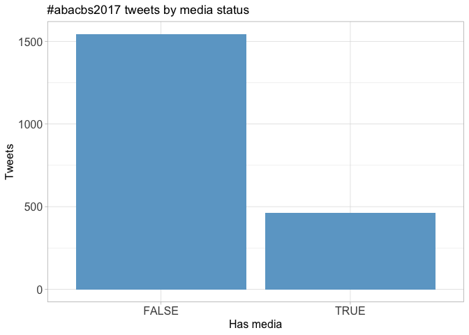
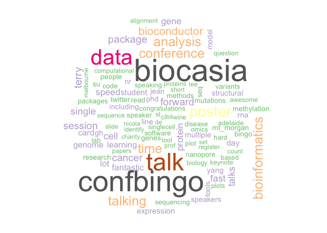
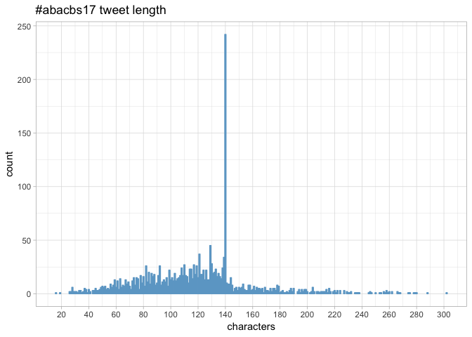

Twitter Coverage of the Australian Bioinformatics & Computational Biology Society Conference 2017
================
Neil Saunders
2018-03-15 17:22:50

-   [Introduction](#introduction)
-   [Timeline](#timeline)
    -   [Tweets by day](#tweets-by-day)
    -   [Tweets by day and time](#tweets-by-day-and-time)
-   [Users](#users)
    -   [Top tweeters](#top-tweeters)
    -   [Sources](#sources)
-   [Networks](#networks)
    -   [Replies](#replies)
    -   [Mentions](#mentions)
-   [Retweets](#retweets)
    -   [Retweet proportion](#retweet-proportion)
    -   [Retweet count](#retweet-count)
    -   [Top retweets](#top-retweets)
-   [Favourites](#favourites)
    -   [Favourite proportion](#favourite-proportion)
    -   [Favourite count](#favourite-count)
    -   [Top favourites](#top-favourites)
-   [Quotes](#quotes)
    -   [Quote proportion](#quote-proportion)
    -   [Quote count](#quote-count)
    -   [Top quotes](#top-quotes)
-   [Media](#media)
    -   [Media count](#media-count)
    -   [Top media](#top-media)
        -   [Most liked media image](#most-liked-media-image)
-   [Tweet text](#tweet-text)
    -   [Who has 280 characters?](#who-has-280-characters)

Introduction
============

An analysis of tweets from the ABACBS 2017 meeting. 2006 tweets were collected using the `rtweet` R package:

``` r
library(rtweet)
abacbs2017 <- search_tweets("#abacbs17 OR #combine17", 5000)
```

<table>
<thead>
<tr>
<th style="text-align:left;">
hashtag
</th>
<th style="text-align:right;">
count
</th>
</tr>
</thead>
<tbody>
<tr>
<td style="text-align:left;">
abacbs
</td>
<td style="text-align:right;">
1577
</td>
</tr>
<tr>
<td style="text-align:left;">
combine
</td>
<td style="text-align:right;">
262
</td>
</tr>
<tr>
<td style="text-align:left;">
abacbs + combine
</td>
<td style="text-align:right;">
167
</td>
</tr>
<tr>
<td style="text-align:left;">
neither
</td>
<td style="text-align:right;">
0
</td>
</tr>
</tbody>
</table>
For this analysis we retain all tweets and treat the ABACBS and COMBINE meetings as one event.

Timeline
========

Tweets by day
-------------



Tweets by day and time
----------------------

Filtered for dates November 13-17, Adelaide time. 

Users
=====

Top tweeters
------------



Sources
-------



Networks
========

Replies
-------

The "replies network", composed from users who reply directly to one another.

Better to view the original PNG file in the `data` directory.


Mentions
--------

The "mentions network", where users mention other users in their tweets.

Better to view the original PNG file in the `data` directory.


Retweets
========

Retweet proportion
------------------


Retweet count
-------------


Top retweets
------------

<table>
<thead>
<tr>
<th style="text-align:left;">
screen\_name
</th>
<th style="text-align:left;">
text
</th>
<th style="text-align:right;">
retweet\_count
</th>
</tr>
</thead>
<tbody>
<tr>
<td style="text-align:left;">
torstenseemann
</td>
<td style="text-align:left;">
High performance computing (HPC) works better when used in conjunction with a High Performance Bioinformatician (HPB). \#abacbs17 🖥️💻↔️👩👨
</td>
<td style="text-align:right;">
57
</td>
</tr>
<tr>
<td style="text-align:left;">
*lazappi*
</td>
<td style="text-align:left;">
Su-In Lee "Big data to personalised medicine with machine learning" \#abacbs17 \#sketchnotes <https://t.co/7v5DFP4yQ3>
</td>
<td style="text-align:right;">
22
</td>
</tr>
<tr>
<td style="text-align:left;">
abacbs
</td>
<td style="text-align:left;">
Terry Speed says he had no vision: "I'm a statistician, we do little things. Now when someone asks me, I say I want to cure cancer." \#abacbs17
</td>
<td style="text-align:right;">
18
</td>
</tr>
<tr>
<td style="text-align:left;">
*lazappi*
</td>
<td style="text-align:left;">
\#abacbs17 Opening keynote @HigginsDes "Everything you ever wanted to know about multiple alignment" \#sketchnotes <https://t.co/zdQlKKfqCa>
</td>
<td style="text-align:right;">
16
</td>
</tr>
<tr>
<td style="text-align:left;">
hdashnow
</td>
<td style="text-align:left;">
\#lornegenome 2018 will have a dedicated computational biology/bioinformatics session. Bioinformatics and comp bio abstracts from encouraged! Oral abstract deadline extended to Friday 24th Nov <https://t.co/gswSQVoTHk> \#COMBINE17 \#ABACBS17
</td>
<td style="text-align:right;">
15
</td>
</tr>
<tr>
<td style="text-align:left;">
atma\_ivancevic
</td>
<td style="text-align:left;">
You know it's a \#BioInformatics conference when every speaker lists their @biorxivpreprint and @github code \#openscience \#openaccess \#sharingiscaring \#abacbs17
</td>
<td style="text-align:right;">
12
</td>
</tr>
<tr>
<td style="text-align:left;">
shazanfar
</td>
<td style="text-align:left;">
Do you want to be more involved in the COMBINE @combine\_au community? Joining the exec team is a great way to improve your leadership skills, build your confidence and help the COMBINE student community! Nominate: <https://t.co/MvY0I1OIME> \#abacbs17 \#COMBINE17 @abacbs
</td>
<td style="text-align:right;">
11
</td>
</tr>
<tr>
<td style="text-align:left;">
milicang
</td>
<td style="text-align:left;">
Congratulations to @CSL travel award recipients @annaquagli , @\_StuartLee , @\_lazappi\_ and Virginie Perlo \#BioCAsia 2017 \#abacbs17 <https://t.co/10HXvlTkBB>
</td>
<td style="text-align:right;">
10
</td>
</tr>
<tr>
<td style="text-align:left;">
MelanieBahlo
</td>
<td style="text-align:left;">
Running conferences is a hard job, which takes guts &amp; persistence. We do not want people scared off doing this. It is a part of career progression. Thank you so much for a great conference: \#abacbs17 &amp; congratulations to David Lynn &amp; his team. I loved it.
</td>
<td style="text-align:right;">
9
</td>
</tr>
<tr>
<td style="text-align:left;">
KerryLevett
</td>
<td style="text-align:left;">
Look @andsdata \#FAIR Galaxy Training poster at \#ABACBS17 by @galaxyproject @MelBioInf <https://t.co/u9NLJ6smcd>
</td>
<td style="text-align:right;">
9
</td>
</tr>
</tbody>
</table>
Favourites
==========

Favourite proportion
--------------------



Favourite count
---------------



Top favourites
--------------

<table>
<thead>
<tr>
<th style="text-align:left;">
screen\_name
</th>
<th style="text-align:left;">
text
</th>
<th style="text-align:right;">
favorite\_count
</th>
</tr>
</thead>
<tbody>
<tr>
<td style="text-align:left;">
torstenseemann
</td>
<td style="text-align:left;">
High performance computing (HPC) works better when used in conjunction with a High Performance Bioinformatician (HPB). \#abacbs17 🖥️💻↔️👩👨
</td>
<td style="text-align:right;">
152
</td>
</tr>
<tr>
<td style="text-align:left;">
torstenseemann
</td>
<td style="text-align:left;">
Legend. \#abacbs17 <https://t.co/dbIfVnV6TQ>
</td>
<td style="text-align:right;">
76
</td>
</tr>
<tr>
<td style="text-align:left;">
MelanieBahlo
</td>
<td style="text-align:left;">
Running conferences is a hard job, which takes guts &amp; persistence. We do not want people scared off doing this. It is a part of career progression. Thank you so much for a great conference: \#abacbs17 &amp; congratulations to David Lynn &amp; his team. I loved it.
</td>
<td style="text-align:right;">
50
</td>
</tr>
<tr>
<td style="text-align:left;">
abacbs
</td>
<td style="text-align:left;">
Terry Speed says he had no vision: "I'm a statistician, we do little things. Now when someone asks me, I say I want to cure cancer." \#abacbs17
</td>
<td style="text-align:right;">
47
</td>
</tr>
<tr>
<td style="text-align:left;">
torstenseemann
</td>
<td style="text-align:left;">
I knew something was up when I saw Terry Speed wearing pants at \#abacbs17 ! Well deserved award 😁
</td>
<td style="text-align:right;">
47
</td>
</tr>
<tr>
<td style="text-align:left;">
atma\_ivancevic
</td>
<td style="text-align:left;">
You know it's a \#BioInformatics conference when every speaker lists their @biorxivpreprint and @github code \#openscience \#openaccess \#sharingiscaring \#abacbs17
</td>
<td style="text-align:right;">
35
</td>
</tr>
<tr>
<td style="text-align:left;">
*lazappi*
</td>
<td style="text-align:left;">
\#abacbs17 Opening keynote @HigginsDes "Everything you ever wanted to know about multiple alignment" \#sketchnotes <https://t.co/zdQlKKfqCa>
</td>
<td style="text-align:right;">
35
</td>
</tr>
<tr>
<td style="text-align:left;">
RLadiesAU
</td>
<td style="text-align:left;">
Our past first year, our vision, our speakers and sponsors in one infographic! Thanks to @annaquagli and to @robbie\_bonelli for designing it! Grab one at \#COMBINE17 or @abacbs and spread the word! <https://t.co/5xcY7gxMPs>
</td>
<td style="text-align:right;">
32
</td>
</tr>
<tr>
<td style="text-align:left;">
hdashnow
</td>
<td style="text-align:left;">
We're in Adelaide ready for \#COMBINE17 \#abacbs17! Is that @sahmriAU in the distance? <https://t.co/yQYMm4P249>
</td>
<td style="text-align:right;">
32
</td>
</tr>
<tr>
<td style="text-align:left;">
LonsBio
</td>
<td style="text-align:left;">
Awwwww yeah! \#ABACBS17 <https://t.co/7uwXhTHlIc>
</td>
<td style="text-align:right;">
29
</td>
</tr>
</tbody>
</table>
Quotes
======

Quote proportion
----------------



Quote count
-----------



Top quotes
----------

<table>
<thead>
<tr>
<th style="text-align:left;">
screen\_name
</th>
<th style="text-align:left;">
text
</th>
<th style="text-align:right;">
quote\_count
</th>
</tr>
</thead>
<tbody>
<tr>
<td style="text-align:left;">
robbie\_bonelli
</td>
<td style="text-align:left;">
Don't miss out on @RLadiesAU here at \#COMBINE17 \#abacbs17! Grab a pamphlet or simply talk to us! :D <https://t.co/PddTGsmDRB>
</td>
<td style="text-align:right;">
2
</td>
</tr>
<tr>
<td style="text-align:left;">
combine\_au
</td>
<td style="text-align:left;">
It's great to have @RLadiesAU and @RLadiesAdelaide representing at \#COMBINE17 and \#abacbs17 this week! \#rstats <https://t.co/kBsHrWTHkB>
</td>
<td style="text-align:right;">
2
</td>
</tr>
<tr>
<td style="text-align:left;">
AliciaOshlack
</td>
<td style="text-align:left;">
Obviously too easy! Before lunch on the first day. Keep going to get a full card everyone! \#confbingo \#abacbs17 <https://t.co/2cqeH0ah6q>
</td>
<td style="text-align:right;">
2
</td>
</tr>
<tr>
<td style="text-align:left;">
LonsBio
</td>
<td style="text-align:left;">
Winning all the prizes! \#abacbs17 <https://t.co/GpibqMzHQC>
</td>
<td style="text-align:right;">
2
</td>
</tr>
<tr>
<td style="text-align:left;">
annaquagli
</td>
<td style="text-align:left;">
The second genetic eye disease treated so far \#abacbs17! Cousin of \#MacTel showcased by @robbie\_bonelli <https://t.co/coW9orShQw>
</td>
<td style="text-align:right;">
2
</td>
</tr>
<tr>
<td style="text-align:left;">
combine\_au
</td>
<td style="text-align:left;">
Yay more fantastic student talks! \#abacbs17 <https://t.co/fYFLcM57IP>
</td>
<td style="text-align:right;">
2
</td>
</tr>
<tr>
<td style="text-align:left;">
atma\_ivancevic
</td>
<td style="text-align:left;">
When your plots are so pretty they get more tweets than your science \#firstworldproblems \#dataviz \#abacbs17 <https://t.co/ueOi8sYKqu>
</td>
<td style="text-align:right;">
2
</td>
</tr>
<tr>
<td style="text-align:left;">
abacbs
</td>
<td style="text-align:left;">
Early \#christmas festivities at @sahmriAU \#abacbs17 <https://t.co/0cUhpTWVmg>
</td>
<td style="text-align:right;">
2
</td>
</tr>
<tr>
<td style="text-align:left;">
robbie\_bonelli
</td>
<td style="text-align:left;">
.@bluebirdi shows us how to give an awesome and engaging presentation even when preceded by Terry Speed! \#YouAlsoHadPrettyPictures! \#abacbs17 <https://t.co/5DREmTEe5o>
</td>
<td style="text-align:right;">
2
</td>
</tr>
<tr>
<td style="text-align:left;">
AliciaOshlack
</td>
<td style="text-align:left;">
And doing a great job! @bluebirdi \#abacbs17 <https://t.co/QtCSCqbsow>
</td>
<td style="text-align:right;">
2
</td>
</tr>
</tbody>
</table>
Media
=====

Media count
-----------



Top media
---------

<table>
<thead>
<tr>
<th style="text-align:left;">
screen\_name
</th>
<th style="text-align:left;">
text
</th>
<th style="text-align:right;">
favorite\_count
</th>
</tr>
</thead>
<tbody>
<tr>
<td style="text-align:left;">
torstenseemann
</td>
<td style="text-align:left;">
Legend. \#abacbs17 <https://t.co/dbIfVnV6TQ>
</td>
<td style="text-align:right;">
76
</td>
</tr>
<tr>
<td style="text-align:left;">
*lazappi*
</td>
<td style="text-align:left;">
\#abacbs17 Opening keynote @HigginsDes "Everything you ever wanted to know about multiple alignment" \#sketchnotes <https://t.co/zdQlKKfqCa>
</td>
<td style="text-align:right;">
35
</td>
</tr>
<tr>
<td style="text-align:left;">
RLadiesAU
</td>
<td style="text-align:left;">
Our past first year, our vision, our speakers and sponsors in one infographic! Thanks to @annaquagli and to @robbie\_bonelli for designing it! Grab one at \#COMBINE17 or @abacbs and spread the word! <https://t.co/5xcY7gxMPs>
</td>
<td style="text-align:right;">
32
</td>
</tr>
<tr>
<td style="text-align:left;">
hdashnow
</td>
<td style="text-align:left;">
We're in Adelaide ready for \#COMBINE17 \#abacbs17! Is that @sahmriAU in the distance? <https://t.co/yQYMm4P249>
</td>
<td style="text-align:right;">
32
</td>
</tr>
<tr>
<td style="text-align:left;">
LonsBio
</td>
<td style="text-align:left;">
Awwwww yeah! \#ABACBS17 <https://t.co/7uwXhTHlIc>
</td>
<td style="text-align:right;">
29
</td>
</tr>
<tr>
<td style="text-align:left;">
*lazappi*
</td>
<td style="text-align:left;">
Su-In Lee "Big data to personalised medicine with machine learning" \#abacbs17 \#sketchnotes <https://t.co/7v5DFP4yQ3>
</td>
<td style="text-align:right;">
29
</td>
</tr>
<tr>
<td style="text-align:left;">
*lazappi*
</td>
<td style="text-align:left;">
.@AliciaOshlack presenting on the behalf of @nadia\_davidson who can't be here sure to being part of the @MCRI\_for\_kids Bioinformatics baby boom \#abacbs17 <https://t.co/mSlzXAjX5n>
</td>
<td style="text-align:right;">
27
</td>
</tr>
<tr>
<td style="text-align:left;">
torstenseemann
</td>
<td style="text-align:left;">
Genomic Tetris is a game that needs to be written \#abacbs17 @jaredtsimpson @sjackman @ianholmes ? <https://t.co/jRaLtLpk3A>
</td>
<td style="text-align:right;">
27
</td>
</tr>
<tr>
<td style="text-align:left;">
trashystats
</td>
<td style="text-align:left;">
Come see me at my poster \#abacbs17 <https://t.co/OVbeOqWZDv>
</td>
<td style="text-align:right;">
27
</td>
</tr>
<tr>
<td style="text-align:left;">
torstenseemann
</td>
<td style="text-align:left;">
Now @hdashnow speaking on pathogenic short tandem repeat expansions in humans and her STRretch software \#COMBINE17 @AliciaOshlack <https://t.co/raW4r4ZCGS>
</td>
<td style="text-align:right;">
27
</td>
</tr>
</tbody>
</table>
### Most liked media image


Tweet text
==========

The 100 words used 3 or more times.



Who has 280 characters?
-----------------------


