# Introduction
An analysis of tweets from the ABACBS 2017 meeting. 2032 tweets were collected using the `rtweet` R package:


```r
library(rtweet)
abacbs2017 <- search_tweets("#abacbs17 OR #combine17", 5000)
```

Rather confusingly, some of the tweets have neither *abacbs* or *combine* in their hashtags, but do appear to originate from the meeting.

<table>
 <thead>
  <tr>
   <th style="text-align:left;"> hashtag </th>
   <th style="text-align:right;"> count </th>
  </tr>
 </thead>
<tbody>
  <tr>
   <td style="text-align:left;"> abacbs </td>
   <td style="text-align:right;"> 1362 </td>
  </tr>
  <tr>
   <td style="text-align:left;"> combine </td>
   <td style="text-align:right;"> 250 </td>
  </tr>
  <tr>
   <td style="text-align:left;"> abacbs + combine </td>
   <td style="text-align:right;"> 146 </td>
  </tr>
  <tr>
   <td style="text-align:left;"> neither </td>
   <td style="text-align:right;"> 274 </td>
  </tr>
</tbody>
</table>

For this analysis we retain all tweets and treat the ABACBS and COMBINE meetings as one event.

# Timeline
## Tweets by day
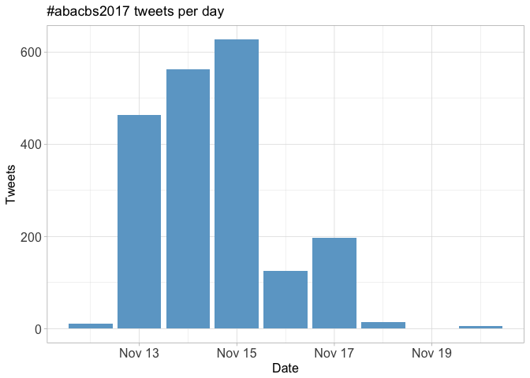<!-- -->

## Tweets by day and time
Filtered for dates November 13-17, Adelaide time.
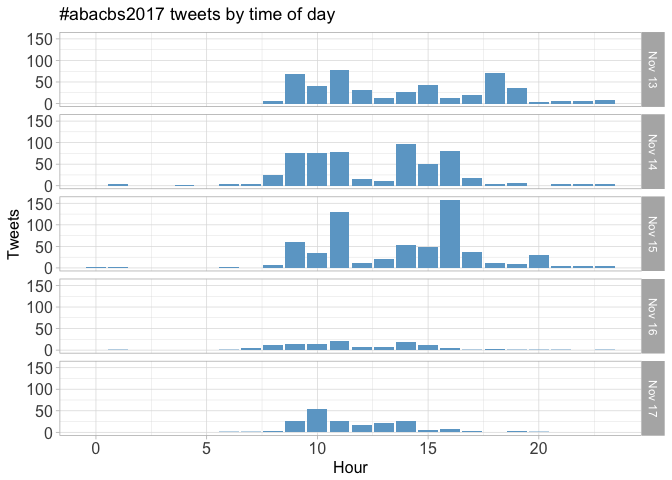<!-- -->

# Users
## Top tweeters
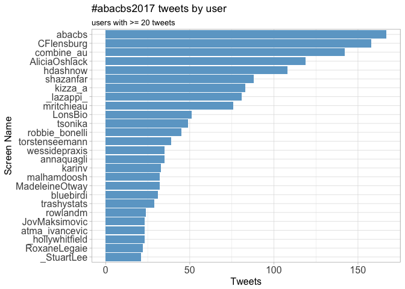<!-- -->

## Sources
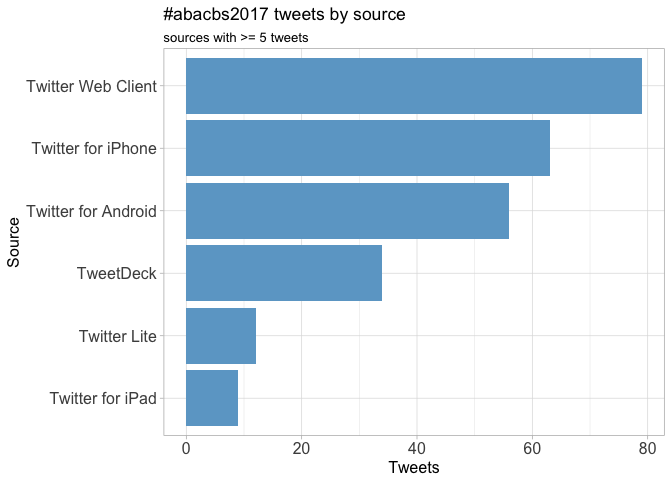<!-- -->

# Networks
## Replies
The "replies network", composed from users who reply directly to one another.

Better to view the original PNG file in the `data` directory.


## Mentions
The "mentions network", where users mention other users in their tweets.

Better to view the original PNG file in the `data` directory.


# Retweets
## Retweet proportion
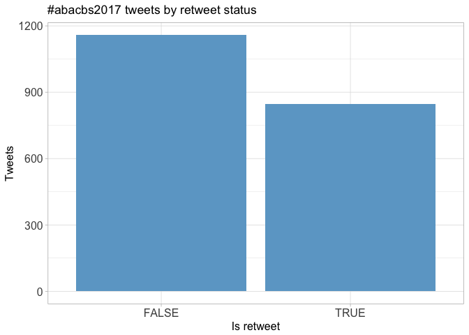<!-- -->

## Retweet count
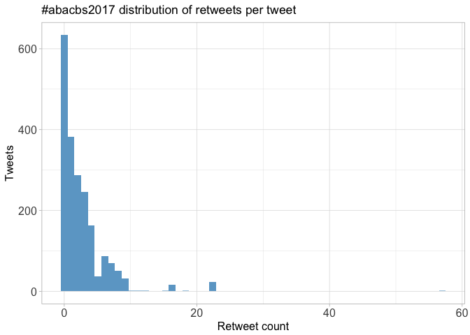<!-- -->

## Top retweets
<table>
 <thead>
  <tr>
   <th style="text-align:left;"> screen_name </th>
   <th style="text-align:left;"> text </th>
   <th style="text-align:right;"> retweet_count </th>
  </tr>
 </thead>
<tbody>
  <tr>
   <td style="text-align:left;"> torstenseemann </td>
   <td style="text-align:left;"> High performance computing (HPC) works better when used in conjunction with a High Performance Bioinformatician (HPB).  #abacbs17 🖥️💻↔️👩👨 </td>
   <td style="text-align:right;"> 57 </td>
  </tr>
  <tr>
   <td style="text-align:left;"> _lazappi_ </td>
   <td style="text-align:left;"> Su-In Lee &quot;Big data to personalised medicine with machine learning&quot; #abacbs17 #sketchnotes https://t.co/7v5DFP4yQ3 </td>
   <td style="text-align:right;"> 22 </td>
  </tr>
  <tr>
   <td style="text-align:left;"> abacbs </td>
   <td style="text-align:left;"> Terry Speed says he had no vision: &quot;I'm a statistician, we do little things. Now when someone asks me, I say I want… https://t.co/FinvXUjCec </td>
   <td style="text-align:right;"> 18 </td>
  </tr>
  <tr>
   <td style="text-align:left;"> _lazappi_ </td>
   <td style="text-align:left;"> #abacbs17 Opening keynote @HigginsDes &quot;Everything you ever wanted to know about multiple alignment&quot; #sketchnotes https://t.co/zdQlKKfqCa </td>
   <td style="text-align:right;"> 16 </td>
  </tr>
  <tr>
   <td style="text-align:left;"> hdashnow </td>
   <td style="text-align:left;"> #lornegenome 2018 will have a dedicated computational biology/bioinformatics session. Bioinformatics and comp bio a… https://t.co/aZSFec9zDr </td>
   <td style="text-align:right;"> 15 </td>
  </tr>
  <tr>
   <td style="text-align:left;"> atma_ivancevic </td>
   <td style="text-align:left;"> You know it's a #BioInformatics conference when every speaker lists their @biorxivpreprint and @github code… https://t.co/wE2FxPPCeo </td>
   <td style="text-align:right;"> 12 </td>
  </tr>
  <tr>
   <td style="text-align:left;"> shazanfar </td>
   <td style="text-align:left;"> Do you want to be more involved in the COMBINE @combine_au community? Joining the exec team is a great way to impro… https://t.co/xcbJEJeiPE </td>
   <td style="text-align:right;"> 11 </td>
  </tr>
  <tr>
   <td style="text-align:left;"> milicang </td>
   <td style="text-align:left;"> Congratulations to @CSL travel award recipients @annaquagli , @_StuartLee , @_lazappi_ and Virginie Perlo #BioCAsia… https://t.co/5pYJIRhB5A </td>
   <td style="text-align:right;"> 10 </td>
  </tr>
  <tr>
   <td style="text-align:left;"> MelanieBahlo </td>
   <td style="text-align:left;"> Running conferences is a hard job, which takes guts &amp;amp; persistence. We do not want people scared off doing this. It… https://t.co/90wLWafL5c </td>
   <td style="text-align:right;"> 9 </td>
  </tr>
  <tr>
   <td style="text-align:left;"> KerryLevett </td>
   <td style="text-align:left;"> Look @andsdata #FAIR Galaxy Training poster at #ABACBS17 by @galaxyproject @MelBioInf https://t.co/u9NLJ6smcd </td>
   <td style="text-align:right;"> 9 </td>
  </tr>
</tbody>
</table>

# Favourites
## Favourite proportion
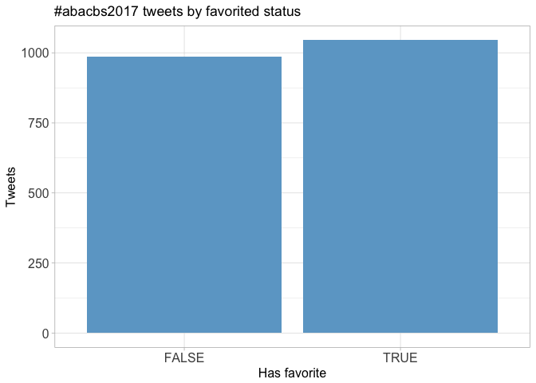<!-- -->

## Favourite count
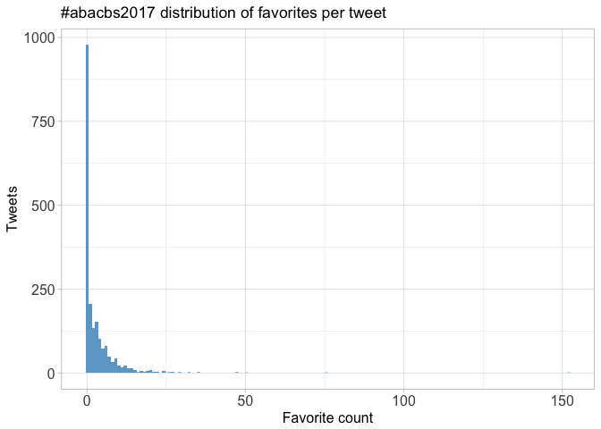<!-- -->

## Top favourites
<table>
 <thead>
  <tr>
   <th style="text-align:left;"> screen_name </th>
   <th style="text-align:left;"> text </th>
   <th style="text-align:right;"> favorite_count </th>
  </tr>
 </thead>
<tbody>
  <tr>
   <td style="text-align:left;"> torstenseemann </td>
   <td style="text-align:left;"> High performance computing (HPC) works better when used in conjunction with a High Performance Bioinformatician (HPB).  #abacbs17 🖥️💻↔️👩👨 </td>
   <td style="text-align:right;"> 152 </td>
  </tr>
  <tr>
   <td style="text-align:left;"> torstenseemann </td>
   <td style="text-align:left;"> Legend. #abacbs17 https://t.co/dbIfVnV6TQ </td>
   <td style="text-align:right;"> 76 </td>
  </tr>
  <tr>
   <td style="text-align:left;"> MelanieBahlo </td>
   <td style="text-align:left;"> Running conferences is a hard job, which takes guts &amp;amp; persistence. We do not want people scared off doing this. It… https://t.co/90wLWafL5c </td>
   <td style="text-align:right;"> 50 </td>
  </tr>
  <tr>
   <td style="text-align:left;"> abacbs </td>
   <td style="text-align:left;"> Terry Speed says he had no vision: &quot;I'm a statistician, we do little things. Now when someone asks me, I say I want… https://t.co/FinvXUjCec </td>
   <td style="text-align:right;"> 47 </td>
  </tr>
  <tr>
   <td style="text-align:left;"> torstenseemann </td>
   <td style="text-align:left;"> I knew something was up when I saw Terry Speed wearing pants at #abacbs17 ! Well deserved award 😁 </td>
   <td style="text-align:right;"> 47 </td>
  </tr>
  <tr>
   <td style="text-align:left;"> atma_ivancevic </td>
   <td style="text-align:left;"> You know it's a #BioInformatics conference when every speaker lists their @biorxivpreprint and @github code… https://t.co/wE2FxPPCeo </td>
   <td style="text-align:right;"> 35 </td>
  </tr>
  <tr>
   <td style="text-align:left;"> _lazappi_ </td>
   <td style="text-align:left;"> #abacbs17 Opening keynote @HigginsDes &quot;Everything you ever wanted to know about multiple alignment&quot; #sketchnotes https://t.co/zdQlKKfqCa </td>
   <td style="text-align:right;"> 35 </td>
  </tr>
  <tr>
   <td style="text-align:left;"> RLadiesAU </td>
   <td style="text-align:left;"> Our past first year, our vision, our speakers and sponsors in one infographic! Thanks to @annaquagli and to… https://t.co/oWYI8wiwbj </td>
   <td style="text-align:right;"> 32 </td>
  </tr>
  <tr>
   <td style="text-align:left;"> hdashnow </td>
   <td style="text-align:left;"> We're in Adelaide ready for #COMBINE17 #abacbs17! Is that @sahmriAU in the distance? https://t.co/yQYMm4P249 </td>
   <td style="text-align:right;"> 32 </td>
  </tr>
  <tr>
   <td style="text-align:left;"> LonsBio </td>
   <td style="text-align:left;"> Awwwww yeah! #ABACBS17 https://t.co/7uwXhTHlIc </td>
   <td style="text-align:right;"> 29 </td>
  </tr>
</tbody>
</table>

# Quotes
## Quote proportion
<!-- -->

## Quote count
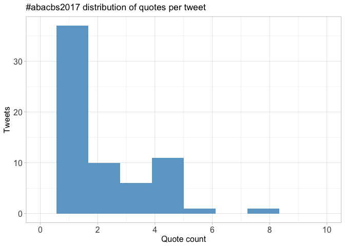<!-- -->

## Top quotes
<table>
 <thead>
  <tr>
   <th style="text-align:left;"> screen_name </th>
   <th style="text-align:left;"> text </th>
   <th style="text-align:right;"> quote_count </th>
  </tr>
 </thead>
<tbody>
  <tr>
   <td style="text-align:left;"> atma_ivancevic </td>
   <td style="text-align:left;"> @AliciaOshlack lab singlehandedly trying to close the gender gap in #bioinfo #binfiebaby #abacbs17 https://t.co/4gvwKfwtuh </td>
   <td style="text-align:right;"> 8 </td>
  </tr>
  <tr>
   <td style="text-align:left;"> hdashnow </td>
   <td style="text-align:left;"> .@nadia_davidson @JovMaksimovic @BelindaPhipson sorry you're not here at #ABACBS17 https://t.co/TBmSz5MO57 </td>
   <td style="text-align:right;"> 8 </td>
  </tr>
  <tr>
   <td style="text-align:left;"> GenomeConf </td>
   <td style="text-align:left;"> For all of you at #COMBINE17 #abacbs17 . We have more opportunities for comp biol and bioinf presentations this yea… https://t.co/Q7h9dEj9lA </td>
   <td style="text-align:right;"> 6 </td>
  </tr>
  <tr>
   <td style="text-align:left;"> robbie_bonelli </td>
   <td style="text-align:left;"> Don't miss out on @RLadiesAU here at #COMBINE17 #abacbs17! Grab a pamphlet or simply talk to us! :D https://t.co/PddTGsmDRB </td>
   <td style="text-align:right;"> 5 </td>
  </tr>
  <tr>
   <td style="text-align:left;"> combine_au </td>
   <td style="text-align:left;"> It's great to have @RLadiesAU and @RLadiesAdelaide representing at #COMBINE17 and #abacbs17 this week! #rstats https://t.co/kBsHrWTHkB </td>
   <td style="text-align:right;"> 5 </td>
  </tr>
  <tr>
   <td style="text-align:left;"> AylaLvL </td>
   <td style="text-align:left;"> &quot;At any point where you have a choice, choose the thing thats most interesting&quot; Career advice from Des Higgins… https://t.co/pdbGHvaB6y </td>
   <td style="text-align:right;"> 5 </td>
  </tr>
  <tr>
   <td style="text-align:left;"> _lazappi_ </td>
   <td style="text-align:left;"> Relevant to many at #abacbs17, more details about useR! 2018 in Brisbane https://t.co/pBlipof9tt </td>
   <td style="text-align:right;"> 5 </td>
  </tr>
  <tr>
   <td style="text-align:left;"> karinv </td>
   <td style="text-align:left;"> Coolest summary of one of my talks I've ever seem. Thanks @_lazappi_! #abacbs17 https://t.co/BCRpPRkbG6 </td>
   <td style="text-align:right;"> 5 </td>
  </tr>
  <tr>
   <td style="text-align:left;"> atma_ivancevic </td>
   <td style="text-align:left;"> When your plots are so pretty they get more tweets than your science #firstworldproblems #dataviz #abacbs17 https://t.co/ueOi8sYKqu </td>
   <td style="text-align:right;"> 5 </td>
  </tr>
  <tr>
   <td style="text-align:left;"> abacbs </td>
   <td style="text-align:left;"> Early #christmas festivities at @sahmriAU #abacbs17 https://t.co/0cUhpTWVmg </td>
   <td style="text-align:right;"> 5 </td>
  </tr>
</tbody>
</table>

# Media
## Media count
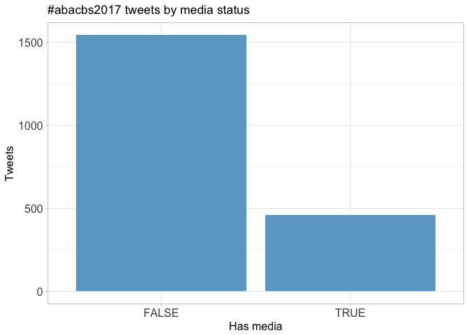<!-- -->

## Top media
<table>
 <thead>
  <tr>
   <th style="text-align:left;"> screen_name </th>
   <th style="text-align:left;"> text </th>
   <th style="text-align:right;"> favorite_count </th>
  </tr>
 </thead>
<tbody>
  <tr>
   <td style="text-align:left;"> torstenseemann </td>
   <td style="text-align:left;"> Legend. #abacbs17 https://t.co/dbIfVnV6TQ </td>
   <td style="text-align:right;"> 76 </td>
  </tr>
  <tr>
   <td style="text-align:left;"> _lazappi_ </td>
   <td style="text-align:left;"> #abacbs17 Opening keynote @HigginsDes &quot;Everything you ever wanted to know about multiple alignment&quot; #sketchnotes https://t.co/zdQlKKfqCa </td>
   <td style="text-align:right;"> 35 </td>
  </tr>
  <tr>
   <td style="text-align:left;"> hdashnow </td>
   <td style="text-align:left;"> We're in Adelaide ready for #COMBINE17 #abacbs17! Is that @sahmriAU in the distance? https://t.co/yQYMm4P249 </td>
   <td style="text-align:right;"> 32 </td>
  </tr>
  <tr>
   <td style="text-align:left;"> LonsBio </td>
   <td style="text-align:left;"> Awwwww yeah! #ABACBS17 https://t.co/7uwXhTHlIc </td>
   <td style="text-align:right;"> 29 </td>
  </tr>
  <tr>
   <td style="text-align:left;"> _lazappi_ </td>
   <td style="text-align:left;"> Su-In Lee &quot;Big data to personalised medicine with machine learning&quot; #abacbs17 #sketchnotes https://t.co/7v5DFP4yQ3 </td>
   <td style="text-align:right;"> 29 </td>
  </tr>
  <tr>
   <td style="text-align:left;"> torstenseemann </td>
   <td style="text-align:left;"> Genomic Tetris is a game that needs to be written #abacbs17 @jaredtsimpson @sjackman @ianholmes ? https://t.co/jRaLtLpk3A </td>
   <td style="text-align:right;"> 27 </td>
  </tr>
  <tr>
   <td style="text-align:left;"> trashystats </td>
   <td style="text-align:left;"> Come see me at my poster #abacbs17 https://t.co/OVbeOqWZDv </td>
   <td style="text-align:right;"> 27 </td>
  </tr>
  <tr>
   <td style="text-align:left;"> MonashBioinfo </td>
   <td style="text-align:left;"> We are off to #abacbs17 #COMBINE17 See you there! https://t.co/pkv4wA0BK3 </td>
   <td style="text-align:right;"> 25 </td>
  </tr>
  <tr>
   <td style="text-align:left;"> torstenseemann </td>
   <td style="text-align:left;"> Did you pass the @JosephPowell_UQ t-SNE Rorschach test? #abacbs17 #shark #dolphins https://t.co/3Ko7RdaRds </td>
   <td style="text-align:right;"> 24 </td>
  </tr>
  <tr>
   <td style="text-align:left;"> hdashnow </td>
   <td style="text-align:left;"> Ready for #confbingo! Got my card from https://t.co/xGKvICHstd
#COMBINE17 #abacbs17 https://t.co/VDje5oNj2C </td>
   <td style="text-align:right;"> 24 </td>
  </tr>
</tbody>
</table>

### Most liked media image


# Tweet text
The 100 words used 3 or more times.

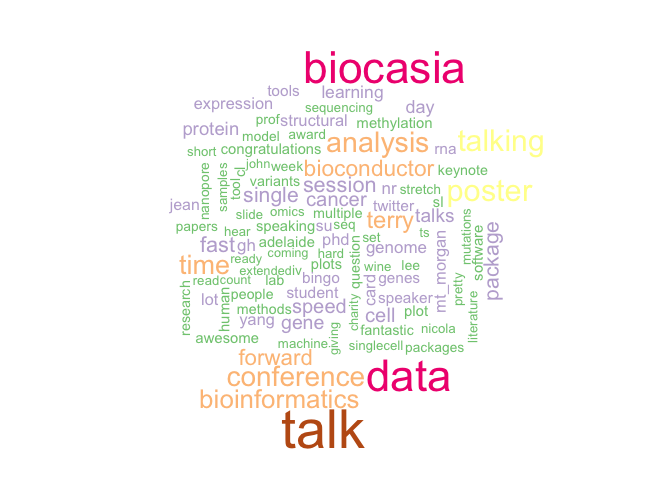<!-- -->

## Who has 280 characters?
<!-- -->
