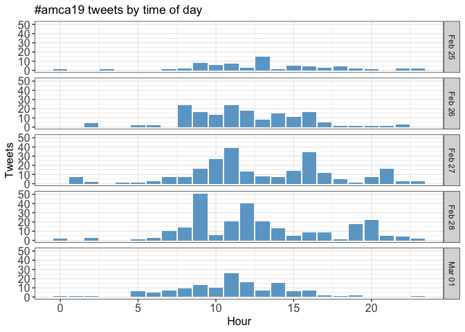
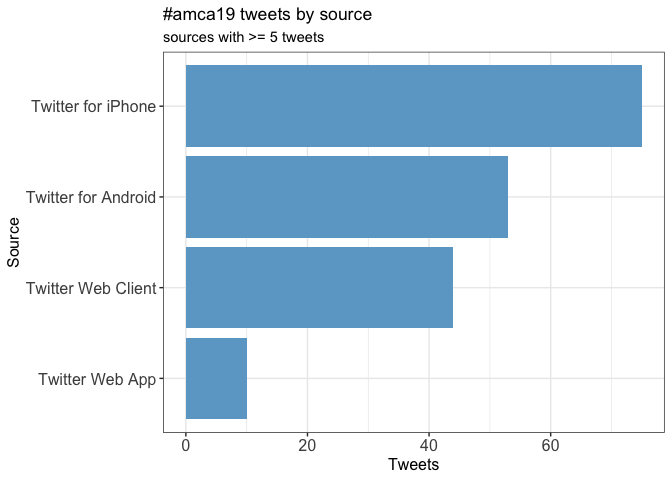
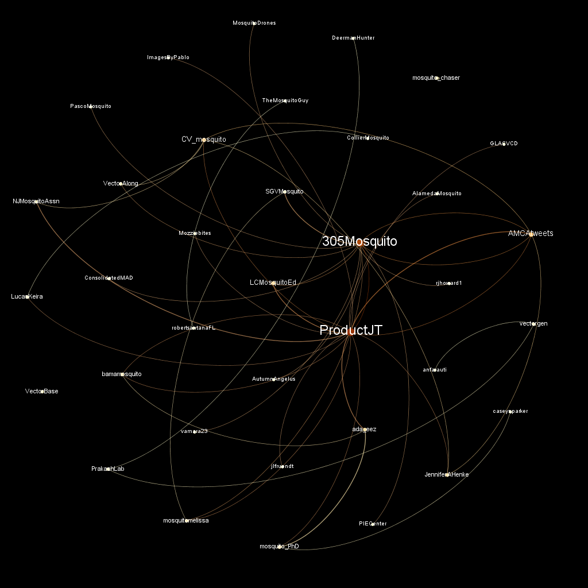
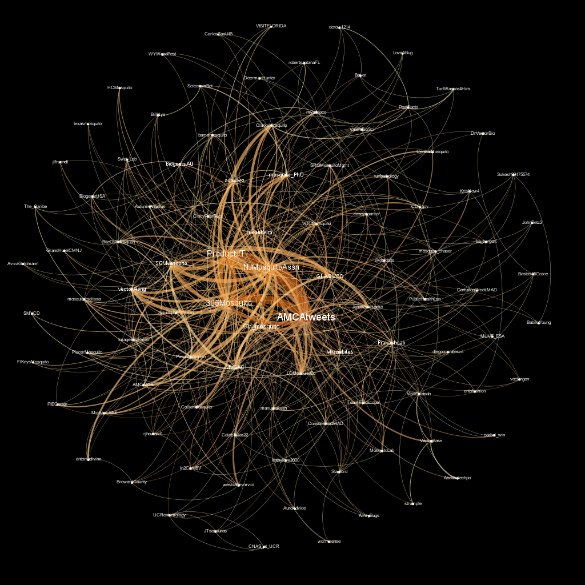
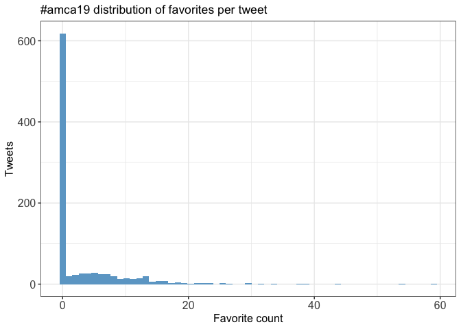
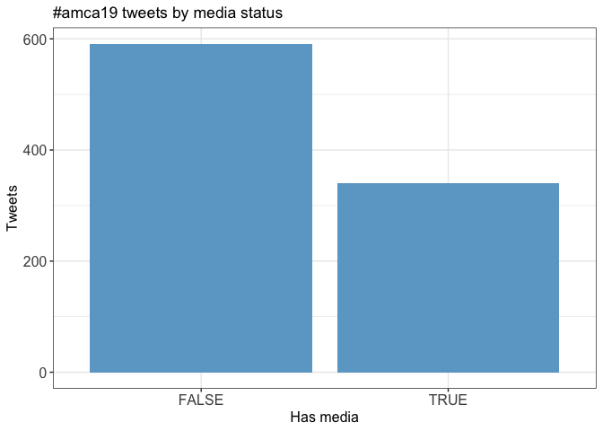

Twitter Coverage of \#amca19
================
Neil Saunders
2019-03-04 16:55:43

Introduction
============

An analysis of tweets containing \#amca19, \#amca2019.

932 tweets were collected using the `rtweet` R package.

Timeline
========

Tweets by day
-------------

Tweets by day and time
----------------------

Filtered for the days of the meeting: February 25 - March 1.

Users
=====

Top tweeters
------------

Sources
-------

Networks
========

Replies
-------

The "replies network", composed from users who reply directly to one another.

Better to view the original PNG file in the `data` directory.

Mentions
--------

The "mentions network", where users mention other users in their tweets.

Better to view the original PNG file in the `data` directory.

Retweets
========

Retweet proportion
------------------

Retweet count
-------------

Top retweets
------------

<table style="width:92%;">
<colgroup>
<col width="25%" />
<col width="45%" />
<col width="20%" />
</colgroup>
<thead>
<tr class="header">
<th align="left">screen_name</th>
<th align="left">text</th>
<th align="right">retweet_count</th>
</tr>
</thead>
<tbody>
<tr class="odd">
<td align="left">AMCAtweets</td>
<td align="left">Attendees visited #AMCA2019 Field Day to learn about the latest equipment and outreach tools in #MosquitoControl. Thank you to everyone for participating! <a href="https://t.co/7xVbSjZY1i" class="uri">https://t.co/7xVbSjZY1i</a></td>
<td align="right">9</td>
</tr>
<tr class="even">
<td align="left">CV_mosquito</td>
<td align="left">Blown away by a @Stanford Lab run by @manuprakash who has reached 650,000 people in 140 countries with the #foldscope - a microscope made of paper🔬 that costs under $2 for low resources community to be able to identify 🦟 larvae and microbes 🦠 whoa 😮 great talk at #AMCA2019 <a href="https://t.co/rBi0U03vNU" class="uri">https://t.co/rBi0U03vNU</a></td>
<td align="right">9</td>
</tr>
<tr class="odd">
<td align="left">305Mosquito</td>
<td align="left">Just learned about a great and inexpensive tool for research and #scienceeducation called @TeamFoldscope. HT @AMCAtweets @STEMDesignation @MDCPS @MDCPSSTEAM #AMCA2019 <a href="https://t.co/1f1M6JbZvI" class="uri">https://t.co/1f1M6JbZvI</a></td>
<td align="right">8</td>
</tr>
<tr class="even">
<td align="left">caseynparker</td>
<td align="left">I was recognized last night with the Hollandsworth prize at the #AMCA2019 annual meeting for my student competition talk. I am very thankful to @AMCAtweets, and also to my advisor, Dr. Connelly, who has been an incredible example of what strong #WomeninSTEM look like. #UFBugs <a href="https://t.co/zCXRa8Jf6I" class="uri">https://t.co/zCXRa8Jf6I</a></td>
<td align="right">8</td>
</tr>
<tr class="odd">
<td align="left">PublicHealthLan</td>
<td align="left">#BacktotheAedes #AMCA2019 <a href="https://t.co/PyBEdHRx2d" class="uri">https://t.co/PyBEdHRx2d</a></td>
<td align="right">8</td>
</tr>
<tr class="even">
<td align="left">SGVMosquito</td>
<td align="left">District Manager, Jared Dever, presenting on how to stress the importance of vector control to your audience at @AMCAtweets #AMCA2019 #SGVmosquito 🦟 <a href="https://t.co/ziOoTpjRxL" class="uri">https://t.co/ziOoTpjRxL</a></td>
<td align="right">7</td>
</tr>
<tr class="odd">
<td align="left">VDCImosquito</td>
<td align="left">#AMCA2019 #takeaway Mosquitoes can cycle through various levels of susceptibility, depending on whether they are host seeking or gravid. Using only one type of pre/post trapping may not tell the whole story. Presentation by Mark Clifton from @NorthShoreMAD @AMCAtweets</td>
<td align="right">7</td>
</tr>
<tr class="even">
<td align="left">305Mosquito</td>
<td align="left">Thanks to everyone who attended yesterday's #AMCA2019 #SocialMedia Symposium! For those interested in downloading a copy of our PIO @Michael_Mut's presentation, click <a href="https://t.co/acJRa2jdMf" class="uri">https://t.co/acJRa2jdMf</a>. Please RT! #publichealth #mosquitocontrol <a href="https://t.co/tzJi8qp787" class="uri">https://t.co/tzJi8qp787</a></td>
<td align="right">7</td>
</tr>
<tr class="odd">
<td align="left">NJMosquitoAssn</td>
<td align="left">With a great showing this week at #AMCA2019 we can add to our list #FollowFriday @CV_mosquito @GLACVCD @AMCAtweets @SGVMosquito @AutumnAngelus @MosquitoLab @GrandHotelCMNJ @HCMosquito @PascoMosquito @CentralMosquito @ProductJT @GLACVCD @texasmosquito retweet and add some more</td>
<td align="right">7</td>
</tr>
<tr class="even">
<td align="left">BiogentsUSA</td>
<td align="left">Today is 1st day of the annual American Mosquito Control Association (AMCA) meeting! Welcome to the #Biogents booth (n° 516), and learn about our latest developments! (We also have this cool activity book for kids.) #AMCA2019 #BGTrap #mosquitocontrol @AMCAtweets @The_Caribe <a href="https://t.co/2ykTGrj0BC" class="uri">https://t.co/2ykTGrj0BC</a></td>
<td align="right">7</td>
</tr>
</tbody>
</table>

Favourites
==========

Favourite proportion
--------------------

Favourite count
---------------

Top favourites
--------------

<table style="width:93%;">
<colgroup>
<col width="25%" />
<col width="45%" />
<col width="22%" />
</colgroup>
<thead>
<tr class="header">
<th align="left">screen_name</th>
<th align="left">text</th>
<th align="right">favorite_count</th>
</tr>
</thead>
<tbody>
<tr class="odd">
<td align="left">vectorgen</td>
<td align="left">They grow big in Florida #AMCA2019 <a href="https://t.co/qtMFdb0MRF" class="uri">https://t.co/qtMFdb0MRF</a></td>
<td align="right">59</td>
</tr>
<tr class="even">
<td align="left">caseynparker</td>
<td align="left">I was recognized last night with the Hollandsworth prize at the #AMCA2019 annual meeting for my student competition talk. I am very thankful to @AMCAtweets, and also to my advisor, Dr. Connelly, who has been an incredible example of what strong #WomeninSTEM look like. #UFBugs <a href="https://t.co/zCXRa8Jf6I" class="uri">https://t.co/zCXRa8Jf6I</a></td>
<td align="right">54</td>
</tr>
<tr class="odd">
<td align="left">skeetobite</td>
<td align="left">Mosquitoes in Florida are bigger than I remember. #AMCA2019 <a href="https://t.co/3Kikx5oWTe" class="uri">https://t.co/3Kikx5oWTe</a></td>
<td align="right">44</td>
</tr>
<tr class="even">
<td align="left">turfpathology</td>
<td align="left">Stop 2: 24 hrs at #AMCA2019 in Orlando moderating tomorrow’s Pollinator Protection symposium - You gotta control #mosquitos; there are plenty of effective ways to mitigate #pesticide exposure to #bees and other insects while you’re doing it <a href="https://t.co/j5RSVE6Cws" class="uri">https://t.co/j5RSVE6Cws</a></td>
<td align="right">39</td>
</tr>
<tr class="odd">
<td align="left">mosquito_PhD</td>
<td align="left">⁦@ada_eez⁩ is living it up with a swarm of mosquito 🦟 loving people #AMCA2019 #IWannaDanceWithVelma ⁦@myadapco⁩ ⁦@ValentBioSci⁩ <a href="https://t.co/OlwDFvvsFe" class="uri">https://t.co/OlwDFvvsFe</a></td>
<td align="right">38</td>
</tr>
<tr class="even">
<td align="left">mosquito_PhD</td>
<td align="left">Happy to be back amongst my all mosquito people, so of course I need a #mosquitoselfie to kick off my week at #AMCA2019 <a href="https://t.co/jygfebFKJ8" class="uri">https://t.co/jygfebFKJ8</a></td>
<td align="right">34</td>
</tr>
<tr class="odd">
<td align="left">BabiloYoung</td>
<td align="left">Made a new friend, but she’s not coming home with me. #AMCA2019 <a href="https://t.co/xNUcCrIdhn" class="uri">https://t.co/xNUcCrIdhn</a></td>
<td align="right">32</td>
</tr>
<tr class="even">
<td align="left">LucasKeira</td>
<td align="left">This #AMCA2019 #AMCA19 <a href="https://t.co/bPfcfscliy" class="uri">https://t.co/bPfcfscliy</a></td>
<td align="right">30</td>
</tr>
<tr class="odd">
<td align="left">mosquito_PhD</td>
<td align="left">Flying down to Orlando to attend my favorite mosquito 🦟 conference #AMCA2019 can’t wait to see all my friends, colleagues, and fellow #MosquitoTweeps <a href="https://t.co/TD8OOEHM7z" class="uri">https://t.co/TD8OOEHM7z</a></td>
<td align="right">29</td>
</tr>
<tr class="even">
<td align="left">PublicHealthLan</td>
<td align="left">#BacktotheAedes #AMCA2019 <a href="https://t.co/PyBEdHRx2d" class="uri">https://t.co/PyBEdHRx2d</a></td>
<td align="right">29</td>
</tr>
</tbody>
</table>

Quotes
======

Quote proportion
----------------

Quote count
-----------

Top quotes
----------

<table style="width:88%;">
<colgroup>
<col width="23%" />
<col width="45%" />
<col width="18%" />
</colgroup>
<thead>
<tr class="header">
<th align="left">screen_name</th>
<th align="left">text</th>
<th align="right">quote_count</th>
</tr>
</thead>
<tbody>
<tr class="odd">
<td align="left">Mozziebites</td>
<td align="left">Keep an eye on #AMCA2019 for plenty of news from the conference this week! I’m not there but will be keen to follow along from down here 🦟 <a href="https://t.co/qDIL7LxK1A" class="uri">https://t.co/qDIL7LxK1A</a></td>
<td align="right">2</td>
</tr>
<tr class="even">
<td align="left">ProductJT</td>
<td align="left">Whoop! On my way! #Chicago ➡️ #Orlando #AMCA2019 #publichealth #ချင်ကောင် #lamok #muskiet #umiyane #efon #مچکو #Mosquitoes <a href="https://t.co/c5Y0kOVGsy" class="uri">https://t.co/c5Y0kOVGsy</a></td>
<td align="right">2</td>
</tr>
<tr class="odd">
<td align="left">BiogentsUSA</td>
<td align="left">Innovative R&amp;D at Biogents: Our remote-controled mosquito traps that can count the catch (BG-Counter) are being made so smart they can be taught to identity species and sex. Check out our presentation at the American Mosquito Control Association meeting in Florida. #AMCA2019 <a href="https://t.co/zIbrnGLUjY" class="uri">https://t.co/zIbrnGLUjY</a></td>
<td align="right">2</td>
</tr>
<tr class="even">
<td align="left">medentorose</td>
<td align="left">Michael Weber's complete presentation on the BG-Counter and what is done to make it so smart that it can not only count mosquitoes, but also ID species and sex, as a thread. #AMCA2019 #sciencetwitter #mosquitoes #ArtificialIntelligence <a href="https://t.co/XZ8aXon8vT" class="uri">https://t.co/XZ8aXon8vT</a></td>
<td align="right">2</td>
</tr>
<tr class="odd">
<td align="left">NJMosquitoAssn</td>
<td align="left">Hey, we know @stormyfreese down there in the front row. Great work to all those involved #AMCA2019 @AMCAtweets @AMCAYPs <a href="https://t.co/X150qlIEIE" class="uri">https://t.co/X150qlIEIE</a></td>
<td align="right">2</td>
</tr>
<tr class="even">
<td align="left">LCMosquitoEd</td>
<td align="left">What an amazing event, we were happy to participate! #AMCA2019 #MosquitoEd #FightTheBite #LCMCD <a href="https://t.co/qMHA9nkpvV" class="uri">https://t.co/qMHA9nkpvV</a></td>
<td align="right">2</td>
</tr>
<tr class="odd">
<td align="left">ProductJT</td>
<td align="left">Ahhh! Get out of #Florida! You don’t belong here @ada_eez ! #AMCA2019 <a href="https://t.co/2gOY63cHKK" class="uri">https://t.co/2gOY63cHKK</a></td>
<td align="right">2</td>
</tr>
<tr class="even">
<td align="left">ada_eez</td>
<td align="left">Yasss Velma!!!! ❤️❤️❤️ #AMCA2019 <a href="https://t.co/hTEm2qvbr2" class="uri">https://t.co/hTEm2qvbr2</a></td>
<td align="right">2</td>
</tr>
</tbody>
</table>

Media
=====

Media count
-----------

Top media
---------

<table style="width:93%;">
<colgroup>
<col width="25%" />
<col width="45%" />
<col width="22%" />
</colgroup>
<thead>
<tr class="header">
<th align="left">screen_name</th>
<th align="left">text</th>
<th align="right">favorite_count</th>
</tr>
</thead>
<tbody>
<tr class="odd">
<td align="left">vectorgen</td>
<td align="left">They grow big in Florida #AMCA2019 <a href="https://t.co/qtMFdb0MRF" class="uri">https://t.co/qtMFdb0MRF</a></td>
<td align="right">59</td>
</tr>
<tr class="even">
<td align="left">caseynparker</td>
<td align="left">I was recognized last night with the Hollandsworth prize at the #AMCA2019 annual meeting for my student competition talk. I am very thankful to @AMCAtweets, and also to my advisor, Dr. Connelly, who has been an incredible example of what strong #WomeninSTEM look like. #UFBugs <a href="https://t.co/zCXRa8Jf6I" class="uri">https://t.co/zCXRa8Jf6I</a></td>
<td align="right">54</td>
</tr>
<tr class="odd">
<td align="left">skeetobite</td>
<td align="left">Mosquitoes in Florida are bigger than I remember. #AMCA2019 <a href="https://t.co/3Kikx5oWTe" class="uri">https://t.co/3Kikx5oWTe</a></td>
<td align="right">44</td>
</tr>
<tr class="even">
<td align="left">turfpathology</td>
<td align="left">Stop 2: 24 hrs at #AMCA2019 in Orlando moderating tomorrow’s Pollinator Protection symposium - You gotta control #mosquitos; there are plenty of effective ways to mitigate #pesticide exposure to #bees and other insects while you’re doing it <a href="https://t.co/j5RSVE6Cws" class="uri">https://t.co/j5RSVE6Cws</a></td>
<td align="right">39</td>
</tr>
<tr class="odd">
<td align="left">mosquito_PhD</td>
<td align="left">⁦@ada_eez⁩ is living it up with a swarm of mosquito 🦟 loving people #AMCA2019 #IWannaDanceWithVelma ⁦@myadapco⁩ ⁦@ValentBioSci⁩ <a href="https://t.co/OlwDFvvsFe" class="uri">https://t.co/OlwDFvvsFe</a></td>
<td align="right">38</td>
</tr>
<tr class="even">
<td align="left">mosquito_PhD</td>
<td align="left">Happy to be back amongst my all mosquito people, so of course I need a #mosquitoselfie to kick off my week at #AMCA2019 <a href="https://t.co/jygfebFKJ8" class="uri">https://t.co/jygfebFKJ8</a></td>
<td align="right">34</td>
</tr>
<tr class="odd">
<td align="left">BabiloYoung</td>
<td align="left">Made a new friend, but she’s not coming home with me. #AMCA2019 <a href="https://t.co/xNUcCrIdhn" class="uri">https://t.co/xNUcCrIdhn</a></td>
<td align="right">32</td>
</tr>
<tr class="even">
<td align="left">LucasKeira</td>
<td align="left">This #AMCA2019 #AMCA19 <a href="https://t.co/bPfcfscliy" class="uri">https://t.co/bPfcfscliy</a></td>
<td align="right">30</td>
</tr>
<tr class="odd">
<td align="left">mosquito_PhD</td>
<td align="left">Flying down to Orlando to attend my favorite mosquito 🦟 conference #AMCA2019 can’t wait to see all my friends, colleagues, and fellow #MosquitoTweeps <a href="https://t.co/TD8OOEHM7z" class="uri">https://t.co/TD8OOEHM7z</a></td>
<td align="right">29</td>
</tr>
<tr class="even">
<td align="left">PublicHealthLan</td>
<td align="left">#BacktotheAedes #AMCA2019 <a href="https://t.co/PyBEdHRx2d" class="uri">https://t.co/PyBEdHRx2d</a></td>
<td align="right">29</td>
</tr>
</tbody>
</table>

### Most liked media image

Tweet text
==========

The 100 words used 3 or more times.

