Twitter Coverage of the Bioinformatics Open Source Conference 2017
================
Neil Saunders
2018-07-16 22:40:09

Introduction
============

An analysis of tweets from the BOSC 2017 meeting. 3268 tweets were collected using the `rtweet` R package:

``` r
library(rtweet)
bosc17 <- search_tweets("#bosc2017", 5000)
```

Timeline
========

Tweets by day
-------------

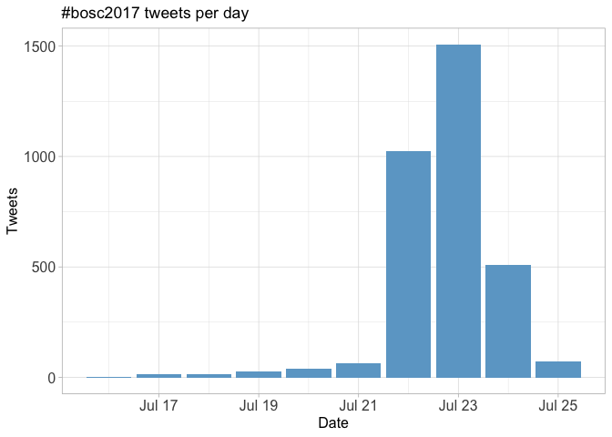

Tweets by day and time
----------------------

Filtered for dates July 21-24, Prague time. 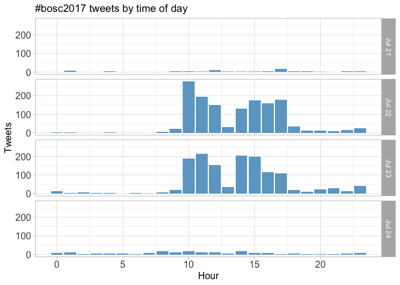

Users
=====

Top tweeters
------------

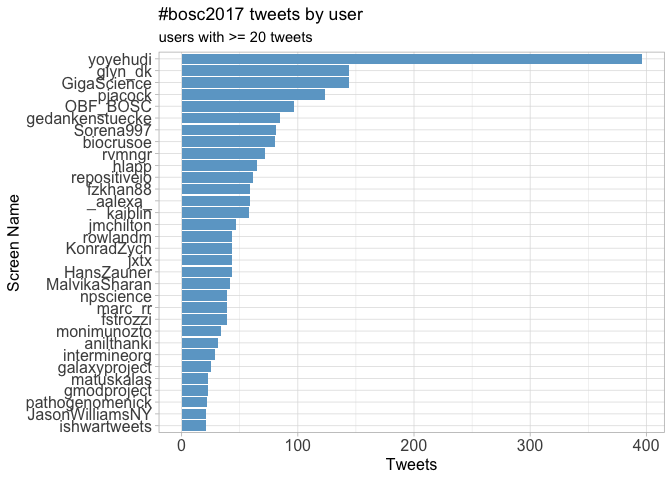

Sources
-------

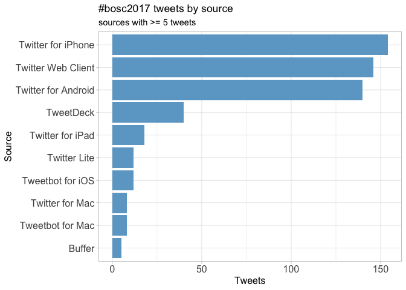

Networks
========

Replies
-------

The "replies network", composed from users who reply directly to one another.

Better to view the original PNG file in the `data` directory.

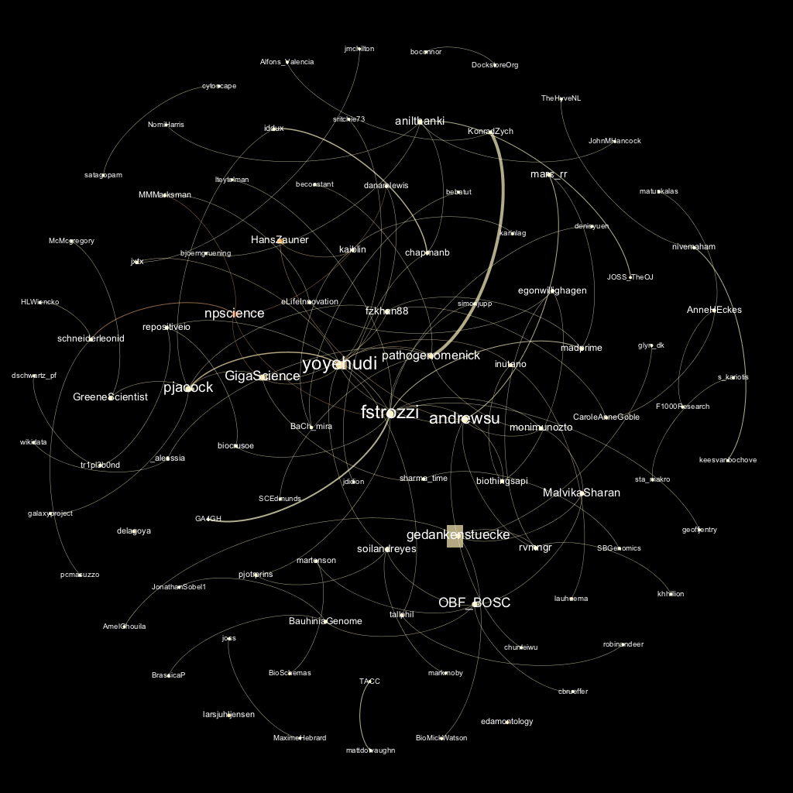

Mentions
--------

The "mentions network", where users mention other users in their tweets.

Better to view the original PNG file in the `data` directory.

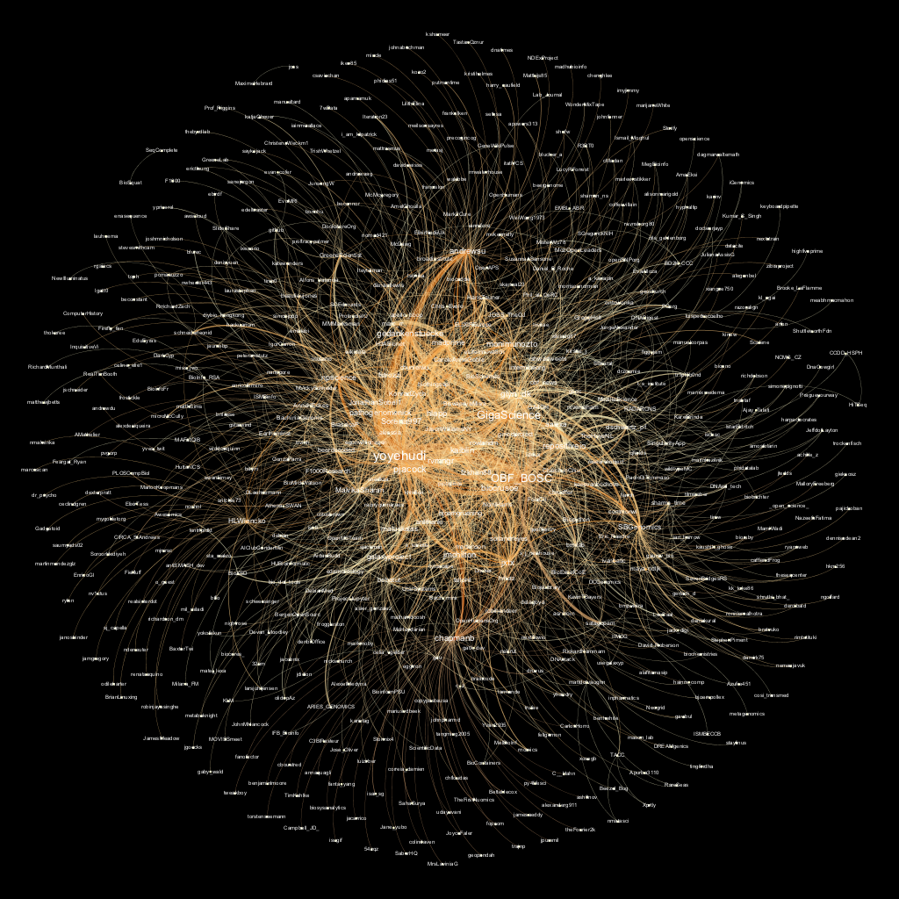

Retweets
========

Retweet proportion
------------------


Retweet count
-------------

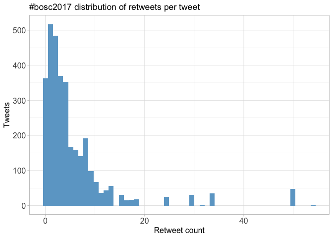

Top retweets
------------

<table style="width:92%;">
<colgroup>
<col width="25%" />
<col width="45%" />
<col width="20%" />
</colgroup>
<thead>
<tr class="header">
<th align="left">screen_name</th>
<th align="left">text</th>
<th align="right">retweet_count</th>
</tr>
</thead>
<tbody>
<tr class="odd">
<td align="left">pathogenomenick</td>
<td align="left">.<span class="citation">@tallphil</span> presenting MultiQC. Website is fantastic eg of how to present 21st c bioinformatics software:… <a href="https://t.co/y9oBxgCT5k" class="uri">https://t.co/y9oBxgCT5k</a></td>
<td align="right">54</td>
</tr>
<tr class="even">
<td align="left">chapmanb</td>
<td align="left">Bioinformatics Open Source Conference #bosc2017: notes from day 1 morning; workflows and practical interoperability <a href="https://t.co/JC7Fyo3xj8" class="uri">https://t.co/JC7Fyo3xj8</a></td>
<td align="right">50</td>
</tr>
<tr class="odd">
<td align="left">HLWiencko</td>
<td align="left">Well played. #BOSC2017 totally has wifi. <a href="https://t.co/C28TNNFS8k" class="uri">https://t.co/C28TNNFS8k</a></td>
<td align="right">34</td>
</tr>
<tr class="even">
<td align="left">andrewsu</td>
<td align="left">Posted slides for my afternoon talk at #ismbeccb #BOSC2017 on biomedical data integration using #wikidata… <a href="https://t.co/z3pp8ooIHO" class="uri">https://t.co/z3pp8ooIHO</a></td>
<td align="right">30</td>
</tr>
<tr class="odd">
<td align="left">chapmanb</td>
<td align="left">Bioinformatics Open Source Conference #BOSC2017: day 1 afternoon notes: reproducibility, visualization, open data <a href="https://t.co/rZV4jxWkmy" class="uri">https://t.co/rZV4jxWkmy</a></td>
<td align="right">24</td>
</tr>
<tr class="even">
<td align="left">monimunozto</td>
<td align="left">#BOSC2017 gets underway. This year's theme is #OpenData, inspiration for artwork by <span class="citation">@GreggHelt</span>.… <a href="https://t.co/MhtrDuvAiv" class="uri">https://t.co/MhtrDuvAiv</a></td>
<td align="right">18</td>
</tr>
<tr class="odd">
<td align="left">bebatut</td>
<td align="left">My slides about #usegalaxy training material at #BOSC2017 <a href="https://t.co/G0h3hWkuRz" class="uri">https://t.co/G0h3hWkuRz</a></td>
<td align="right">17</td>
</tr>
<tr class="even">
<td align="left">chapmanb</td>
<td align="left">Bioinformatics Open Source Conference #bosc2017 day 2 afternoon notes: community building, citizen science, LBLTs <a href="https://t.co/pJL9bw6JhN" class="uri">https://t.co/pJL9bw6JhN</a></td>
<td align="right">16</td>
</tr>
<tr class="odd">
<td align="left">OBF_BOSC</td>
<td align="left">#BOSC2017 #codefest is in full swing this morning. Thanks to the deeply awesome <span class="citation">@brmlab</span> for the space! <a href="https://t.co/GXvZH3qPt4" class="uri">https://t.co/GXvZH3qPt4</a></td>
<td align="right">15</td>
</tr>
<tr class="even">
<td align="left">OBF_BOSC</td>
<td align="left">OpenBio Codefest kicks off tomorrow! <a href="https://t.co/PrGJcWbuCp" class="uri">https://t.co/PrGJcWbuCp</a> #BOSC2017</td>
<td align="right">15</td>
</tr>
</tbody>
</table>

Favourites
==========

Favourite proportion
--------------------

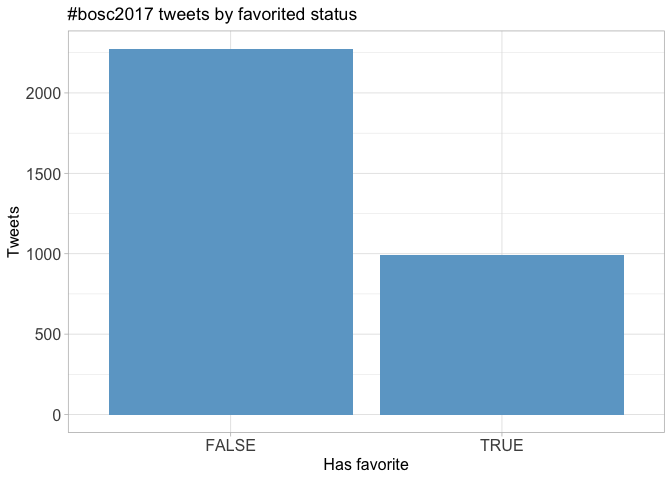

Favourite count
---------------

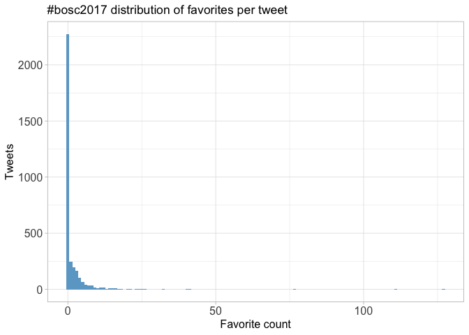

Top favourites
--------------

<table style="width:93%;">
<colgroup>
<col width="25%" />
<col width="45%" />
<col width="22%" />
</colgroup>
<thead>
<tr class="header">
<th align="left">screen_name</th>
<th align="left">text</th>
<th align="right">favorite_count</th>
</tr>
</thead>
<tbody>
<tr class="odd">
<td align="left">pathogenomenick</td>
<td align="left">.<span class="citation">@tallphil</span> presenting MultiQC. Website is fantastic eg of how to present 21st c bioinformatics software:… <a href="https://t.co/y9oBxgCT5k" class="uri">https://t.co/y9oBxgCT5k</a></td>
<td align="right">127</td>
</tr>
<tr class="even">
<td align="left">HLWiencko</td>
<td align="left">Well played. #BOSC2017 totally has wifi. <a href="https://t.co/C28TNNFS8k" class="uri">https://t.co/C28TNNFS8k</a></td>
<td align="right">111</td>
</tr>
<tr class="odd">
<td align="left">chapmanb</td>
<td align="left">Bioinformatics Open Source Conference #bosc2017: notes from day 1 morning; workflows and practical interoperability <a href="https://t.co/JC7Fyo3xj8" class="uri">https://t.co/JC7Fyo3xj8</a></td>
<td align="right">77</td>
</tr>
<tr class="even">
<td align="left">chapmanb</td>
<td align="left">Bioinformatics Open Source Conference #BOSC2017: day 1 afternoon notes: reproducibility, visualization, open data <a href="https://t.co/rZV4jxWkmy" class="uri">https://t.co/rZV4jxWkmy</a></td>
<td align="right">41</td>
</tr>
<tr class="odd">
<td align="left">andrewsu</td>
<td align="left">Posted slides for my afternoon talk at #ismbeccb #BOSC2017 on biomedical data integration using #wikidata… <a href="https://t.co/z3pp8ooIHO" class="uri">https://t.co/z3pp8ooIHO</a></td>
<td align="right">40</td>
</tr>
<tr class="even">
<td align="left">fstrozzi</td>
<td align="left">Bioinformatics finally moving from old &quot;here is my tool&quot; to &quot;here is my workflow let's see how you can run it&quot;. The Right Approach #BOSC2017</td>
<td align="right">32</td>
</tr>
<tr class="odd">
<td align="left">gedankenstuecke</td>
<td align="left">The crowd sourced talk title for <span class="citation">@pathogenomenick</span>: Talky McTalkface, thanks to <span class="citation">@kaiblin</span> #BOSC2017 <a href="https://t.co/mTSzesEKhh" class="uri">https://t.co/mTSzesEKhh</a></td>
<td align="right">26</td>
</tr>
<tr class="even">
<td align="left">monimunozto</td>
<td align="left">#BOSC2017 gets underway. This year's theme is #OpenData, inspiration for artwork by <span class="citation">@GreggHelt</span>.… <a href="https://t.co/MhtrDuvAiv" class="uri">https://t.co/MhtrDuvAiv</a></td>
<td align="right">25</td>
</tr>
<tr class="odd">
<td align="left">OBF_BOSC</td>
<td align="left">#BOSC2017 #codefest is in full swing this morning. Thanks to the deeply awesome <span class="citation">@brmlab</span> for the space! <a href="https://t.co/GXvZH3qPt4" class="uri">https://t.co/GXvZH3qPt4</a></td>
<td align="right">25</td>
</tr>
<tr class="even">
<td align="left">yoyehudi</td>
<td align="left">Common Workflow Language was a popular theme for CodeFest and will be talked about at <span class="citation">@OBF_BOSC</span> soon too! #bosc2017 #ismbeccb</td>
<td align="right">24</td>
</tr>
</tbody>
</table>

Quotes
======

Quote proportion
----------------

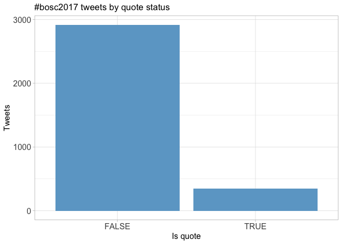

Quote count
-----------


Top quotes
----------

<table style="width:89%;">
<colgroup>
<col width="25%" />
<col width="45%" />
<col width="18%" />
</colgroup>
<thead>
<tr class="header">
<th align="left">screen_name</th>
<th align="left">text</th>
<th align="right">quote_count</th>
</tr>
</thead>
<tbody>
<tr class="odd">
<td align="left">gedankenstuecke</td>
<td align="left">If you want to have a look what I’m actually sharing: <a href="https://t.co/wSVBjB6hjv" class="uri">https://t.co/wSVBjB6hjv</a> &amp; <a href="https://t.co/6ZIpj013He" class="uri">https://t.co/6ZIpj013He</a> 😂 #BOSC2017 <a href="https://t.co/bGbXws1y84" class="uri">https://t.co/bGbXws1y84</a></td>
<td align="right">15</td>
</tr>
<tr class="even">
<td align="left">gedankenstuecke</td>
<td align="left">Please take my genome, my biological traits and my location data. But my Google Search History? 🤔 #BOSC2017 <a href="https://t.co/bGbXws1y84" class="uri">https://t.co/bGbXws1y84</a></td>
<td align="right">15</td>
</tr>
<tr class="odd">
<td align="left">jxtx</td>
<td align="left">Oh, we're doing this now? Okay, we are also hiring. Frontend, backend, analysts, etc. Talk to me, <span class="citation">@nekrut</span>,… <a href="https://t.co/2wcQW59uIu" class="uri">https://t.co/2wcQW59uIu</a></td>
<td align="right">12</td>
</tr>
<tr class="even">
<td align="left">kaiblin</td>
<td align="left">I wonder if I can list this in my impact statement... #BOSC2017 <a href="https://t.co/9A3Y64qjNq" class="uri">https://t.co/9A3Y64qjNq</a></td>
<td align="right">12</td>
</tr>
<tr class="odd">
<td align="left">t_s_institute</td>
<td align="left">#BOSC2017 final talk, Taylor Swift keynote from <span class="citation">@pathogenomenick</span> “Talky McTalkface” <a href="https://t.co/bt7y9fsezM" class="uri">https://t.co/bt7y9fsezM</a> <a href="https://t.co/QbkW7zD66b" class="uri">https://t.co/QbkW7zD66b</a></td>
<td align="right">12</td>
</tr>
<tr class="even">
<td align="left">pjacock</td>
<td align="left">#BOSC2017 final talk, open data keynote from <span class="citation">@pathogenomenick</span> “Talky McTalkface” <a href="https://t.co/KnC06pXr9Q" class="uri">https://t.co/KnC06pXr9Q</a> <a href="https://t.co/cvoHU5QaQr" class="uri">https://t.co/cvoHU5QaQr</a></td>
<td align="right">12</td>
</tr>
<tr class="odd">
<td align="left">npscience</td>
<td align="left">Are you fed up with submitting your bioinformatics research as a Word doc? Discuss the alternatives at #BOSC2017… <a href="https://t.co/8qFtft6aUR" class="uri">https://t.co/8qFtft6aUR</a></td>
<td align="right">10</td>
</tr>
<tr class="even">
<td align="left">andrewsu</td>
<td align="left">If you're interested in our work using #wikidata to integrate open biomedical data... #ismbeccb #BOSC2017 <a href="https://t.co/ivGeEpkk2l" class="uri">https://t.co/ivGeEpkk2l</a></td>
<td align="right">9</td>
</tr>
<tr class="odd">
<td align="left">npscience</td>
<td align="left">We've had an incredible discussion about diversity and inclusion at #BOSC2017 1/n <a href="https://t.co/190sdeFMBH" class="uri">https://t.co/190sdeFMBH</a></td>
<td align="right">9</td>
</tr>
<tr class="even">
<td align="left">OBF_BOSC</td>
<td align="left">#BOSC2017 <span class="citation">@asrmoin</span>’s code is at <a href="https://t.co/R86ViQTNHp" class="uri">https://t.co/R86ViQTNHp</a> “NGL – a molecular graphics library for the web” <a href="https://t.co/PI6Lt3abTf" class="uri">https://t.co/PI6Lt3abTf</a></td>
<td align="right">9</td>
</tr>
</tbody>
</table>

Media
=====

Media count
-----------

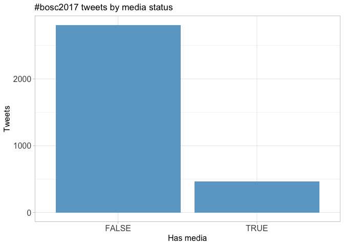

Top media
---------

<table style="width:93%;">
<colgroup>
<col width="25%" />
<col width="45%" />
<col width="22%" />
</colgroup>
<thead>
<tr class="header">
<th align="left">screen_name</th>
<th align="left">text</th>
<th align="right">favorite_count</th>
</tr>
</thead>
<tbody>
<tr class="odd">
<td align="left">HLWiencko</td>
<td align="left">Well played. #BOSC2017 totally has wifi. <a href="https://t.co/C28TNNFS8k" class="uri">https://t.co/C28TNNFS8k</a></td>
<td align="right">111</td>
</tr>
<tr class="even">
<td align="left">gedankenstuecke</td>
<td align="left">The crowd sourced talk title for <span class="citation">@pathogenomenick</span>: Talky McTalkface, thanks to <span class="citation">@kaiblin</span> #BOSC2017 <a href="https://t.co/mTSzesEKhh" class="uri">https://t.co/mTSzesEKhh</a></td>
<td align="right">26</td>
</tr>
<tr class="odd">
<td align="left">OBF_BOSC</td>
<td align="left">#BOSC2017 #codefest is in full swing this morning. Thanks to the deeply awesome <span class="citation">@brmlab</span> for the space! <a href="https://t.co/GXvZH3qPt4" class="uri">https://t.co/GXvZH3qPt4</a></td>
<td align="right">25</td>
</tr>
<tr class="even">
<td align="left">gedankenstuecke</td>
<td align="left">And we’re ready to present at #BOSC2017 😂 <a href="https://t.co/wx3uj8uNig" class="uri">https://t.co/wx3uj8uNig</a></td>
<td align="right">21</td>
</tr>
<tr class="odd">
<td align="left">monimunozto</td>
<td align="left">Alright <span class="citation">@JOSS_TheOJ</span>, you're on! I'm going to submit before #ismbeccb is over! #GiveMeThatBadge! #BOSC2017 <a href="https://t.co/qn51k5yu30" class="uri">https://t.co/qn51k5yu30</a></td>
<td align="right">20</td>
</tr>
<tr class="even">
<td align="left">npscience</td>
<td align="left">Seriously need some air con in here #BOSC2017 <a href="https://t.co/el4Pqv8vGw" class="uri">https://t.co/el4Pqv8vGw</a></td>
<td align="right">18</td>
</tr>
<tr class="odd">
<td align="left">OBF_BOSC</td>
<td align="left">Thank you again to <span class="citation">@brmlab</span> for hosting, and <span class="citation">@SBGenomics</span> &amp; <span class="citation">@repositiveio</span> for sponsoring the #BOSC2017 #CodeFest <a href="https://t.co/e5YkYZfSB6" class="uri">https://t.co/e5YkYZfSB6</a></td>
<td align="right">18</td>
</tr>
<tr class="even">
<td align="left">SCEdmunds</td>
<td align="left">Having his laptop open is <span class="citation">@pathogenomenick</span> going to tweet during the #BOSC2017 panel? <a href="https://t.co/tg9nM9qteO" class="uri">https://t.co/tg9nM9qteO</a></td>
<td align="right">17</td>
</tr>
<tr class="odd">
<td align="left">silviadg87</td>
<td align="left">#BOSC2017 <a href="https://t.co/SNPsJsXXuI" class="uri">https://t.co/SNPsJsXXuI</a></td>
<td align="right">16</td>
</tr>
<tr class="even">
<td align="left">gedankenstuecke</td>
<td align="left">Czech vegetarian food. #BOSC2017 <a href="https://t.co/TFCTJ35tC8" class="uri">https://t.co/TFCTJ35tC8</a></td>
<td align="right">16</td>
</tr>
</tbody>
</table>

### Most liked media image


Tweet text
==========

The 100 words used 3 or more times.

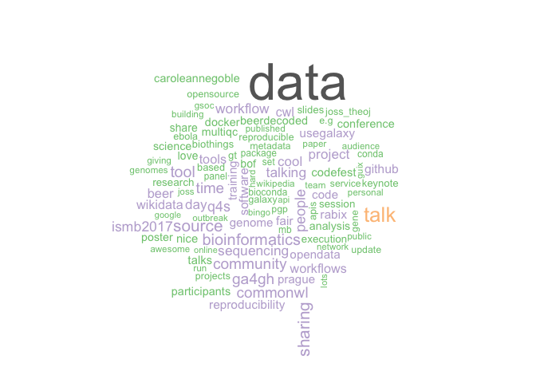
