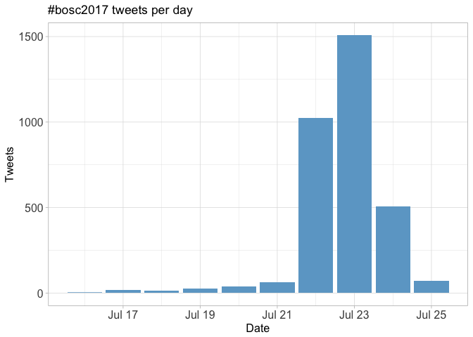
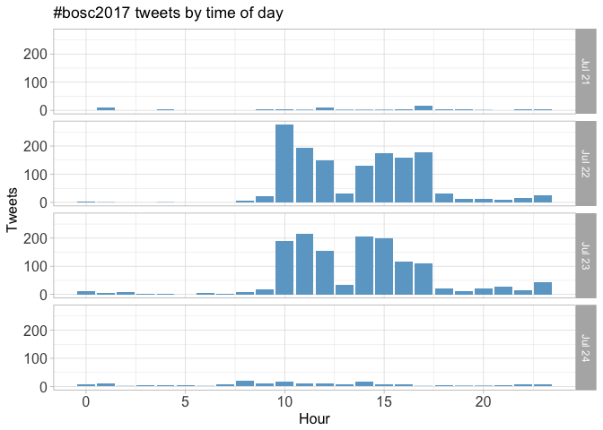
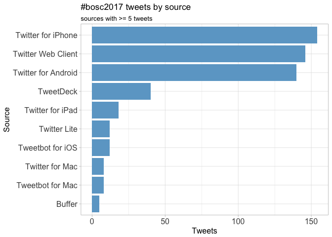
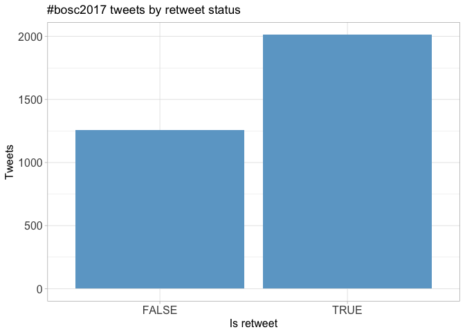
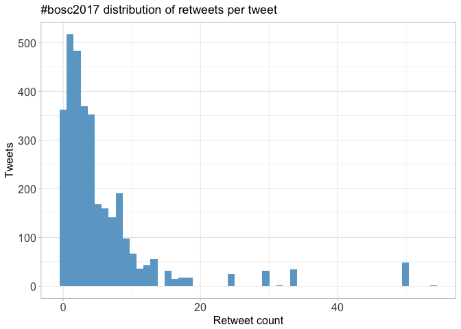
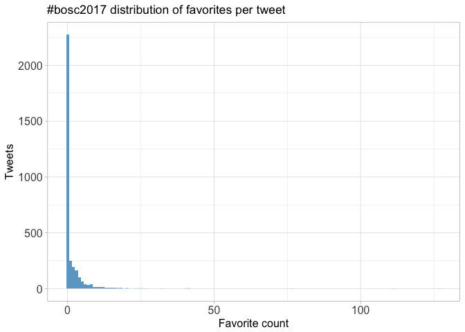
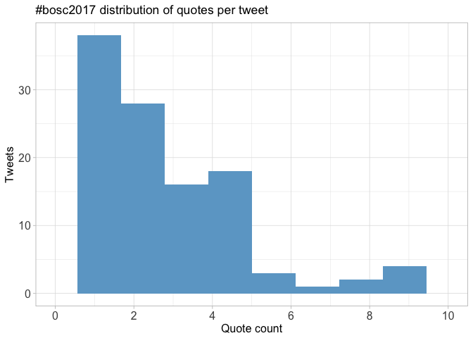
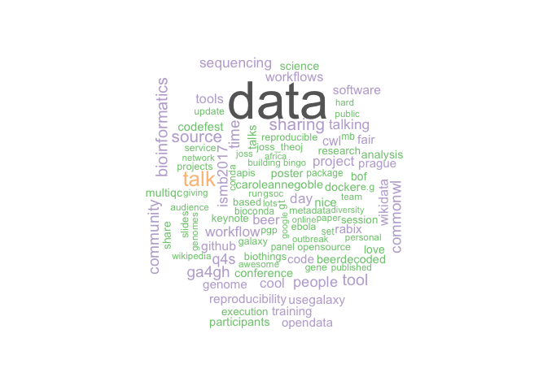

# Twitter Coverage of the Bioinformatics Open Source Conference 2017
Neil Saunders  
`r Sys.time()`  


# Introduction
An analysis of tweets from the BOSC 2017 meeting. 3268 tweets were collected using the `rtweet` R package:


```r
library(rtweet)
bosc17 <- search_tweets("#bosc2017", 5000)
```

# Timeline
## Tweets by day
<!-- -->

## Tweets by day and time
Filtered for dates July 21-24, Prague time.
<!-- -->

# Users
## Top tweeters
<!-- -->

## Sources
<!-- -->

# Networks
## Replies
The "replies network", composed from users who reply directly to one another.

Better to view the original PNG file in the `data` directory.


## Mentions
The "mentions network", where users mention other users in their tweets.

Better to view the original PNG file in the `data` directory.


# Retweets
## Retweet proportion
<!-- -->

## Retweet count
<!-- -->

## Top retweets
<table>
 <thead>
  <tr>
   <th style="text-align:left;"> screen_name </th>
   <th style="text-align:left;"> text </th>
   <th style="text-align:right;"> retweet_count </th>
  </tr>
 </thead>
<tbody>
  <tr>
   <td style="text-align:left;"> pathogenomenick </td>
   <td style="text-align:left;"> .@tallphil presenting MultiQC. Website is fantastic eg of how to present 21st c bioinformatics software:… https://t.co/y9oBxgCT5k </td>
   <td style="text-align:right;"> 54 </td>
  </tr>
  <tr>
   <td style="text-align:left;"> chapmanb </td>
   <td style="text-align:left;"> Bioinformatics Open Source Conference #bosc2017: notes from day 1 morning; workflows and practical interoperability https://t.co/JC7Fyo3xj8 </td>
   <td style="text-align:right;"> 50 </td>
  </tr>
  <tr>
   <td style="text-align:left;"> HLWiencko </td>
   <td style="text-align:left;"> Well played. #BOSC2017 totally has wifi. https://t.co/C28TNNFS8k </td>
   <td style="text-align:right;"> 34 </td>
  </tr>
  <tr>
   <td style="text-align:left;"> andrewsu </td>
   <td style="text-align:left;"> Posted slides for my afternoon talk at #ismbeccb #BOSC2017 on biomedical data integration using #wikidata… https://t.co/z3pp8ooIHO </td>
   <td style="text-align:right;"> 30 </td>
  </tr>
  <tr>
   <td style="text-align:left;"> chapmanb </td>
   <td style="text-align:left;"> Bioinformatics Open Source Conference #BOSC2017: day 1 afternoon notes: reproducibility, visualization, open data https://t.co/rZV4jxWkmy </td>
   <td style="text-align:right;"> 24 </td>
  </tr>
  <tr>
   <td style="text-align:left;"> monimunozto </td>
   <td style="text-align:left;"> #BOSC2017 gets underway. This year's theme is #OpenData, inspiration for artwork by @GreggHelt.… https://t.co/MhtrDuvAiv </td>
   <td style="text-align:right;"> 18 </td>
  </tr>
  <tr>
   <td style="text-align:left;"> bebatut </td>
   <td style="text-align:left;"> My slides about #usegalaxy training material at #BOSC2017 https://t.co/G0h3hWkuRz </td>
   <td style="text-align:right;"> 17 </td>
  </tr>
  <tr>
   <td style="text-align:left;"> chapmanb </td>
   <td style="text-align:left;"> Bioinformatics Open Source Conference #bosc2017 day 2 afternoon notes: community building, citizen science, LBLTs https://t.co/pJL9bw6JhN </td>
   <td style="text-align:right;"> 16 </td>
  </tr>
  <tr>
   <td style="text-align:left;"> OBF_BOSC </td>
   <td style="text-align:left;"> #BOSC2017 #codefest is in full swing this morning. Thanks to the deeply awesome @brmlab for the space! https://t.co/GXvZH3qPt4 </td>
   <td style="text-align:right;"> 15 </td>
  </tr>
  <tr>
   <td style="text-align:left;"> OBF_BOSC </td>
   <td style="text-align:left;"> OpenBio Codefest kicks off tomorrow! https://t.co/PrGJcWbuCp #BOSC2017 </td>
   <td style="text-align:right;"> 15 </td>
  </tr>
</tbody>
</table>

# Favourites
## Favourite proportion
<!-- -->

## Favourite count
<!-- -->

## Top favourites
<table>
 <thead>
  <tr>
   <th style="text-align:left;"> screen_name </th>
   <th style="text-align:left;"> text </th>
   <th style="text-align:right;"> favorite_count </th>
  </tr>
 </thead>
<tbody>
  <tr>
   <td style="text-align:left;"> pathogenomenick </td>
   <td style="text-align:left;"> .@tallphil presenting MultiQC. Website is fantastic eg of how to present 21st c bioinformatics software:… https://t.co/y9oBxgCT5k </td>
   <td style="text-align:right;"> 127 </td>
  </tr>
  <tr>
   <td style="text-align:left;"> HLWiencko </td>
   <td style="text-align:left;"> Well played. #BOSC2017 totally has wifi. https://t.co/C28TNNFS8k </td>
   <td style="text-align:right;"> 111 </td>
  </tr>
  <tr>
   <td style="text-align:left;"> chapmanb </td>
   <td style="text-align:left;"> Bioinformatics Open Source Conference #bosc2017: notes from day 1 morning; workflows and practical interoperability https://t.co/JC7Fyo3xj8 </td>
   <td style="text-align:right;"> 77 </td>
  </tr>
  <tr>
   <td style="text-align:left;"> chapmanb </td>
   <td style="text-align:left;"> Bioinformatics Open Source Conference #BOSC2017: day 1 afternoon notes: reproducibility, visualization, open data https://t.co/rZV4jxWkmy </td>
   <td style="text-align:right;"> 41 </td>
  </tr>
  <tr>
   <td style="text-align:left;"> andrewsu </td>
   <td style="text-align:left;"> Posted slides for my afternoon talk at #ismbeccb #BOSC2017 on biomedical data integration using #wikidata… https://t.co/z3pp8ooIHO </td>
   <td style="text-align:right;"> 40 </td>
  </tr>
  <tr>
   <td style="text-align:left;"> fstrozzi </td>
   <td style="text-align:left;"> Bioinformatics finally moving from old &quot;here is my tool&quot; to &quot;here is my workflow let's see how you can run it&quot;. The Right Approach #BOSC2017 </td>
   <td style="text-align:right;"> 32 </td>
  </tr>
  <tr>
   <td style="text-align:left;"> gedankenstuecke </td>
   <td style="text-align:left;"> The crowd sourced talk title for @pathogenomenick: Talky McTalkface, thanks to @kaiblin  #BOSC2017 https://t.co/mTSzesEKhh </td>
   <td style="text-align:right;"> 26 </td>
  </tr>
  <tr>
   <td style="text-align:left;"> monimunozto </td>
   <td style="text-align:left;"> #BOSC2017 gets underway. This year's theme is #OpenData, inspiration for artwork by @GreggHelt.… https://t.co/MhtrDuvAiv </td>
   <td style="text-align:right;"> 25 </td>
  </tr>
  <tr>
   <td style="text-align:left;"> OBF_BOSC </td>
   <td style="text-align:left;"> #BOSC2017 #codefest is in full swing this morning. Thanks to the deeply awesome @brmlab for the space! https://t.co/GXvZH3qPt4 </td>
   <td style="text-align:right;"> 25 </td>
  </tr>
  <tr>
   <td style="text-align:left;"> yoyehudi </td>
   <td style="text-align:left;"> Common Workflow Language was a popular theme for CodeFest and will be talked about at @OBF_BOSC soon too! #bosc2017 #ismbeccb </td>
   <td style="text-align:right;"> 24 </td>
  </tr>
</tbody>
</table>

# Quotes
## Quote proportion
<!-- -->

## Quote count
<!-- -->

## Top quotes
<table>
 <thead>
  <tr>
   <th style="text-align:left;"> screen_name </th>
   <th style="text-align:left;"> text </th>
   <th style="text-align:right;"> quote_count </th>
  </tr>
 </thead>
<tbody>
  <tr>
   <td style="text-align:left;"> gedankenstuecke </td>
   <td style="text-align:left;"> If you want to have a look what I’m actually sharing: https://t.co/wSVBjB6hjv &amp;amp; https://t.co/6ZIpj013He 😂 #BOSC2017 https://t.co/bGbXws1y84 </td>
   <td style="text-align:right;"> 15 </td>
  </tr>
  <tr>
   <td style="text-align:left;"> gedankenstuecke </td>
   <td style="text-align:left;"> Please take my genome, my biological traits and my location data. But my Google Search History? 🤔 #BOSC2017 https://t.co/bGbXws1y84 </td>
   <td style="text-align:right;"> 15 </td>
  </tr>
  <tr>
   <td style="text-align:left;"> jxtx </td>
   <td style="text-align:left;"> Oh, we're doing this now? Okay, we are also hiring. Frontend, backend, analysts, etc. Talk to me, @nekrut,… https://t.co/2wcQW59uIu </td>
   <td style="text-align:right;"> 12 </td>
  </tr>
  <tr>
   <td style="text-align:left;"> kaiblin </td>
   <td style="text-align:left;"> I wonder if I can list this in my impact statement... #BOSC2017 https://t.co/9A3Y64qjNq </td>
   <td style="text-align:right;"> 12 </td>
  </tr>
  <tr>
   <td style="text-align:left;"> t_s_institute </td>
   <td style="text-align:left;"> #BOSC2017 final talk, Taylor Swift keynote from @pathogenomenick “Talky McTalkface” https://t.co/bt7y9fsezM https://t.co/QbkW7zD66b </td>
   <td style="text-align:right;"> 12 </td>
  </tr>
  <tr>
   <td style="text-align:left;"> pjacock </td>
   <td style="text-align:left;"> #BOSC2017 final talk, open data keynote from @pathogenomenick “Talky McTalkface” https://t.co/KnC06pXr9Q https://t.co/cvoHU5QaQr </td>
   <td style="text-align:right;"> 12 </td>
  </tr>
  <tr>
   <td style="text-align:left;"> npscience </td>
   <td style="text-align:left;"> Are you fed up with submitting your bioinformatics research as a Word doc? Discuss the alternatives at #BOSC2017… https://t.co/8qFtft6aUR </td>
   <td style="text-align:right;"> 10 </td>
  </tr>
  <tr>
   <td style="text-align:left;"> andrewsu </td>
   <td style="text-align:left;"> If you're interested in our work using #wikidata to integrate open biomedical data... #ismbeccb #BOSC2017  https://t.co/ivGeEpkk2l </td>
   <td style="text-align:right;"> 9 </td>
  </tr>
  <tr>
   <td style="text-align:left;"> npscience </td>
   <td style="text-align:left;"> We've had an incredible discussion about diversity and inclusion at #BOSC2017 1/n https://t.co/190sdeFMBH </td>
   <td style="text-align:right;"> 9 </td>
  </tr>
  <tr>
   <td style="text-align:left;"> OBF_BOSC </td>
   <td style="text-align:left;"> #BOSC2017 @asrmoin’s code is at https://t.co/R86ViQTNHp “NGL – a molecular graphics library for the web” https://t.co/PI6Lt3abTf </td>
   <td style="text-align:right;"> 9 </td>
  </tr>
</tbody>
</table>

# Media
## Media count
<!-- -->

## Top media
<table>
 <thead>
  <tr>
   <th style="text-align:left;"> screen_name </th>
   <th style="text-align:left;"> text </th>
   <th style="text-align:right;"> favorite_count </th>
  </tr>
 </thead>
<tbody>
  <tr>
   <td style="text-align:left;"> HLWiencko </td>
   <td style="text-align:left;"> Well played. #BOSC2017 totally has wifi. https://t.co/C28TNNFS8k </td>
   <td style="text-align:right;"> 111 </td>
  </tr>
  <tr>
   <td style="text-align:left;"> gedankenstuecke </td>
   <td style="text-align:left;"> The crowd sourced talk title for @pathogenomenick: Talky McTalkface, thanks to @kaiblin  #BOSC2017 https://t.co/mTSzesEKhh </td>
   <td style="text-align:right;"> 26 </td>
  </tr>
  <tr>
   <td style="text-align:left;"> OBF_BOSC </td>
   <td style="text-align:left;"> #BOSC2017 #codefest is in full swing this morning. Thanks to the deeply awesome @brmlab for the space! https://t.co/GXvZH3qPt4 </td>
   <td style="text-align:right;"> 25 </td>
  </tr>
  <tr>
   <td style="text-align:left;"> gedankenstuecke </td>
   <td style="text-align:left;"> And we’re ready to present at #BOSC2017 😂 https://t.co/wx3uj8uNig </td>
   <td style="text-align:right;"> 21 </td>
  </tr>
  <tr>
   <td style="text-align:left;"> monimunozto </td>
   <td style="text-align:left;"> Alright @JOSS_TheOJ, you're on! I'm going to submit before #ismbeccb is over! #GiveMeThatBadge! #BOSC2017 https://t.co/qn51k5yu30 </td>
   <td style="text-align:right;"> 20 </td>
  </tr>
  <tr>
   <td style="text-align:left;"> npscience </td>
   <td style="text-align:left;"> Seriously need some air con in here #BOSC2017 https://t.co/el4Pqv8vGw </td>
   <td style="text-align:right;"> 18 </td>
  </tr>
  <tr>
   <td style="text-align:left;"> OBF_BOSC </td>
   <td style="text-align:left;"> Thank you again to @brmlab for hosting, and @SBGenomics &amp;amp; @repositiveio for sponsoring the #BOSC2017 #CodeFest https://t.co/e5YkYZfSB6 </td>
   <td style="text-align:right;"> 18 </td>
  </tr>
  <tr>
   <td style="text-align:left;"> SCEdmunds </td>
   <td style="text-align:left;"> Having his laptop open is @pathogenomenick going to tweet during the #BOSC2017 panel? https://t.co/tg9nM9qteO </td>
   <td style="text-align:right;"> 17 </td>
  </tr>
  <tr>
   <td style="text-align:left;"> silviadg87 </td>
   <td style="text-align:left;"> #BOSC2017 https://t.co/SNPsJsXXuI </td>
   <td style="text-align:right;"> 16 </td>
  </tr>
  <tr>
   <td style="text-align:left;"> gedankenstuecke </td>
   <td style="text-align:left;"> Czech vegetarian food.  #BOSC2017 https://t.co/TFCTJ35tC8 </td>
   <td style="text-align:right;"> 16 </td>
  </tr>
</tbody>
</table>

### Most liked media image


# Tweet text
The 100 words used 3 or more times.

<!-- -->

