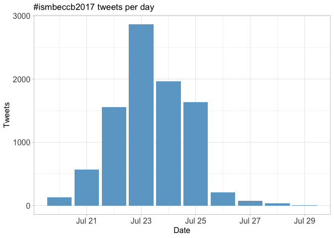
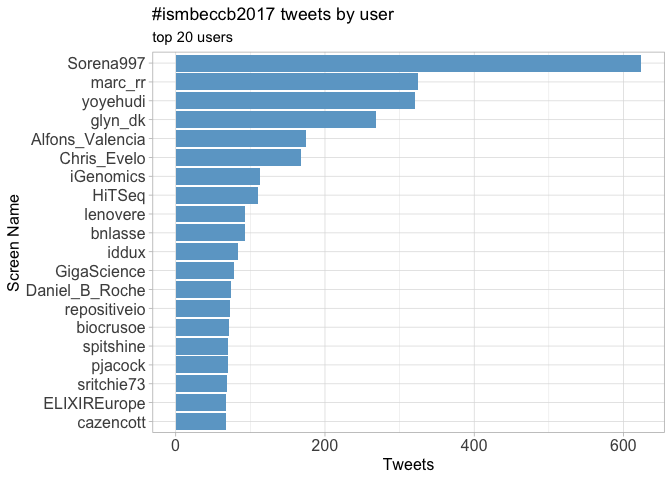
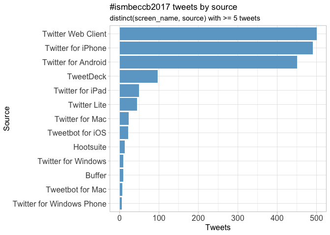
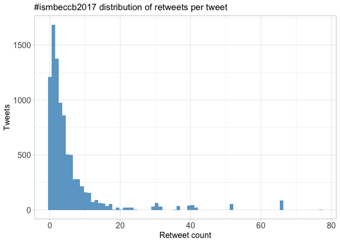
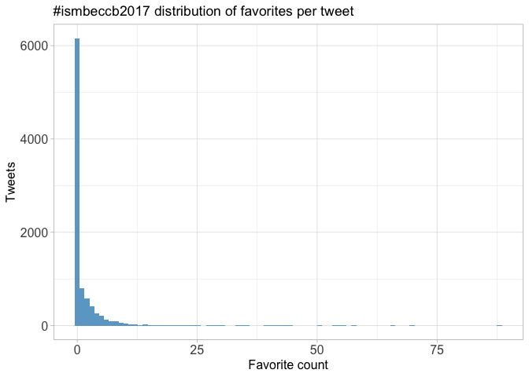
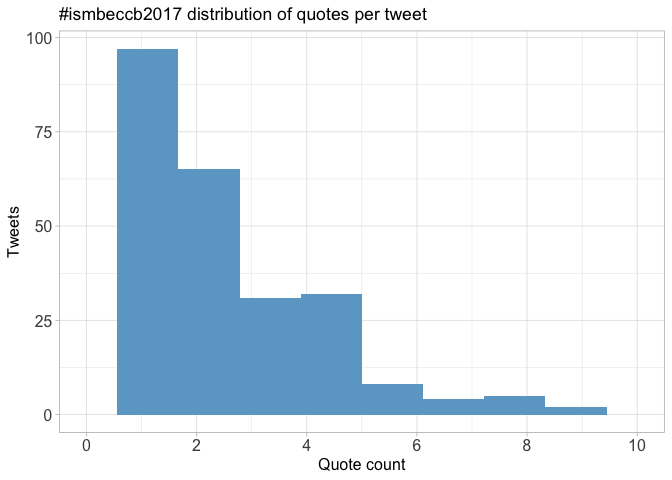
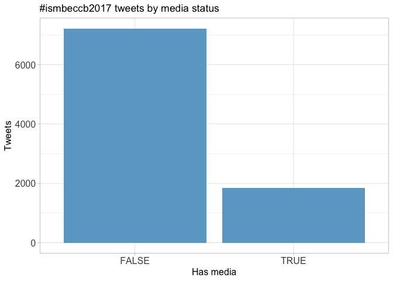
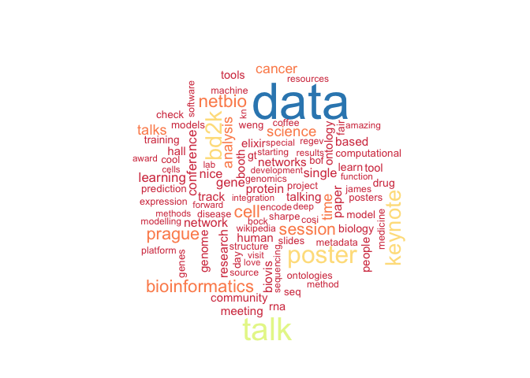

Twitter Coverage of the ISMB/ECCB Conference 2017
================
Neil Saunders
2018-07-16 22:47:48

Introduction
============

An analysis of tweets from the ISMB/ECCB 2017 meeting. 9052 tweets were collected using the `rtweet` R package:

``` r
library(rtweet)
ismbeccb2017 <- search_tweets("#ismb2017 OR #ismb17 OR #eccb2017 OR #eccb17 OR #ismbeccb OR #ismbeccb2017 OR #ismbeccb17", 10000)
```

Search all the hashtags!
------------------------


Timeline
========

Tweets by day
-------------



Tweets by day and time
----------------------

Filtered for dates July 21-26, Prague time. 

Users
=====

Top tweeters
------------



Sources
-------



Networks
========

Replies
-------

The "replies network", composed from users who reply directly to one another. Filtered for k-core &gt;= 4 and coloured by page rank.

Better to view the original PNG file in the `data` directory.


Mentions
--------

The "mentions network", where users mention other users in their tweets. Filtered for k-core &gt;= 4 and coloured by modularity class.

Better to view the original PNG file in the `data` directory.


Retweets
========

Retweet proportion
------------------


Retweet count
-------------



Top retweets
------------

<table style="width:99%;">
<caption>Table continues below</caption>
<colgroup>
<col width="25%" />
<col width="73%" />
</colgroup>
<thead>
<tr class="header">
<th align="left">screen_name</th>
<th align="left">text</th>
</tr>
</thead>
<tbody>
<tr class="odd">
<td align="left">reactome</td>
<td align="left">Try out our new interactive textbook illustrations accessible via the #PathwayBrowser <a href="https://t.co/zGzbfEbQSQ" class="uri">https://t.co/zGzbfEbQSQ</a>… <a href="https://t.co/fMWuYydPM4" class="uri">https://t.co/fMWuYydPM4</a></td>
</tr>
<tr class="even">
<td align="left">aphillippy</td>
<td align="left">I'm hiring this fall! Please talk to me at #ISMB2017 if you'd like to do research with us (<a href="https://t.co/yzZ9zYYRMP" class="uri">https://t.co/yzZ9zYYRMP</a>)</td>
</tr>
<tr class="odd">
<td align="left">GreeneScientist</td>
<td align="left">Don't forget to get your applications ready for the 2018 Research Parasite Awards! #ISMBECCB… <a href="https://t.co/hFN2FK5AeT" class="uri">https://t.co/hFN2FK5AeT</a></td>
</tr>
<tr class="even">
<td align="left">iscb</td>
<td align="left">ISMB/ECCB recorded talks since 2009 are available for ISCB members at ISCBtv <a href="https://t.co/qbL0rpijHY" class="uri">https://t.co/qbL0rpijHY</a> #ismbeccb <a href="https://t.co/tq685DbWa7" class="uri">https://t.co/tq685DbWa7</a></td>
</tr>
<tr class="odd">
<td align="left">nils_gehlenborg</td>
<td align="left">My lab <span class="citation">@HarvardDBMI</span> is hiring postdocs in #datavis/#cancer/#genomics/#epigenomics/#fairdata:… <a href="https://t.co/Plb1aKxPHA" class="uri">https://t.co/Plb1aKxPHA</a></td>
</tr>
<tr class="even">
<td align="left">LauCan88</td>
<td align="left">Tips for a successful research career by Christine Orengo #SCS17 #ismbeccb <a href="https://t.co/7y8DdHlrIb" class="uri">https://t.co/7y8DdHlrIb</a></td>
</tr>
<tr class="odd">
<td align="left">VeraMatser</td>
<td align="left">BoF How to build your scientific network as an early career researcher <span class="citation">@iscbsc</span> #ismbeccb #ismb17 #sketchnoting <a href="https://t.co/QHwsDwyUOt" class="uri">https://t.co/QHwsDwyUOt</a></td>
</tr>
<tr class="even">
<td align="left">Alfons_Valencia</td>
<td align="left">Happy to announce Tramontano's fellowship prog. Col of <span class="citation">@iscb</span> <span class="citation">@iscbsc</span> w #casp <span class="citation">@ISBSIB</span> + other joining soon + individual donations. #ismbeccb</td>
</tr>
<tr class="odd">
<td align="left">KarelBrinda</td>
<td align="left">Current challenges in genome assembly by <span class="citation">@aphillippy</span>. #ismbeccb <span class="citation">@HiTSeq</span> <a href="https://t.co/3YAwEjVrxe" class="uri">https://t.co/3YAwEjVrxe</a></td>
</tr>
<tr class="even">
<td align="left">andrewsu</td>
<td align="left">Posted slides for my afternoon talk at #ismbeccb #BOSC2017 on biomedical data integration using #wikidata… <a href="https://t.co/z3pp8ooIHO" class="uri">https://t.co/z3pp8ooIHO</a></td>
</tr>
</tbody>
</table>

<table style="width:21%;">
<colgroup>
<col width="20%" />
</colgroup>
<thead>
<tr class="header">
<th align="right">retweet_count</th>
</tr>
</thead>
<tbody>
<tr class="odd">
<td align="right">77</td>
</tr>
<tr class="even">
<td align="right">66</td>
</tr>
<tr class="odd">
<td align="right">52</td>
</tr>
<tr class="even">
<td align="right">41</td>
</tr>
<tr class="odd">
<td align="right">40</td>
</tr>
<tr class="even">
<td align="right">40</td>
</tr>
<tr class="odd">
<td align="right">36</td>
</tr>
<tr class="even">
<td align="right">35</td>
</tr>
<tr class="odd">
<td align="right">31</td>
</tr>
<tr class="even">
<td align="right">30</td>
</tr>
</tbody>
</table>

Favourites
==========

Favourite proportion
--------------------


Favourite count
---------------



Top favourites
--------------

<table style="width:93%;">
<colgroup>
<col width="25%" />
<col width="45%" />
<col width="22%" />
</colgroup>
<thead>
<tr class="header">
<th align="left">screen_name</th>
<th align="left">text</th>
<th align="right">favorite_count</th>
</tr>
</thead>
<tbody>
<tr class="odd">
<td align="left">reactome</td>
<td align="left">Try out our new interactive textbook illustrations accessible via the #PathwayBrowser <a href="https://t.co/zGzbfEbQSQ" class="uri">https://t.co/zGzbfEbQSQ</a>… <a href="https://t.co/fMWuYydPM4" class="uri">https://t.co/fMWuYydPM4</a></td>
<td align="right">88</td>
</tr>
<tr class="even">
<td align="left">Alfons_Valencia</td>
<td align="left">Happy to say that my LAST ISMB as <span class="citation">@iscb</span> President ended &amp; it was quite sucesfull. All my gratitude to all who worked for it! #ismbeccb</td>
<td align="right">70</td>
</tr>
<tr class="odd">
<td align="left">LauCan88</td>
<td align="left">Tips for a successful research career by Christine Orengo #SCS17 #ismbeccb <a href="https://t.co/7y8DdHlrIb" class="uri">https://t.co/7y8DdHlrIb</a></td>
<td align="right">66</td>
</tr>
<tr class="even">
<td align="left">aphillippy</td>
<td align="left">I'm hiring this fall! Please talk to me at #ISMB2017 if you'd like to do research with us (<a href="https://t.co/yzZ9zYYRMP" class="uri">https://t.co/yzZ9zYYRMP</a>)</td>
<td align="right">58</td>
</tr>
<tr class="odd">
<td align="left">baym</td>
<td align="left">Prague certainly was a beautiful venue for #ISMBECCB <a href="https://t.co/jkKl6Mj6LW" class="uri">https://t.co/jkKl6Mj6LW</a></td>
<td align="right">56</td>
</tr>
<tr class="even">
<td align="left">VeraMatser</td>
<td align="left">Glad I remembered to bring my #sketchnoting kit to #ismbeccb. Great keynote by James Sharpe <a href="https://t.co/hfBn8MTVvw" class="uri">https://t.co/hfBn8MTVvw</a></td>
<td align="right">55</td>
</tr>
<tr class="odd">
<td align="left">GreeneScientist</td>
<td align="left">Don't forget to get your applications ready for the 2018 Research Parasite Awards! #ISMBECCB… <a href="https://t.co/hFN2FK5AeT" class="uri">https://t.co/hFN2FK5AeT</a></td>
<td align="right">54</td>
</tr>
<tr class="even">
<td align="left">VeraMatser</td>
<td align="left">BoF How to build your scientific network as an early career researcher <span class="citation">@iscbsc</span> #ismbeccb #ismb17 #sketchnoting <a href="https://t.co/QHwsDwyUOt" class="uri">https://t.co/QHwsDwyUOt</a></td>
<td align="right">51</td>
</tr>
<tr class="odd">
<td align="left">Alfons_Valencia</td>
<td align="left">How many talks are already accesible as #preprints? (Many of the ones today). If it is a trend, should we get organised about it. #ismbeccb</td>
<td align="right">45</td>
</tr>
<tr class="even">
<td align="left">lpachter</td>
<td align="left">Full house for <span class="citation">@coletrapnell</span> at #ismbeccb discussing <a href="https://t.co/MZjSv9f90x" class="uri">https://t.co/MZjSv9f90x</a> <a href="https://t.co/7ewLdwUrgg" class="uri">https://t.co/7ewLdwUrgg</a></td>
<td align="right">44</td>
</tr>
</tbody>
</table>

Quotes
======

Quote proportion
----------------


Quote count
-----------



Top quotes
----------

<table style="width:89%;">
<colgroup>
<col width="25%" />
<col width="45%" />
<col width="18%" />
</colgroup>
<thead>
<tr class="header">
<th align="left">screen_name</th>
<th align="left">text</th>
<th align="right">quote_count</th>
</tr>
</thead>
<tbody>
<tr class="odd">
<td align="left">commonwl</td>
<td align="left">#CommonWL is an <span class="citation">@iscb</span> community success story, started at the <span class="citation">@OBF_BOSC</span> codefest in 2014 which makes this #ismbeccb… <a href="https://t.co/qGpeX1S8ka" class="uri">https://t.co/qGpeX1S8ka</a></td>
<td align="right">14</td>
</tr>
<tr class="even">
<td align="left">andrewsu</td>
<td align="left">If you're interested in our work using #wikidata to integrate open biomedical data... #ismbeccb #BOSC2017 <a href="https://t.co/ivGeEpkk2l" class="uri">https://t.co/ivGeEpkk2l</a></td>
<td align="right">9</td>
</tr>
<tr class="odd">
<td align="left">propicee</td>
<td align="left">Join careercentral panel discussion <span class="citation">@nils_gehlenborg</span> <span class="citation">@satagopam</span> <span class="citation">@smarkel</span> &amp; Anna Ritz. cc <span class="citation">@emreg00</span> <span class="citation">@danfdeblasio</span>… <a href="https://t.co/9Jhzi62rbx" class="uri">https://t.co/9Jhzi62rbx</a></td>
<td align="right">9</td>
</tr>
<tr class="even">
<td align="left">nils_gehlenborg</td>
<td align="left">I am really looking forward to being part of this conversation. Hope to see you there! #ismbeccb <a href="https://t.co/nQpN5Ftlz6" class="uri">https://t.co/nQpN5Ftlz6</a></td>
<td align="right">9</td>
</tr>
<tr class="odd">
<td align="left">IVP27</td>
<td align="left">In addition to Alfonso's <span class="citation">@Endukugga</span> talk, come meet Laura <span class="citation">@lauhuema</span> by our poster <span class="citation">@ExpressionAtlas</span> #ismbeccb… <a href="https://t.co/avuiayqzxx" class="uri">https://t.co/avuiayqzxx</a></td>
<td align="right">8</td>
</tr>
<tr class="even">
<td align="left">SSirarat</td>
<td align="left">Among the best-curated databases, i've known :) Learn the best practice of #biocuration at A118 poster today… <a href="https://t.co/Otyy1bhzwK" class="uri">https://t.co/Otyy1bhzwK</a></td>
<td align="right">8</td>
</tr>
<tr class="odd">
<td align="left">chunleiwu</td>
<td align="left">my slides for BioThings SDK now online: <a href="https://t.co/TBAWppVCmO" class="uri">https://t.co/TBAWppVCmO</a> #BOSC2017 #ismbeccb <a href="https://t.co/2FFPf82bPr" class="uri">https://t.co/2FFPf82bPr</a></td>
<td align="right">8</td>
</tr>
<tr class="even">
<td align="left">soilandreyes</td>
<td align="left">Our #CWL poster won <span class="citation">@F1000Research</span> Poster Award at #ISMBECCB17! Thanks <span class="citation">@m4rkrobinson</span> <span class="citation">@biocrusoe</span> <span class="citation">@CaroleAnneGoble</span>!… <a href="https://t.co/M6Ypg5UAwZ" class="uri">https://t.co/M6Ypg5UAwZ</a></td>
<td align="right">8</td>
</tr>
<tr class="odd">
<td align="left">NCI_NCIP</td>
<td align="left">View #NCICBIIT Director <span class="citation">@wakibbe</span>'s slides from #ISMBECCB. #PrecisionMedicine <a href="https://t.co/xXuuyl01tR" class="uri">https://t.co/xXuuyl01tR</a></td>
<td align="right">8</td>
</tr>
<tr class="even">
<td align="left">FrancescaBZNY</td>
<td align="left">Tarcisio Federizzi <span class="citation">@CIBIO_UniTrento</span> CWL based pipeline for #SPICE-ERC-project at #ismbeccb <a href="https://t.co/pNqBUjj7Te" class="uri">https://t.co/pNqBUjj7Te</a></td>
<td align="right">8</td>
</tr>
</tbody>
</table>

Media
=====

Media count
-----------



Top media
---------

<table style="width:93%;">
<colgroup>
<col width="25%" />
<col width="45%" />
<col width="22%" />
</colgroup>
<thead>
<tr class="header">
<th align="left">screen_name</th>
<th align="left">text</th>
<th align="right">favorite_count</th>
</tr>
</thead>
<tbody>
<tr class="odd">
<td align="left">LauCan88</td>
<td align="left">Tips for a successful research career by Christine Orengo #SCS17 #ismbeccb <a href="https://t.co/7y8DdHlrIb" class="uri">https://t.co/7y8DdHlrIb</a></td>
<td align="right">66</td>
</tr>
<tr class="even">
<td align="left">baym</td>
<td align="left">Prague certainly was a beautiful venue for #ISMBECCB <a href="https://t.co/jkKl6Mj6LW" class="uri">https://t.co/jkKl6Mj6LW</a></td>
<td align="right">56</td>
</tr>
<tr class="odd">
<td align="left">VeraMatser</td>
<td align="left">Glad I remembered to bring my #sketchnoting kit to #ismbeccb. Great keynote by James Sharpe <a href="https://t.co/hfBn8MTVvw" class="uri">https://t.co/hfBn8MTVvw</a></td>
<td align="right">55</td>
</tr>
<tr class="even">
<td align="left">VeraMatser</td>
<td align="left">BoF How to build your scientific network as an early career researcher <span class="citation">@iscbsc</span> #ismbeccb #ismb17 #sketchnoting <a href="https://t.co/QHwsDwyUOt" class="uri">https://t.co/QHwsDwyUOt</a></td>
<td align="right">51</td>
</tr>
<tr class="odd">
<td align="left">lpachter</td>
<td align="left">Full house for <span class="citation">@coletrapnell</span> at #ismbeccb discussing <a href="https://t.co/MZjSv9f90x" class="uri">https://t.co/MZjSv9f90x</a> <a href="https://t.co/7ewLdwUrgg" class="uri">https://t.co/7ewLdwUrgg</a></td>
<td align="right">44</td>
</tr>
<tr class="even">
<td align="left">iscb</td>
<td align="left">ISMB/ECCB recorded talks since 2009 are available for ISCB members at ISCBtv <a href="https://t.co/qbL0rpijHY" class="uri">https://t.co/qbL0rpijHY</a> #ismbeccb <a href="https://t.co/tq685DbWa7" class="uri">https://t.co/tq685DbWa7</a></td>
<td align="right">41</td>
</tr>
<tr class="odd">
<td align="left">baym</td>
<td align="left">Oh man, the #ISMB2017 official app is brutal <a href="https://t.co/zwaiT1emJd" class="uri">https://t.co/zwaiT1emJd</a></td>
<td align="right">41</td>
</tr>
<tr class="even">
<td align="left">kieranrcampbell</td>
<td align="left">The official #ismbeccb drinking game would include &quot;drink every time you see a Waddington landscape&quot; <a href="https://t.co/UaV6FecDMw" class="uri">https://t.co/UaV6FecDMw</a></td>
<td align="right">35</td>
</tr>
<tr class="odd">
<td align="left">atulbutte</td>
<td align="left">Download immunology #opendata at <span class="citation">@ImmPortDB</span>; ~300 studies, free accounts! <a href="https://t.co/Ze4PJkTcV3" class="uri">https://t.co/Ze4PJkTcV3</a> #ismbeccb <a href="https://t.co/DFgmocfVW6" class="uri">https://t.co/DFgmocfVW6</a></td>
<td align="right">34</td>
</tr>
<tr class="even">
<td align="left">KarelBrinda</td>
<td align="left">Current challenges in genome assembly by <span class="citation">@aphillippy</span>. #ismbeccb <span class="citation">@HiTSeq</span> <a href="https://t.co/3YAwEjVrxe" class="uri">https://t.co/3YAwEjVrxe</a></td>
<td align="right">33</td>
</tr>
</tbody>
</table>

### Most liked media image


Tweet text
==========

The 100 words used 3 or more times. Hashtags for satellite meetings removed.


