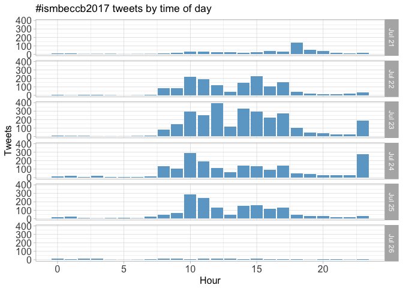
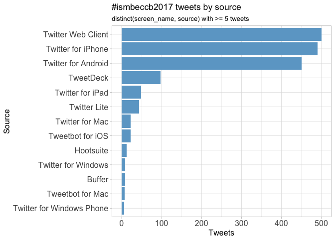
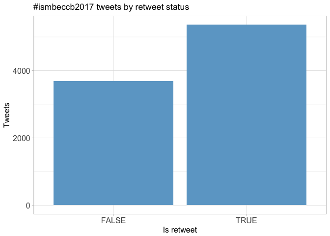
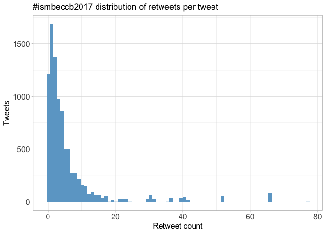
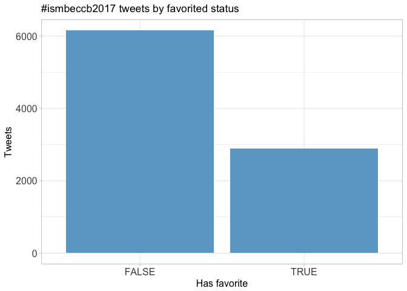
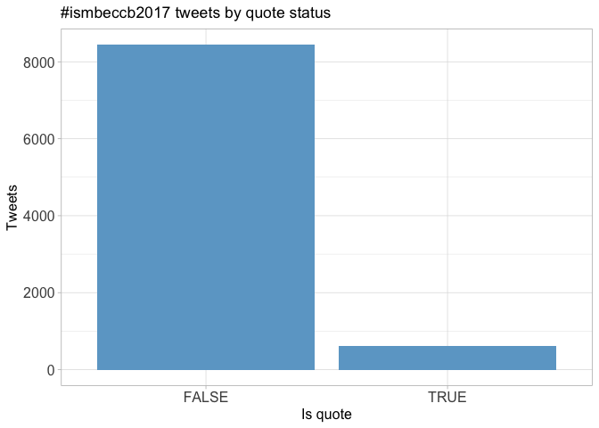
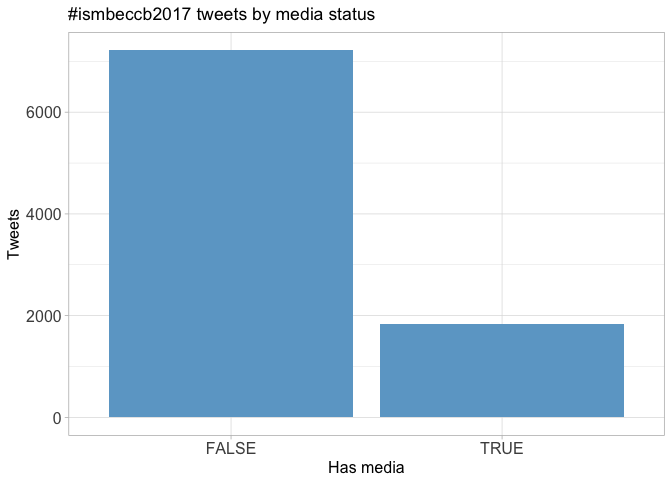
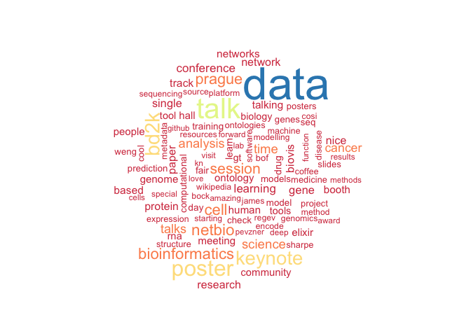

# Twitter Coverage of the ISMB/ECCB Conference 2017
Neil Saunders  
`r Sys.time()`  


# Introduction
An analysis of tweets from the ISMB/ECCB 2017 meeting. 9052 tweets were collected using the `rtweet` R package:


```r
library(rtweet)
ismbeccb2017 <- search_tweets("#ismb2017 OR #ismb17 OR #eccb2017 OR #eccb17 OR #ismbeccb OR #ismbeccb2017 OR #ismbeccb17", 10000)
```

# Timeline
## Tweets by day
<!-- -->

## Tweets by day and time
Filtered for dates July 21-26, Prague time.
<!-- -->

# Users
## Top tweeters
<!-- -->

## Sources
<!-- -->

# Networks
## Replies
The "replies network", composed from users who reply directly to one another.

Better to view the original PNG file in the `data` directory.


<!--[](../../data/ismbeccb2017_replies.png)-->

## Mentions
The "mentions network", where users mention other users in their tweets.

Better to view the original PNG file in the `data` directory.


<!--[](../../data/ismbeccb2017_mentions.png)-->

# Retweets
## Retweet proportion
<!-- -->

## Retweet count
<!-- -->

## Top retweets
<table>
 <thead>
  <tr>
   <th style="text-align:left;"> screen_name </th>
   <th style="text-align:left;"> text </th>
   <th style="text-align:right;"> retweet_count </th>
  </tr>
 </thead>
<tbody>
  <tr>
   <td style="text-align:left;"> reactome </td>
   <td style="text-align:left;"> Try out our new interactive textbook illustrations accessible via the #PathwayBrowser https://t.co/zGzbfEbQSQ… https://t.co/fMWuYydPM4 </td>
   <td style="text-align:right;"> 77 </td>
  </tr>
  <tr>
   <td style="text-align:left;"> aphillippy </td>
   <td style="text-align:left;"> I'm hiring this fall! Please talk to me at #ISMB2017 if you'd like to do research with us (https://t.co/yzZ9zYYRMP) </td>
   <td style="text-align:right;"> 66 </td>
  </tr>
  <tr>
   <td style="text-align:left;"> GreeneScientist </td>
   <td style="text-align:left;"> Don't forget to get your applications ready for the 2018 Research Parasite Awards! #ISMBECCB… https://t.co/hFN2FK5AeT </td>
   <td style="text-align:right;"> 52 </td>
  </tr>
  <tr>
   <td style="text-align:left;"> iscb </td>
   <td style="text-align:left;"> ISMB/ECCB recorded talks since 2009 are available for ISCB members at ISCBtv https://t.co/qbL0rpijHY #ismbeccb https://t.co/tq685DbWa7 </td>
   <td style="text-align:right;"> 41 </td>
  </tr>
  <tr>
   <td style="text-align:left;"> nils_gehlenborg </td>
   <td style="text-align:left;"> My lab @HarvardDBMI is hiring postdocs in #datavis/#cancer/#genomics/#epigenomics/#fairdata:… https://t.co/Plb1aKxPHA </td>
   <td style="text-align:right;"> 40 </td>
  </tr>
  <tr>
   <td style="text-align:left;"> LauCan88 </td>
   <td style="text-align:left;"> Tips for a successful research career by Christine Orengo #SCS17 #ismbeccb https://t.co/7y8DdHlrIb </td>
   <td style="text-align:right;"> 40 </td>
  </tr>
  <tr>
   <td style="text-align:left;"> VeraMatser </td>
   <td style="text-align:left;"> BoF How to build your scientific network as an early career researcher @iscbsc #ismbeccb #ismb17 #sketchnoting https://t.co/QHwsDwyUOt </td>
   <td style="text-align:right;"> 36 </td>
  </tr>
  <tr>
   <td style="text-align:left;"> Alfons_Valencia </td>
   <td style="text-align:left;"> Happy to announce Tramontano's fellowship prog. Col of @iscb @iscbsc w #casp @ISBSIB + other joining soon + individual donations. #ismbeccb </td>
   <td style="text-align:right;"> 35 </td>
  </tr>
  <tr>
   <td style="text-align:left;"> KarelBrinda </td>
   <td style="text-align:left;"> Current challenges in genome assembly by @aphillippy. #ismbeccb @HiTSeq https://t.co/3YAwEjVrxe </td>
   <td style="text-align:right;"> 31 </td>
  </tr>
  <tr>
   <td style="text-align:left;"> andrewsu </td>
   <td style="text-align:left;"> Posted slides for my afternoon talk at #ismbeccb #BOSC2017 on biomedical data integration using #wikidata… https://t.co/z3pp8ooIHO </td>
   <td style="text-align:right;"> 30 </td>
  </tr>
</tbody>
</table>

# Favourites
## Favourite proportion
<!-- -->

## Favourite count
<!-- -->

## Top favourites
<table>
 <thead>
  <tr>
   <th style="text-align:left;"> screen_name </th>
   <th style="text-align:left;"> text </th>
   <th style="text-align:right;"> favorite_count </th>
  </tr>
 </thead>
<tbody>
  <tr>
   <td style="text-align:left;"> reactome </td>
   <td style="text-align:left;"> Try out our new interactive textbook illustrations accessible via the #PathwayBrowser https://t.co/zGzbfEbQSQ… https://t.co/fMWuYydPM4 </td>
   <td style="text-align:right;"> 88 </td>
  </tr>
  <tr>
   <td style="text-align:left;"> Alfons_Valencia </td>
   <td style="text-align:left;"> Happy to say that my LAST ISMB as @iscb President ended &amp;amp; it was quite sucesfull. 
All my gratitude to all who worked for it! 
#ismbeccb </td>
   <td style="text-align:right;"> 70 </td>
  </tr>
  <tr>
   <td style="text-align:left;"> LauCan88 </td>
   <td style="text-align:left;"> Tips for a successful research career by Christine Orengo #SCS17 #ismbeccb https://t.co/7y8DdHlrIb </td>
   <td style="text-align:right;"> 66 </td>
  </tr>
  <tr>
   <td style="text-align:left;"> aphillippy </td>
   <td style="text-align:left;"> I'm hiring this fall! Please talk to me at #ISMB2017 if you'd like to do research with us (https://t.co/yzZ9zYYRMP) </td>
   <td style="text-align:right;"> 58 </td>
  </tr>
  <tr>
   <td style="text-align:left;"> baym </td>
   <td style="text-align:left;"> Prague certainly was a beautiful venue for #ISMBECCB https://t.co/jkKl6Mj6LW </td>
   <td style="text-align:right;"> 56 </td>
  </tr>
  <tr>
   <td style="text-align:left;"> VeraMatser </td>
   <td style="text-align:left;"> Glad I remembered to bring my #sketchnoting kit to #ismbeccb. Great keynote by James Sharpe https://t.co/hfBn8MTVvw </td>
   <td style="text-align:right;"> 55 </td>
  </tr>
  <tr>
   <td style="text-align:left;"> GreeneScientist </td>
   <td style="text-align:left;"> Don't forget to get your applications ready for the 2018 Research Parasite Awards! #ISMBECCB… https://t.co/hFN2FK5AeT </td>
   <td style="text-align:right;"> 54 </td>
  </tr>
  <tr>
   <td style="text-align:left;"> VeraMatser </td>
   <td style="text-align:left;"> BoF How to build your scientific network as an early career researcher @iscbsc #ismbeccb #ismb17 #sketchnoting https://t.co/QHwsDwyUOt </td>
   <td style="text-align:right;"> 51 </td>
  </tr>
  <tr>
   <td style="text-align:left;"> Alfons_Valencia </td>
   <td style="text-align:left;"> How many talks are already accesible as #preprints? (Many of the ones today). If it is a trend, should we get organised about it. #ismbeccb </td>
   <td style="text-align:right;"> 45 </td>
  </tr>
  <tr>
   <td style="text-align:left;"> lpachter </td>
   <td style="text-align:left;"> Full house for @coletrapnell at #ismbeccb discussing https://t.co/MZjSv9f90x https://t.co/7ewLdwUrgg </td>
   <td style="text-align:right;"> 44 </td>
  </tr>
</tbody>
</table>

# Quotes
## Quote proportion
<!-- -->

## Quote count
<!-- -->

## Top quotes
<table>
 <thead>
  <tr>
   <th style="text-align:left;"> screen_name </th>
   <th style="text-align:left;"> text </th>
   <th style="text-align:right;"> quote_count </th>
  </tr>
 </thead>
<tbody>
  <tr>
   <td style="text-align:left;"> commonwl </td>
   <td style="text-align:left;"> #CommonWL is an @iscb community success story, started at the @OBF_BOSC codefest in 2014 which makes this #ismbeccb… https://t.co/qGpeX1S8ka </td>
   <td style="text-align:right;"> 14 </td>
  </tr>
  <tr>
   <td style="text-align:left;"> andrewsu </td>
   <td style="text-align:left;"> If you're interested in our work using #wikidata to integrate open biomedical data... #ismbeccb #BOSC2017  https://t.co/ivGeEpkk2l </td>
   <td style="text-align:right;"> 9 </td>
  </tr>
  <tr>
   <td style="text-align:left;"> propicee </td>
   <td style="text-align:left;"> Join careercentral panel discussion @nils_gehlenborg @satagopam @smarkel &amp;amp; Anna Ritz. cc @emreg00 @danfdeblasio… https://t.co/9Jhzi62rbx </td>
   <td style="text-align:right;"> 9 </td>
  </tr>
  <tr>
   <td style="text-align:left;"> nils_gehlenborg </td>
   <td style="text-align:left;"> I am really looking forward to being part of this conversation. Hope to see you there! #ismbeccb https://t.co/nQpN5Ftlz6 </td>
   <td style="text-align:right;"> 9 </td>
  </tr>
  <tr>
   <td style="text-align:left;"> IVP27 </td>
   <td style="text-align:left;"> In addition to Alfonso's @Endukugga talk, come meet Laura @lauhuema by our poster @ExpressionAtlas #ismbeccb… https://t.co/avuiayqzxx </td>
   <td style="text-align:right;"> 8 </td>
  </tr>
  <tr>
   <td style="text-align:left;"> SSirarat </td>
   <td style="text-align:left;"> Among the best-curated databases, i've known :) Learn the best practice of #biocuration at A118 poster today… https://t.co/Otyy1bhzwK </td>
   <td style="text-align:right;"> 8 </td>
  </tr>
  <tr>
   <td style="text-align:left;"> chunleiwu </td>
   <td style="text-align:left;"> my slides for BioThings SDK now online: https://t.co/TBAWppVCmO #BOSC2017 #ismbeccb https://t.co/2FFPf82bPr </td>
   <td style="text-align:right;"> 8 </td>
  </tr>
  <tr>
   <td style="text-align:left;"> soilandreyes </td>
   <td style="text-align:left;"> Our #CWL poster won @F1000Research Poster Award at #ISMBECCB17! 
Thanks @m4rkrobinson @biocrusoe @CaroleAnneGoble!… https://t.co/M6Ypg5UAwZ </td>
   <td style="text-align:right;"> 8 </td>
  </tr>
  <tr>
   <td style="text-align:left;"> NCI_NCIP </td>
   <td style="text-align:left;"> View #NCICBIIT Director @wakibbe's slides from #ISMBECCB. #PrecisionMedicine https://t.co/xXuuyl01tR </td>
   <td style="text-align:right;"> 8 </td>
  </tr>
  <tr>
   <td style="text-align:left;"> FrancescaBZNY </td>
   <td style="text-align:left;"> Tarcisio Federizzi @CIBIO_UniTrento CWL based pipeline for #SPICE-ERC-project at #ismbeccb https://t.co/pNqBUjj7Te </td>
   <td style="text-align:right;"> 8 </td>
  </tr>
</tbody>
</table>

# Media
## Media count
<!-- -->

## Top media
<table>
 <thead>
  <tr>
   <th style="text-align:left;"> screen_name </th>
   <th style="text-align:left;"> text </th>
   <th style="text-align:right;"> favorite_count </th>
  </tr>
 </thead>
<tbody>
  <tr>
   <td style="text-align:left;"> LauCan88 </td>
   <td style="text-align:left;"> Tips for a successful research career by Christine Orengo #SCS17 #ismbeccb https://t.co/7y8DdHlrIb </td>
   <td style="text-align:right;"> 66 </td>
  </tr>
  <tr>
   <td style="text-align:left;"> baym </td>
   <td style="text-align:left;"> Prague certainly was a beautiful venue for #ISMBECCB https://t.co/jkKl6Mj6LW </td>
   <td style="text-align:right;"> 56 </td>
  </tr>
  <tr>
   <td style="text-align:left;"> VeraMatser </td>
   <td style="text-align:left;"> Glad I remembered to bring my #sketchnoting kit to #ismbeccb. Great keynote by James Sharpe https://t.co/hfBn8MTVvw </td>
   <td style="text-align:right;"> 55 </td>
  </tr>
  <tr>
   <td style="text-align:left;"> VeraMatser </td>
   <td style="text-align:left;"> BoF How to build your scientific network as an early career researcher @iscbsc #ismbeccb #ismb17 #sketchnoting https://t.co/QHwsDwyUOt </td>
   <td style="text-align:right;"> 51 </td>
  </tr>
  <tr>
   <td style="text-align:left;"> lpachter </td>
   <td style="text-align:left;"> Full house for @coletrapnell at #ismbeccb discussing https://t.co/MZjSv9f90x https://t.co/7ewLdwUrgg </td>
   <td style="text-align:right;"> 44 </td>
  </tr>
  <tr>
   <td style="text-align:left;"> iscb </td>
   <td style="text-align:left;"> ISMB/ECCB recorded talks since 2009 are available for ISCB members at ISCBtv https://t.co/qbL0rpijHY #ismbeccb https://t.co/tq685DbWa7 </td>
   <td style="text-align:right;"> 41 </td>
  </tr>
  <tr>
   <td style="text-align:left;"> baym </td>
   <td style="text-align:left;"> Oh man, the #ISMB2017 official app is brutal https://t.co/zwaiT1emJd </td>
   <td style="text-align:right;"> 41 </td>
  </tr>
  <tr>
   <td style="text-align:left;"> kieranrcampbell </td>
   <td style="text-align:left;"> The official #ismbeccb drinking game would include &quot;drink every time you see a Waddington landscape&quot; https://t.co/UaV6FecDMw </td>
   <td style="text-align:right;"> 35 </td>
  </tr>
  <tr>
   <td style="text-align:left;"> atulbutte </td>
   <td style="text-align:left;"> Download immunology #opendata at @ImmPortDB; ~300 studies, free accounts! https://t.co/Ze4PJkTcV3 #ismbeccb https://t.co/DFgmocfVW6 </td>
   <td style="text-align:right;"> 34 </td>
  </tr>
  <tr>
   <td style="text-align:left;"> KarelBrinda </td>
   <td style="text-align:left;"> Current challenges in genome assembly by @aphillippy. #ismbeccb @HiTSeq https://t.co/3YAwEjVrxe </td>
   <td style="text-align:right;"> 33 </td>
  </tr>
</tbody>
</table>

### Most liked media image


# Tweet text
The 100 words used 3 or more times.

<!-- -->

