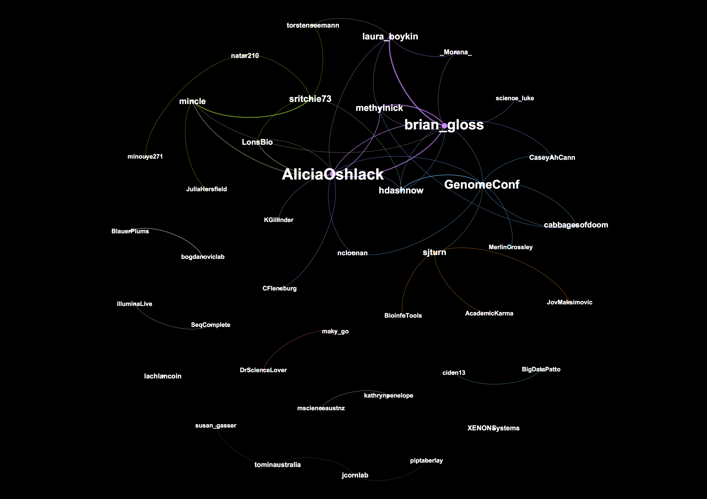
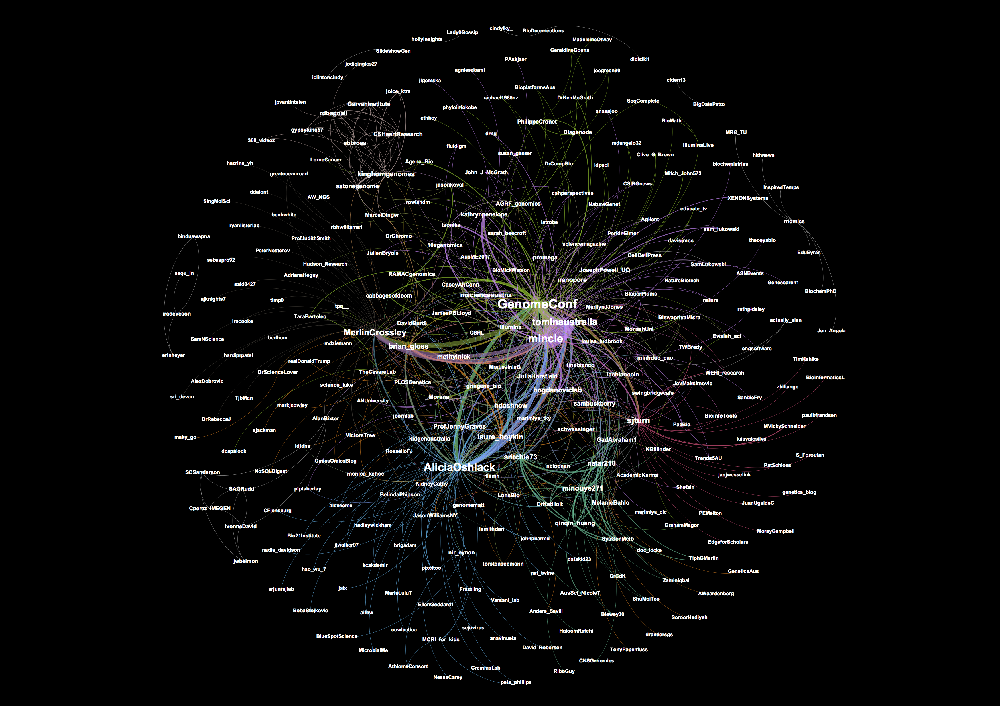

```{r setup, include=FALSE}
knitr::opts_chunk$set(echo = FALSE, message = FALSE, warning = FALSE)
library(rtweet)
library(tidyverse)
library(lubridate)
library(knitr)
library(pander)
library(wordcloud)
library(tidytext)
library(igraph)

theme_set(theme_light())
load("../../scratch/lorne.RData")
lornegenome17 <- lorne
rm(lorne)
```

# Introduction
An analysis of tweets from the Lorne Genome 2017 meeting. `r nrow(lornegenome17)` tweets were collected using the `rtweet` R package:

```{r search-twitter, eval=FALSE, echo=TRUE}
library(rtweet)
lornegenome17 <- search_tweets("#lornegenome", 5000)
```

# Timeline
## Tweets by day
```{r tweets-by-day}
lornegenome17 %>% 
  mutate(date = as_date(created_at, tz = "Australia/Melbourne")) %>% 
  count(date) %>% 
  ggplot(aes(date, n)) + geom_col(fill = "skyblue3") +  
    labs(x = "Date", y = "Tweets", title = "#lornegenome tweets per day") + 
    theme(axis.text = element_text(size = 12), axis.title = element_text(size = 12))
```

## Tweets by day and time
Filtered for dates February 12-14, Melbourne time.
```{r tweets-by-day-hour}
lornegenome17 %>% 
  mutate(datetime = as_datetime(created_at, tz = "Australia/Melbourne"), hour = hour(datetime)) %>% 
  group_by(date = as_date(datetime), hour) %>% 
  summarise(count = n()) %>% 
  filter(date >= as_date("2017-02-12"), date <= as_date("2017-02-14")) %>% 
  ggplot(aes(hour, count)) + geom_col(fill = "skyblue3") + facet_grid(strftime(date, "%b %d") ~ .) + 
    labs(x = "Hour", y = "Tweets", title = "#lornegenome tweets by time of day") + 
    theme(axis.text = element_text(size = 12), axis.title = element_text(size = 12))
```

# Users
## Top tweeters
```{r tweets-top-users}
lornegenome17 %>% 
  count(screen_name) %>% 
  filter(n >= 20) %>% 
  ggplot(aes(reorder(screen_name, n), n)) + geom_col(fill = "skyblue3") + coord_flip() + 
    labs(x = "Screen Name", y = "Tweets", title = "#lornegenome tweets by user", subtitle = "users with >= 20 tweets") + 
    theme(axis.text = element_text(size = 12), axis.title = element_text(size = 12))
```

## Sources
```{r tweets-top-sources}
lornegenome17 %>% 
distinct(screen_name, source) %>%
  count(source) %>% 
  filter(n >= 5) %>%
  ggplot(aes(reorder(source, n), n)) + geom_col(fill = "skyblue3") + coord_flip() + 
    labs(x = "Source", y = "Tweets", title = "#lornegenome tweets by source", subtitle = "sources with >= 5 tweets") + 
    theme(axis.text = element_text(size = 12), axis.title = element_text(size = 12))
```

# Networks
## Replies
The "replies network", composed from users who reply directly to one another.

Better to view the original PNG file in the `data` directory.

```{r reply-network, eval=FALSE}
lornegenome17_replies <- lornegenome17 %>% 
  filter(!is.na(in_reply_to_status_screen_name)) %>% 
  select(screen_name, in_reply_to_status_screen_name) %>% 
  graph.data.frame(directed = TRUE)

V(lornegenome17_replies)$label <- V(lornegenome17_replies)$name
V(lornegenome17_replies)$id    <- V(lornegenome17_replies)$name

write_graph(lornegenome17_replies, file = "../../data/lorne_replies.graphml", format = "graphml")
```



## Mentions
The "mentions network", where users mention other users in their tweets.

Better to view the original PNG file in the `data` directory.

```{r mentions-network, eval=FALSE}
lornegenome17_mentions <- lornegenome17 %>% 
  filter(!is.na(mentions_screen_name)) %>% 
  select(screen_name, mentions_screen_name) %>% 
  mutate(mentions_screen_name = strsplit(mentions_screen_name, " ")) %>% 
  unnest(mentions_screen_name) %>% 
  graph.data.frame()

V(lornegenome17_mentions)$label <- V(lornegenome17_mentions)$name
V(lornegenome17_mentions)$id    <- V(lornegenome17_mentions)$name

write_graph(lornegenome17_mentions, file = "../../data/lorne_mentions.graphml", format = "graphml")
```



# Retweets
## Retweet proportion
```{r is-retweet}
lornegenome17 %>% 
  count(is_retweet) %>% 
  ggplot(aes(is_retweet, n)) + geom_col(fill = "skyblue3") + 
    labs(x = "Is retweet", y = "Tweets", title = "#lornegenome tweets by retweet status") + 
    theme(axis.text = element_text(size = 12), axis.title = element_text(size = 12))
```

## Retweet count
```{r retweet-count}
lornegenome17 %>% 
  ggplot(aes(retweet_count)) + geom_histogram(bins = max(lornegenome17$retweet_count), fill = "skyblue3") +
    labs(x = "Retweet count", y = "Tweets", title = "#lornegenome distribution of retweets per tweet") + 
    theme(axis.text = element_text(size = 12), axis.title = element_text(size = 12))
```

## Top retweets
```{r most-retweeted}
lornegenome17 %>% 
  filter(is.na(retweet_status_id)) %>% 
  select(screen_name, text, retweet_count) %>% 
  arrange(desc(retweet_count)) %>% 
  distinct() %>%
  slice(1:10) %>% 
  pander(justify = c("left", "left", "right"), split.table = Inf)
```

# Favourites
## Favourite proportion
```{r has-favorite}
lornegenome17 %>% 
  mutate(has_favorite = ifelse(favorite_count > 0, TRUE, FALSE)) %>% 
  count(has_favorite) %>%
  ggplot(aes(has_favorite, n)) + geom_col(fill = "skyblue3") + 
    labs(x = "Has favorite", y = "Tweets", title = "#lornegenome tweets by favorited status") + 
    theme(axis.text = element_text(size = 12), axis.title = element_text(size = 12))
```

## Favourite count
```{r favorite-count}
lornegenome17 %>% 
  ggplot(aes(favorite_count)) + geom_histogram(bins = max(lornegenome17$favorite_count), fill = "skyblue3") +
    labs(x = "Favorite count", y = "Tweets", title = "#lornegenome distribution of favorites per tweet") + 
    theme(axis.text = element_text(size = 12), axis.title = element_text(size = 12))
```

## Top favourites
```{r most-favorited}
lornegenome17 %>% 
  select(screen_name, text, favorite_count) %>% 
  arrange(desc(favorite_count)) %>% 
  distinct() %>%
  slice(1:10) %>% 
  pander(justify = c("left", "left", "right"), split.table = Inf)
```

# Quotes
## Quote proportion
```{r is-quote}
lornegenome17 %>% 
  count(is_quote_status) %>% 
  ggplot(aes(is_quote_status, n)) + geom_col(fill = "skyblue3") + 
    labs(x = "Is quote", y = "Tweets", title = "#lornegenome tweets by quote status") + 
    theme(axis.text = element_text(size = 12), axis.title = element_text(size = 12))
```

## Quote count
```{r quotes-count}
lornegenome17 %>% 
  filter(!is.na(quote_status_id)) %>% 
  count(quote_status_id) %>% 
  ggplot(aes(n)) + geom_histogram(bins = 10, fill = "skyblue3") +
    labs(x = "Quote count", y = "Tweets", title = "#lornegenome distribution of quotes per tweet") + 
    scale_x_continuous(limits = c(0, 10), breaks = seq(0, 10, 2)) + 
    theme(axis.text = element_text(size = 12), axis.title = element_text(size = 12))
```

## Top quotes
```{r most-quoted}
lornegenome17 %>% 
  filter(!is.na(quote_status_id)) %>% 
  count(quote_status_id) %>% 
  filter(n > 1) %>% 
  arrange(desc(n)) %>% 
#  slice(1:10) %>% 
  inner_join(select(lornegenome17, screen_name, quote_status_id, is_retweet, text)) %>% 
  filter(is_retweet == FALSE) %>% 
  select(screen_name, text, quote_count = n) %>%
  distinct() %>%
  slice(1:10) %>%
  pander(justify = c("left", "left", "right"), split.table = Inf)
```

# Media
## Media count
```{r has-media}
lornegenome17 %>% 
  mutate(has_media = !is.na(media_id)) %>% 
  count(has_media) %>% 
  ggplot(aes(has_media, n)) + geom_col(fill = "skyblue3") + 
    labs(x = "Has media", y = "Tweets", title = "#lornegenome tweets by media status") + 
    theme(axis.text = element_text(size = 12), axis.title = element_text(size = 12))
```

## Top media
```{r liked-media}
lornegenome17_media <- lornegenome17 %>% 
  filter(!is.na(media_id)) %>% 
  arrange(desc(favorite_count)) %>%
  filter(favorite_count > 0)

lornegenome17_media %>%
  slice(1:10) %>% 
  select(screen_name, text, favorite_count) %>%
  pander(justify = c("left", "left", "right"), split.table = Inf)
```

### Most liked media image


# Tweet text
The 100 words used 3 or more times.

```{r count-words}
data("stop_words")

lornegenome17 %>% 
  filter(is_retweet == FALSE) %>% 
  unnest_tokens(word, text) %>% 
  select(word) %>% 
  filter(!word %in% c("lornegenome", "https", "ismbeccb", "t.co", "amp"),
         !word %in% tolower(lornegenome17$screen_name), 
         !grepl("^\\d+$", word)) %>% 
  anti_join(stop_words) %>% 
  count(word) %>% 
  with(wordcloud(word, n, max.words = 100, min.freq = 3, colors = brewer.pal(8, "Accent")))
```

