Twitter Coverage of the Lorne Genome Conference 2017
========================================================
author: Neil Saunders
date: 2017-02-16 20:47:58
autosize: true

<style>
.footer {
    color: black; background: #E8E8E8;
    position: fixed; top: 90%;
    text-align:left; width:100%;
}

.reveal h1, .reveal h2, .reveal h3 {
  word-wrap: normal;
  hyphens: none;
}

.small-code pre code {
  font-size: 0.8em;
}
</style>


Timeline
========================================================
id: timeline

<div class="footer" style="font-size:60%;">
1532 tweets were retrieved. The majority of tweets were posted during the conference (February 12-14), with some posted in the week prior to the event.
Peaks of activity during the morning sessions on February 13-14 may correspond to keynote speakers. It would be interesting to mash up these data with the conference program schedule.
</div>

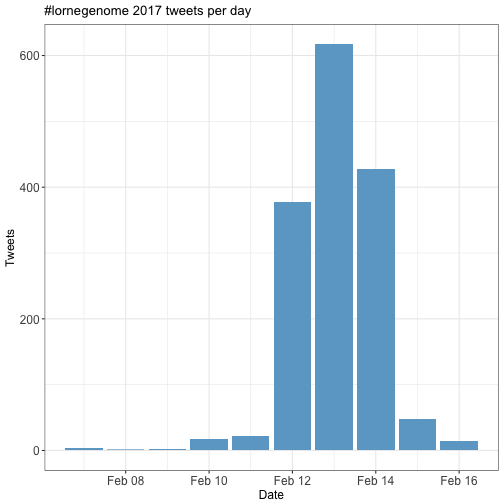

***

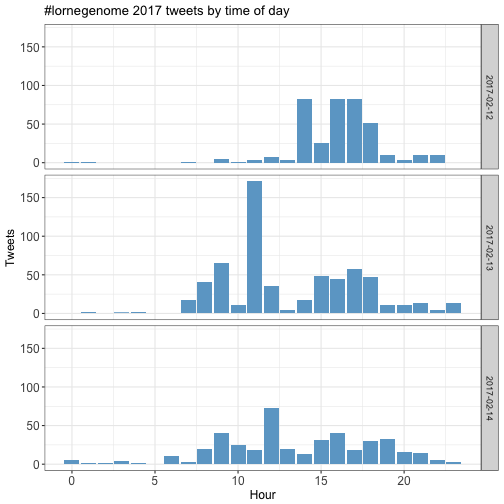

Users
========================================================
id: users

<div class="footer" style="font-size:60%;">
The "top tweeters" are always of interest! Here's everyone who tweeted 10 or more times.
The iPhone is the device of choice for the genome crowd.
</div>

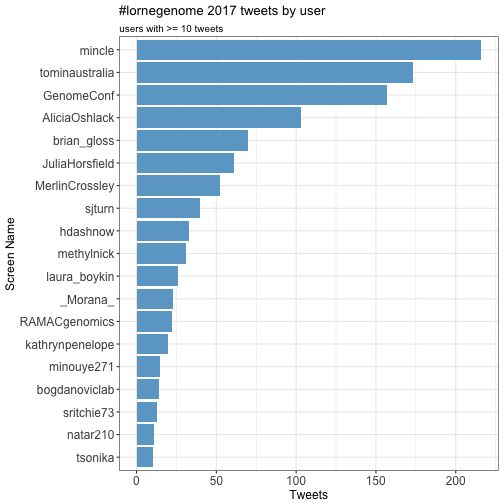

***

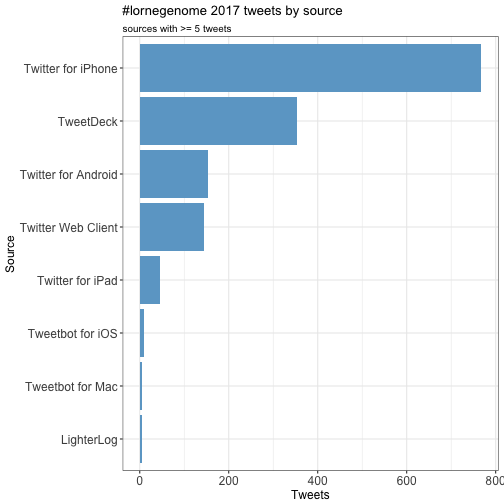

The replies network
========================================================
id: replies

<div class="footer" style="font-size:60%;margin-top:80px;">
Network constructed from users who replied directly to one another. Better to look at the original image in the Github repo.
</div>


The mentions network
========================================================
id: mentions

<div class="footer" style="font-size:60%;margin-top:80px;">
Network constructed from users who mentioned one or more users in their tweets. Better to look at the original image in the Github repo.
</div>


Network code
========================================================
id: networks
class: small-code

<div class="footer" style="font-size:60%;">
We can define two types of interaction: the "replies" network (users who reply directly to one another's tweets) and the "mentions" network (users who mention one or more users in their tweets). This code uses `igraph` to generate those networks and save the results for visualisation using Gephi.
</div>


```r
lorne_replies <- lorne %>% 
  filter(!is.na(in_reply_to_status_screen_name)) %>% 
  select(screen_name, in_reply_to_status_screen_name) %>% 
  graph.data.frame(directed = TRUE)

V(lorne_replies)$label <- V(lorne_replies)$name
V(lorne_replies)$id    <- V(lorne_replies)$name


write_graph(lorne_replies, file = "lorne_replies.graphml", format = "graphml")
```

***


```r
lorne_mentions <- lorne %>% 
  filter(!is.na(mentions_screen_name)) %>% 
  select(screen_name, mentions_screen_name) %>% 
  mutate(mentions_screen_name = strsplit(mentions_screen_name, " ")) %>% 
  unnest(mentions_screen_name) %>% 
  graph.data.frame()

V(lorne_mentions)$label <- V(lorne_mentions)$name
V(lorne_mentions)$id    <- V(lorne_mentions)$name

write_graph(lorne_mentions, file = "lorne_mentions.graphml", format = "graphml")
```

Retweets
========================================================
id: retweets

<div class="footer" style="font-size:60%;">
Slightly more than half of the conference tweets are retweets.
The frequency of retweets per tweet shows a lumpy distribution which is somewhat "long-tailed", skewed by a few highly-retweeted tweets.
</div>

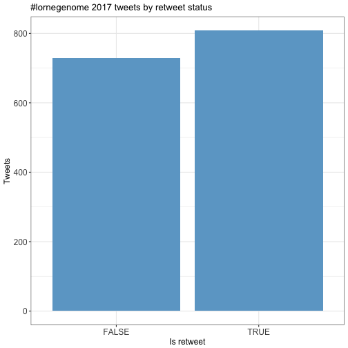

***

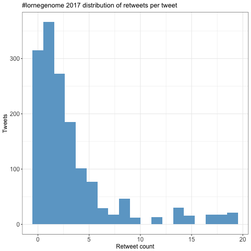

Top 10 most retweeted: 1-5
========================================================
id: top-retweets-1


|screen_name    |text                                                                                                                                                                     | retweet_count|
|:--------------|:------------------------------------------------------------------------------------------------------------------------------------------------------------------------|-------------:|
|minouye271     |Fab talk by @natar210 on creating a map of interactions b/n metabolome &amp; immune gene networks in blood! #LorneGenome https://t.co/YiDhrAXEnK https://t.co/V66yimEQkT |            19|
|sritchie73     |This cockatoo finally managed to steal a caramel slice #LorneGenome https://t.co/rqfStYXnM0                                                                              |            17|
|AliciaOshlack  |9 Aboriginal elders are authors on the DNA sequencing Nature paper #lorneGenome https://t.co/fTyFtb74rm                                                                  |            17|
|MerlinCrossley |The polyA tail is not 'just a boring string of As - it can also contain Gs or Us' #lorneGenome https://t.co/SsuoNfCZAS                                                   |            14|
|sjturn         |#lorneGenome Advice from bioinformatics workshop, if you plan to do large data expts, get buy in early from bioinformatician so design is 👍                              |            14|

Top 10 most retweeted: 6-10
========================================================
id: top-retweets-2


|screen_name    |text                                                                                                                                        | retweet_count|
|:--------------|:-------------------------------------------------------------------------------------------------------------------------------------------|-------------:|
|MerlinCrossley |Genomics pioneer, world leader in sex determination, Jenny Graves receives the Julian Wells Medal #lorneGenome https://t.co/1PidlKiTgA      |            14|
|MelanieBahlo   |I'm at #lorneGenome &amp; looking for two new postdocs. See job ads on the board. Looking forward to talking to interested individuals.     |            12|
|nanopore       |We are at #LorneGenome @genomeconf tomorrow at Booth #37 - and we're giving away a MinION! Come and see us to enter!                        |            10|
|AliciaOshlack  |KN: economics of using genomics in childhood syndromes overwhelmingly supports exome sequencing tests https://t.co/IRomL9y9Ic #lorneGenome  |             9|
|AliciaOshlack  |Shelly Berger invites students to look at the epigenetics research going at Penn Epigenetics Institute #lorneGenome https://t.co/nOpmC09KKH |             8|

Favorites
========================================================
id: favorites

<div class="footer" style="font-size:60%;">
Favorites per tweet follow a more classical long-tailed distribution than retweets, with most tweets receiving zero favorites. However, the most-favorited tweets receive more votes than the most retweeted.
</div>

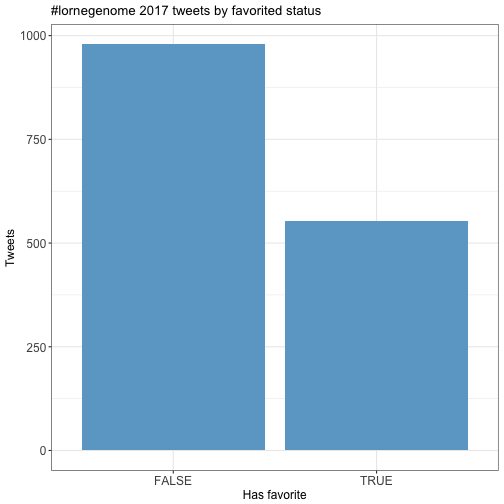

***


Top 10 most favorited: 1-5
========================================================
id: top-favorites-1


|screen_name   |text                                                                                                     | favorite_count|
|:-------------|:--------------------------------------------------------------------------------------------------------|--------------:|
|sritchie73    |This cockatoo finally managed to steal a caramel slice #LorneGenome https://t.co/rqfStYXnM0              |             49|
|AliciaOshlack |9 Aboriginal elders are authors on the DNA sequencing Nature paper #lorneGenome https://t.co/fTyFtb74rm  |             35|
|AliciaOshlack |Platypus has 10 sex chromosomes! #lorneGenome @ProfJennyGraves                                           |             25|
|qinqin_huang  |didn't expect it would be so great talking to people I don't know!! #LorneGenome https://t.co/qE2PLvGFN8 |             22|
|AliciaOshlack |Yay!!! @hdashnow wins a poster prize at #lorneGenome                                                     |             21|

Top 10 most favorited: 6-10
========================================================
id: top-favorites-2


|screen_name    |text                                                                                                                                                                     | favorite_count|
|:--------------|:------------------------------------------------------------------------------------------------------------------------------------------------------------------------|--------------:|
|minouye271     |What happens when u tell ur PhD student to just order a bunch of stuff @sritchie73 #LorneGenome https://t.co/xY7nvEhfwx                                                  |             21|
|MerlinCrossley |The polyA tail is not 'just a boring string of As - it can also contain Gs or Us' #lorneGenome https://t.co/SsuoNfCZAS                                                   |             21|
|sjturn         |#lorneGenome Advice from bioinformatics workshop, if you plan to do large data expts, get buy in early from bioinformatician so design is 👍                              |             20|
|MerlinCrossley |Genomics pioneer, world leader in sex determination, Jenny Graves receives the Julian Wells Medal #lorneGenome https://t.co/1PidlKiTgA                                   |             18|
|minouye271     |Fab talk by @natar210 on creating a map of interactions b/n metabolome &amp; immune gene networks in blood! #LorneGenome https://t.co/YiDhrAXEnK https://t.co/V66yimEQkT |             16|

Quotes
========================================================
id: quotes

<div class="footer" style="font-size:60%;">
Only a small proportion of tweets quote other tweets.
<br />
When quoted, tweets are most commonly quoted once. The most-quoted tweet was quoted 9 times.
</div>

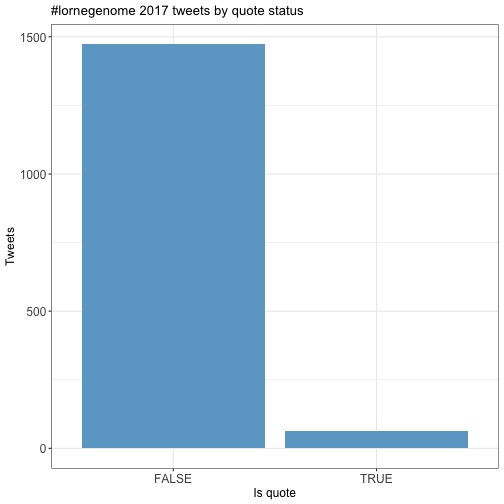

***

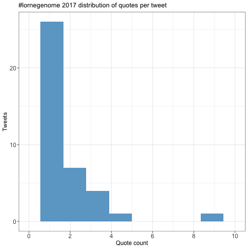

Top 10 most quoted: 1-5
========================================================
id: top-quotes-1


|screen_name     |text                                                                                                                                | quote_count|
|:---------------|:-----------------------------------------------------------------------------------------------------------------------------------|-----------:|
|kathrynpenelope |Ozren Bogdanovic is the winner of this year's Millenium Science Award for young researchers at #lorneGenome https://t.co/5lBdv7D2Jb |           9|
|lachlancoin     |I think @minouye271 currently winning this with two #lorneGenome  preprints https://t.co/XYU1i6m3Lm                                 |           4|
|laura_boykin    |Hmmmm. Australia has some work to do too. Hello #manusisland  &amp; #nauru #lorneGenome #refugee https://t.co/4SjOQaUZJ1            |           3|
|methylnick      |don't forget #biology the #bio in #bioinformatics #lornegenome #iamNOTaBioinformatician https://t.co/dCcu7V9l4o                     |           3|
|kathrynpenelope |All the Cs by the Sea at #LorneGenome https://t.co/2VAomURTBJ                                                                       |           3|

Top 10 most quoted: 6-10
========================================================
id: top-quotes-2


|screen_name     |text                                                                     | quote_count|
|:---------------|:------------------------------------------------------------------------|-----------:|
|kathrynpenelope |All the Cs by the Sea at #LorneGenome https://t.co/2VAomURTBJ            |           3|
|methylnick      |Nice to put name to face. #lornegenome https://t.co/hqBPFCEZbK           |           3|
|methylnick      |#lorneGenome next? I miss #lorne #Melbournian https://t.co/yx7yNSE8uB    |           2|
|GenomeConf      |Bruce Stillman is talking about ORC #lorneGenome https://t.co/H994xVX4HN |           2|
|GenomeConf      |Bruce Stillman is talking about ORC #lorneGenome https://t.co/H994xVX4HN |           2|

Media
========================================================
id: media

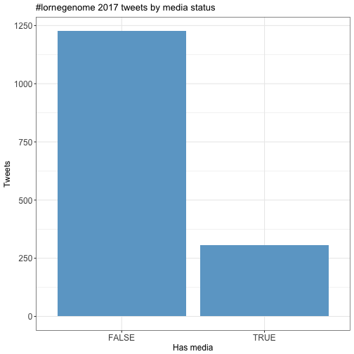

***

<div style="font-size:60%;">
A sizeable fraction (306 / 1532) of tweets have attached media files.
</div>

Most-liked media 1-5
========================================================
id: top-media-1


|screen_name    |text                                                                                                                                   | favorite_count|
|:--------------|:--------------------------------------------------------------------------------------------------------------------------------------|--------------:|
|sritchie73     |This cockatoo finally managed to steal a caramel slice #LorneGenome https://t.co/rqfStYXnM0                                            |             49|
|qinqin_huang   |didn't expect it would be so great talking to people I don't know!! #LorneGenome https://t.co/qE2PLvGFN8                               |             22|
|minouye271     |What happens when u tell ur PhD student to just order a bunch of stuff @sritchie73 #LorneGenome https://t.co/xY7nvEhfwx                |             21|
|MerlinCrossley |The polyA tail is not 'just a boring string of As - it can also contain Gs or Us' #lorneGenome https://t.co/SsuoNfCZAS                 |             21|
|MerlinCrossley |Genomics pioneer, world leader in sex determination, Jenny Graves receives the Julian Wells Medal #lorneGenome https://t.co/1PidlKiTgA |             18|

Most-liked media 6-10
========================================================
id: top-media-2


|screen_name   |text                                                                                                                                                                     | favorite_count|
|:-------------|:------------------------------------------------------------------------------------------------------------------------------------------------------------------------|--------------:|
|minouye271    |Fab talk by @natar210 on creating a map of interactions b/n metabolome &amp; immune gene networks in blood! #LorneGenome https://t.co/YiDhrAXEnK https://t.co/V66yimEQkT |             16|
|AliciaOshlack |#lorneGenome twitterati meeting IRL https://t.co/wbEB31hqTu                                                                                                              |             15|
|natar210      |@sritchie73 just won a poster award at #lorneGenome https://t.co/X3nYcvm1dK                                                                                              |             15|
|LonsBio       |It's @mincle waaaaay out in front, @brian_gloss and @AliciaOshlack neck and neck as we head into the closing lecture. #lorneGenome https://t.co/S79nnhwVPN               |             15|
|astonegenome  |Taking genomics to heart with @CSHeartResearch @sbbross  @rdbagnall @GarvanInstitute @kinghorngenomes #lorneGenome https://t.co/QzBUPsJqqs                               |             15|

Most-liked media image
========================================================
id: top-media-image


Tweet text
========================================================
id: text

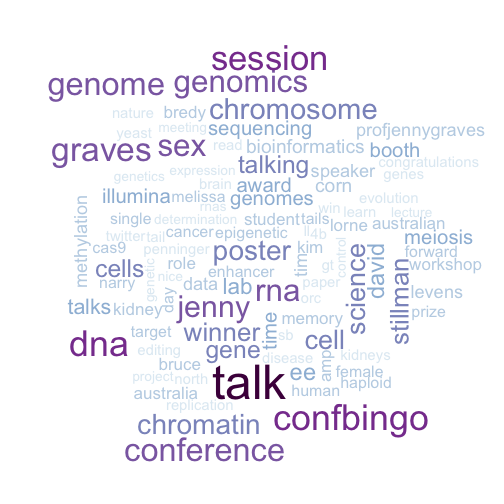

***

<div style="font-size:60%;">
Text of all non-retweets was tokenised to words. The conference hashtag, users screen names and recognisable components of URLs were removed from the word list before generation of the word cloud.
<br />
The word cloud contains the top 100 words with frequency > 3.
</div>

The end
========================================================
id: last

Thanks for reading.

_Neil Saunders_ [@neilfws](https://twitter.com/neilfws)
