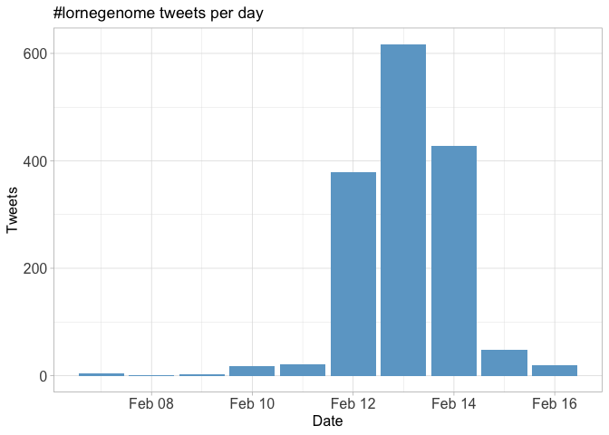
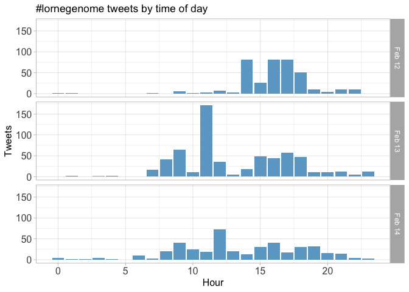
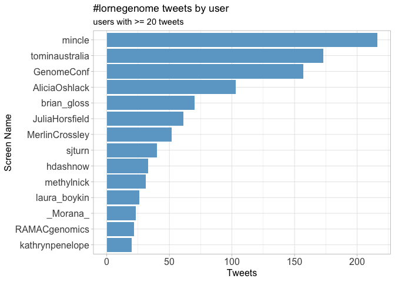
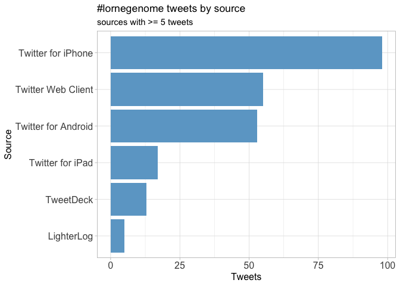
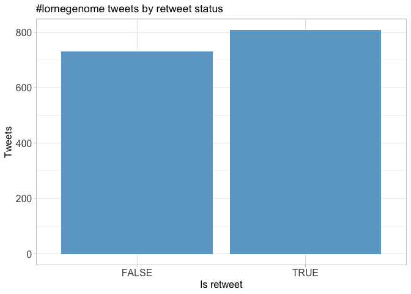
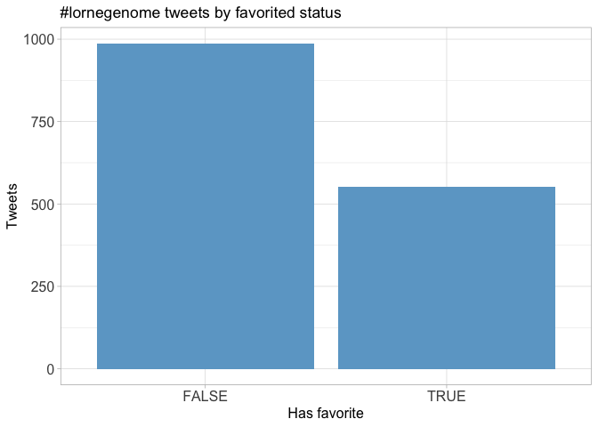
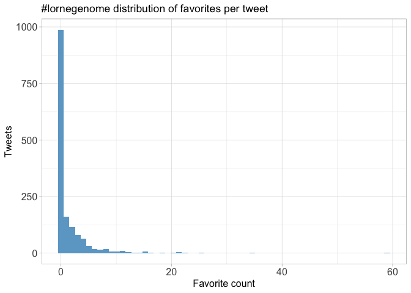
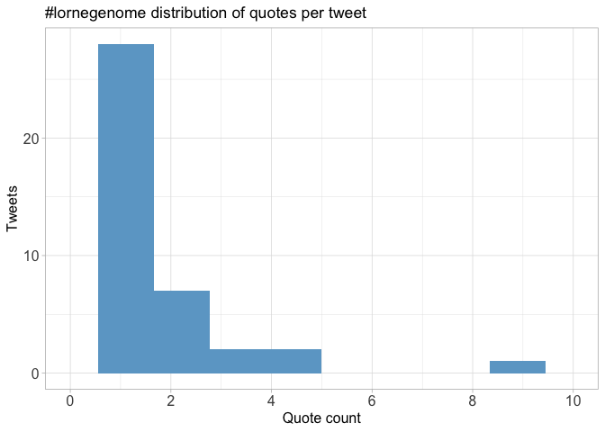
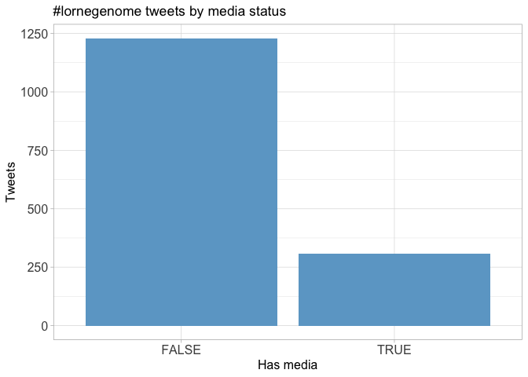
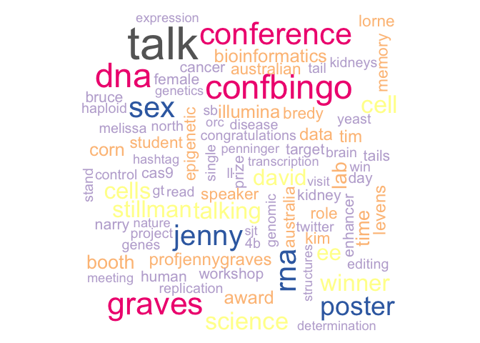

Twitter Coverage of the Lorne Genome Conference 2017
================
Neil Saunders
2018-07-16 22:50:02

Introduction
============

An analysis of tweets from the Lorne Genome 2017 meeting. 1538 tweets were collected using the `rtweet` R package:

``` r
library(rtweet)
lornegenome17 <- search_tweets("#lornegenome", 5000)
```

Timeline
========

Tweets by day
-------------



Tweets by day and time
----------------------

Filtered for dates February 12-14, Melbourne time. 

Users
=====

Top tweeters
------------



Sources
-------



Networks
========

Replies
-------

The "replies network", composed from users who reply directly to one another.

Better to view the original PNG file in the `data` directory.


Mentions
--------

The "mentions network", where users mention other users in their tweets.

Better to view the original PNG file in the `data` directory.


Retweets
========

Retweet proportion
------------------



Retweet count
-------------


Top retweets
------------

<table style="width:90%;">
<colgroup>
<col width="23%" />
<col width="45%" />
<col width="20%" />
</colgroup>
<thead>
<tr class="header">
<th align="left">screen_name</th>
<th align="left">text</th>
<th align="right">retweet_count</th>
</tr>
</thead>
<tbody>
<tr class="odd">
<td align="left">minouye271</td>
<td align="left">Fab talk by <span class="citation">@natar210</span> on creating a map of interactions b/n metabolome &amp; immune gene networks in blood! #LorneGenome <a href="https://t.co/YiDhrAXEnK" class="uri">https://t.co/YiDhrAXEnK</a> <a href="https://t.co/V66yimEQkT" class="uri">https://t.co/V66yimEQkT</a></td>
<td align="right">19</td>
</tr>
<tr class="even">
<td align="left">sritchie73</td>
<td align="left">This cockatoo finally managed to steal a caramel slice #LorneGenome <a href="https://t.co/rqfStYXnM0" class="uri">https://t.co/rqfStYXnM0</a></td>
<td align="right">18</td>
</tr>
<tr class="odd">
<td align="left">AliciaOshlack</td>
<td align="left">9 Aboriginal elders are authors on the DNA sequencing Nature paper #lorneGenome <a href="https://t.co/fTyFtb74rm" class="uri">https://t.co/fTyFtb74rm</a></td>
<td align="right">17</td>
</tr>
<tr class="even">
<td align="left">MerlinCrossley</td>
<td align="left">The polyA tail is not 'just a boring string of As - it can also contain Gs or Us' #lorneGenome <a href="https://t.co/SsuoNfCZAS" class="uri">https://t.co/SsuoNfCZAS</a></td>
<td align="right">15</td>
</tr>
<tr class="odd">
<td align="left">sjturn</td>
<td align="left">#lorneGenome Advice from bioinformatics workshop, if you plan to do large data expts, get buy in early from bioinformatician so design is 👍</td>
<td align="right">14</td>
</tr>
<tr class="even">
<td align="left">MerlinCrossley</td>
<td align="left">Genomics pioneer, world leader in sex determination, Jenny Graves receives the Julian Wells Medal #lorneGenome <a href="https://t.co/1PidlKiTgA" class="uri">https://t.co/1PidlKiTgA</a></td>
<td align="right">14</td>
</tr>
<tr class="odd">
<td align="left">MelanieBahlo</td>
<td align="left">I'm at #lorneGenome &amp; looking for two new postdocs. See job ads on the board. Looking forward to talking to interested individuals.</td>
<td align="right">12</td>
</tr>
<tr class="even">
<td align="left">nanopore</td>
<td align="left">We are at #LorneGenome <span class="citation">@genomeconf</span> tomorrow at Booth #37 - and we're giving away a MinION! Come and see us to enter!</td>
<td align="right">10</td>
</tr>
<tr class="odd">
<td align="left">AliciaOshlack</td>
<td align="left">KN: economics of using genomics in childhood syndromes overwhelmingly supports exome sequencing tests <a href="https://t.co/IRomL9y9Ic" class="uri">https://t.co/IRomL9y9Ic</a> #lorneGenome</td>
<td align="right">9</td>
</tr>
<tr class="even">
<td align="left">AliciaOshlack</td>
<td align="left">Shelly Berger invites students to look at the epigenetics research going at Penn Epigenetics Institute #lorneGenome <a href="https://t.co/nOpmC09KKH" class="uri">https://t.co/nOpmC09KKH</a></td>
<td align="right">8</td>
</tr>
</tbody>
</table>

Favourites
==========

Favourite proportion
--------------------



Favourite count
---------------



Top favourites
--------------

<table style="width:92%;">
<colgroup>
<col width="23%" />
<col width="45%" />
<col width="22%" />
</colgroup>
<thead>
<tr class="header">
<th align="left">screen_name</th>
<th align="left">text</th>
<th align="right">favorite_count</th>
</tr>
</thead>
<tbody>
<tr class="odd">
<td align="left">sritchie73</td>
<td align="left">This cockatoo finally managed to steal a caramel slice #LorneGenome <a href="https://t.co/rqfStYXnM0" class="uri">https://t.co/rqfStYXnM0</a></td>
<td align="right">59</td>
</tr>
<tr class="even">
<td align="left">AliciaOshlack</td>
<td align="left">9 Aboriginal elders are authors on the DNA sequencing Nature paper #lorneGenome <a href="https://t.co/fTyFtb74rm" class="uri">https://t.co/fTyFtb74rm</a></td>
<td align="right">35</td>
</tr>
<tr class="odd">
<td align="left">AliciaOshlack</td>
<td align="left">Platypus has 10 sex chromosomes! #lorneGenome <span class="citation">@ProfJennyGraves</span></td>
<td align="right">25</td>
</tr>
<tr class="even">
<td align="left">qinqin_huang</td>
<td align="left">didn't expect it would be so great talking to people I don't know!! #LorneGenome <a href="https://t.co/qE2PLvGFN8" class="uri">https://t.co/qE2PLvGFN8</a></td>
<td align="right">22</td>
</tr>
<tr class="odd">
<td align="left">AliciaOshlack</td>
<td align="left">Yay!!! <span class="citation">@hdashnow</span> wins a poster prize at #lorneGenome</td>
<td align="right">21</td>
</tr>
<tr class="even">
<td align="left">minouye271</td>
<td align="left">What happens when u tell ur PhD student to just order a bunch of stuff <span class="citation">@sritchie73</span> #LorneGenome <a href="https://t.co/xY7nvEhfwx" class="uri">https://t.co/xY7nvEhfwx</a></td>
<td align="right">21</td>
</tr>
<tr class="odd">
<td align="left">MerlinCrossley</td>
<td align="left">The polyA tail is not 'just a boring string of As - it can also contain Gs or Us' #lorneGenome <a href="https://t.co/SsuoNfCZAS" class="uri">https://t.co/SsuoNfCZAS</a></td>
<td align="right">21</td>
</tr>
<tr class="even">
<td align="left">sjturn</td>
<td align="left">#lorneGenome Advice from bioinformatics workshop, if you plan to do large data expts, get buy in early from bioinformatician so design is 👍</td>
<td align="right">20</td>
</tr>
<tr class="odd">
<td align="left">MerlinCrossley</td>
<td align="left">Genomics pioneer, world leader in sex determination, Jenny Graves receives the Julian Wells Medal #lorneGenome <a href="https://t.co/1PidlKiTgA" class="uri">https://t.co/1PidlKiTgA</a></td>
<td align="right">18</td>
</tr>
<tr class="even">
<td align="left">minouye271</td>
<td align="left">Fab talk by <span class="citation">@natar210</span> on creating a map of interactions b/n metabolome &amp; immune gene networks in blood! #LorneGenome <a href="https://t.co/YiDhrAXEnK" class="uri">https://t.co/YiDhrAXEnK</a> <a href="https://t.co/V66yimEQkT" class="uri">https://t.co/V66yimEQkT</a></td>
<td align="right">16</td>
</tr>
</tbody>
</table>

Quotes
======

Quote proportion
----------------


Quote count
-----------



Top quotes
----------

<table style="width:89%;">
<colgroup>
<col width="25%" />
<col width="45%" />
<col width="18%" />
</colgroup>
<thead>
<tr class="header">
<th align="left">screen_name</th>
<th align="left">text</th>
<th align="right">quote_count</th>
</tr>
</thead>
<tbody>
<tr class="odd">
<td align="left">kathrynpenelope</td>
<td align="left">Ozren Bogdanovic is the winner of this year's Millenium Science Award for young researchers at #lorneGenome <a href="https://t.co/5lBdv7D2Jb" class="uri">https://t.co/5lBdv7D2Jb</a></td>
<td align="right">9</td>
</tr>
<tr class="even">
<td align="left">laura_boykin</td>
<td align="left">Hmmmm. Australia has some work to do too. Hello #manusisland &amp; #nauru #lorneGenome #refugee <a href="https://t.co/4SjOQaUZJ1" class="uri">https://t.co/4SjOQaUZJ1</a></td>
<td align="right">4</td>
</tr>
<tr class="odd">
<td align="left">lachlancoin</td>
<td align="left">I think <span class="citation">@minouye271</span> currently winning this with two #lorneGenome preprints <a href="https://t.co/XYU1i6m3Lm" class="uri">https://t.co/XYU1i6m3Lm</a></td>
<td align="right">4</td>
</tr>
<tr class="even">
<td align="left">methylnick</td>
<td align="left">don't forget #biology the #bio in #bioinformatics #lornegenome #iamNOTaBioinformatician <a href="https://t.co/dCcu7V9l4o" class="uri">https://t.co/dCcu7V9l4o</a></td>
<td align="right">3</td>
</tr>
<tr class="odd">
<td align="left">methylnick</td>
<td align="left">Nice to put name to face. #lornegenome <a href="https://t.co/hqBPFCEZbK" class="uri">https://t.co/hqBPFCEZbK</a></td>
<td align="right">3</td>
</tr>
<tr class="even">
<td align="left">methylnick</td>
<td align="left">#lorneGenome next? I miss #lorne #Melbournian <a href="https://t.co/yx7yNSE8uB" class="uri">https://t.co/yx7yNSE8uB</a></td>
<td align="right">2</td>
</tr>
<tr class="odd">
<td align="left">AliciaOshlack</td>
<td align="left">Poster 111 tonight at #lorneGenome! Detecting pathogenic STR expansions with WGS by my PhD student <span class="citation">@hdashnow</span> <a href="https://t.co/Yi80CiLEH8" class="uri">https://t.co/Yi80CiLEH8</a></td>
<td align="right">2</td>
</tr>
<tr class="even">
<td align="left">kathrynpenelope</td>
<td align="left">All the Cs by the Sea at #LorneGenome <a href="https://t.co/2VAomURTBJ" class="uri">https://t.co/2VAomURTBJ</a></td>
<td align="right">2</td>
</tr>
<tr class="odd">
<td align="left">CSHeartResearch</td>
<td align="left">Well presented to an international crowd at #LorneGenome #HCM #ancestry <a href="https://t.co/BYdwJ6MzGS" class="uri">https://t.co/BYdwJ6MzGS</a></td>
<td align="right">2</td>
</tr>
<tr class="even">
<td align="left">minouye271</td>
<td align="left">Awesome PhD student <span class="citation">@qinqin_huang</span> &amp; her poster at #LorneGenome. Watch out for this one!! <a href="https://t.co/jXWjcDmYsX" class="uri">https://t.co/jXWjcDmYsX</a></td>
<td align="right">2</td>
</tr>
</tbody>
</table>

Media
=====

Media count
-----------



Top media
---------

<table style="width:92%;">
<colgroup>
<col width="23%" />
<col width="45%" />
<col width="22%" />
</colgroup>
<thead>
<tr class="header">
<th align="left">screen_name</th>
<th align="left">text</th>
<th align="right">favorite_count</th>
</tr>
</thead>
<tbody>
<tr class="odd">
<td align="left">sritchie73</td>
<td align="left">This cockatoo finally managed to steal a caramel slice #LorneGenome <a href="https://t.co/rqfStYXnM0" class="uri">https://t.co/rqfStYXnM0</a></td>
<td align="right">59</td>
</tr>
<tr class="even">
<td align="left">qinqin_huang</td>
<td align="left">didn't expect it would be so great talking to people I don't know!! #LorneGenome <a href="https://t.co/qE2PLvGFN8" class="uri">https://t.co/qE2PLvGFN8</a></td>
<td align="right">22</td>
</tr>
<tr class="odd">
<td align="left">minouye271</td>
<td align="left">What happens when u tell ur PhD student to just order a bunch of stuff <span class="citation">@sritchie73</span> #LorneGenome <a href="https://t.co/xY7nvEhfwx" class="uri">https://t.co/xY7nvEhfwx</a></td>
<td align="right">21</td>
</tr>
<tr class="even">
<td align="left">MerlinCrossley</td>
<td align="left">The polyA tail is not 'just a boring string of As - it can also contain Gs or Us' #lorneGenome <a href="https://t.co/SsuoNfCZAS" class="uri">https://t.co/SsuoNfCZAS</a></td>
<td align="right">21</td>
</tr>
<tr class="odd">
<td align="left">MerlinCrossley</td>
<td align="left">Genomics pioneer, world leader in sex determination, Jenny Graves receives the Julian Wells Medal #lorneGenome <a href="https://t.co/1PidlKiTgA" class="uri">https://t.co/1PidlKiTgA</a></td>
<td align="right">18</td>
</tr>
<tr class="even">
<td align="left">minouye271</td>
<td align="left">Fab talk by <span class="citation">@natar210</span> on creating a map of interactions b/n metabolome &amp; immune gene networks in blood! #LorneGenome <a href="https://t.co/YiDhrAXEnK" class="uri">https://t.co/YiDhrAXEnK</a> <a href="https://t.co/V66yimEQkT" class="uri">https://t.co/V66yimEQkT</a></td>
<td align="right">16</td>
</tr>
<tr class="odd">
<td align="left">AliciaOshlack</td>
<td align="left">#lorneGenome twitterati meeting IRL <a href="https://t.co/wbEB31hqTu" class="uri">https://t.co/wbEB31hqTu</a></td>
<td align="right">15</td>
</tr>
<tr class="even">
<td align="left">natar210</td>
<td align="left"><span class="citation">@sritchie73</span> just won a poster award at #lorneGenome <a href="https://t.co/X3nYcvm1dK" class="uri">https://t.co/X3nYcvm1dK</a></td>
<td align="right">15</td>
</tr>
<tr class="odd">
<td align="left">LonsBio</td>
<td align="left">It's <span class="citation">@mincle</span> waaaaay out in front, <span class="citation">@brian_gloss</span> and <span class="citation">@AliciaOshlack</span> neck and neck as we head into the closing lecture. #lorneGenome <a href="https://t.co/S79nnhwVPN" class="uri">https://t.co/S79nnhwVPN</a></td>
<td align="right">15</td>
</tr>
<tr class="even">
<td align="left">astonegenome</td>
<td align="left">Taking genomics to heart with <span class="citation">@CSHeartResearch</span> <span class="citation">@sbbross</span> <span class="citation">@rdbagnall</span> <span class="citation">@GarvanInstitute</span> <span class="citation">@kinghorngenomes</span> #lorneGenome <a href="https://t.co/QzBUPsJqqs" class="uri">https://t.co/QzBUPsJqqs</a></td>
<td align="right">15</td>
</tr>
</tbody>
</table>

### Most liked media image


Tweet text
==========

The 100 words used 3 or more times.


