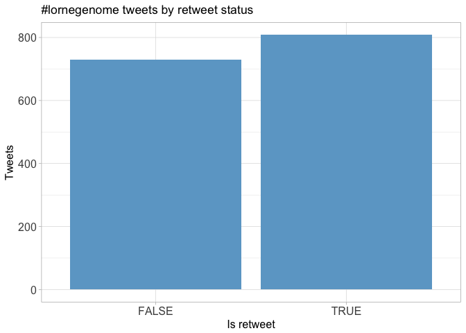
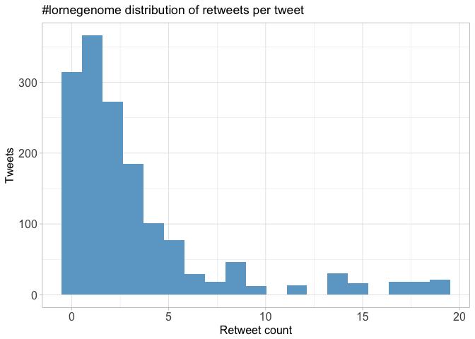
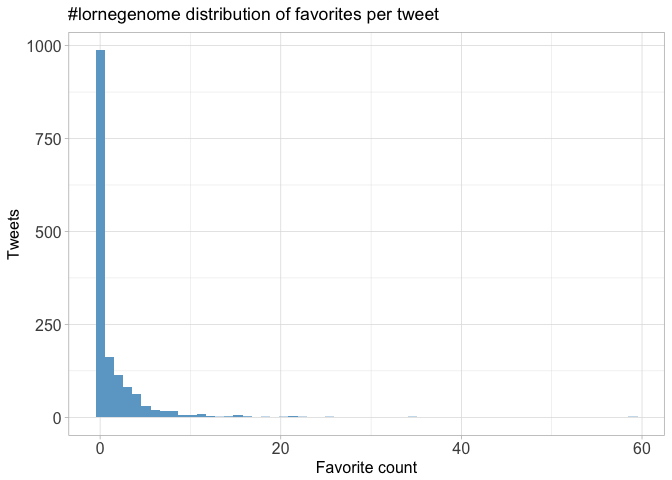
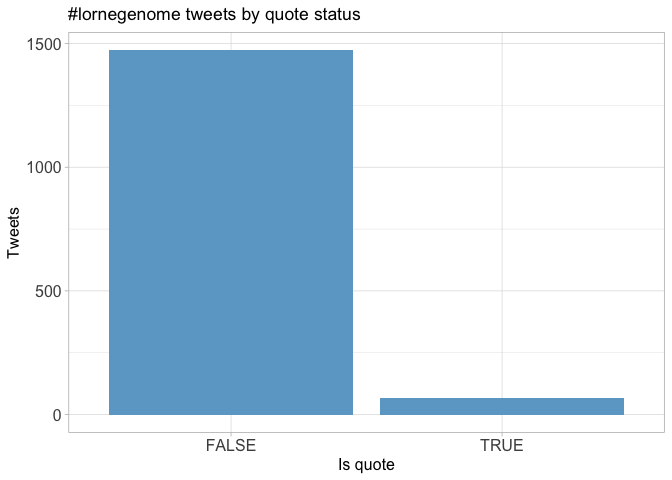
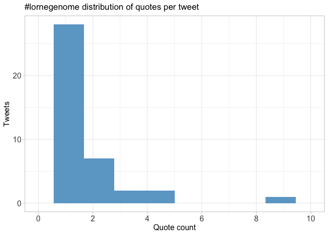
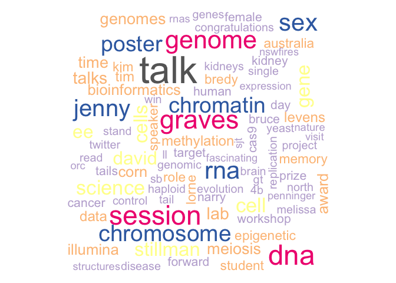

Twitter Coverage of the Lorne Genome Conference 2017
================
Neil Saunders
2018-03-16 21:26:48

# Introduction

An analysis of tweets from the Lorne Genome 2017 meeting. 1538 tweets
were collected using the `rtweet` R package:

``` r
library(rtweet)
lornegenome17 <- search_tweets("#lornegenome", 5000)
```

# Timeline

## Tweets by day

<!-- -->

## Tweets by day and time

Filtered for dates February 12-14, Melbourne time.
<!-- -->

# Users

## Top tweeters

<!-- -->

## Sources

<!-- -->

# Networks

## Replies

The “replies network”, composed from users who reply directly to one
another.

Better to view the original PNG file in the `data` directory.


## Mentions

The “mentions network”, where users mention other users in their tweets.

Better to view the original PNG file in the `data` directory.


# Retweets

## Retweet proportion

<!-- -->

## Retweet count

<!-- -->

## Top retweets

<table>

<thead>

<tr>

<th style="text-align:left;">

screen\_name

</th>

<th style="text-align:left;">

text

</th>

<th style="text-align:right;">

retweet\_count

</th>

</tr>

</thead>

<tbody>

<tr>

<td style="text-align:left;">

minouye271

</td>

<td style="text-align:left;">

Fab talk by @natar210 on creating a map of interactions b/n metabolome
\&amp; immune gene networks in blood\! \#LorneGenome
<https://t.co/YiDhrAXEnK> <https://t.co/V66yimEQkT>

</td>

<td style="text-align:right;">

19

</td>

</tr>

<tr>

<td style="text-align:left;">

sritchie73

</td>

<td style="text-align:left;">

This cockatoo finally managed to steal a caramel slice \#LorneGenome
<https://t.co/rqfStYXnM0>

</td>

<td style="text-align:right;">

18

</td>

</tr>

<tr>

<td style="text-align:left;">

AliciaOshlack

</td>

<td style="text-align:left;">

9 Aboriginal elders are authors on the DNA sequencing Nature paper
\#lorneGenome <https://t.co/fTyFtb74rm>

</td>

<td style="text-align:right;">

17

</td>

</tr>

<tr>

<td style="text-align:left;">

MerlinCrossley

</td>

<td style="text-align:left;">

The polyA tail is not ‘just a boring string of As - it can also contain
Gs or Us’ \#lorneGenome <https://t.co/SsuoNfCZAS>

</td>

<td style="text-align:right;">

15

</td>

</tr>

<tr>

<td style="text-align:left;">

sjturn

</td>

<td style="text-align:left;">

\#lorneGenome Advice from bioinformatics workshop, if you plan to do
large data expts, get buy in early from bioinformatician so design is 👍

</td>

<td style="text-align:right;">

14

</td>

</tr>

<tr>

<td style="text-align:left;">

MerlinCrossley

</td>

<td style="text-align:left;">

Genomics pioneer, world leader in sex determination, Jenny Graves
receives the Julian Wells Medal \#lorneGenome <https://t.co/1PidlKiTgA>

</td>

<td style="text-align:right;">

14

</td>

</tr>

<tr>

<td style="text-align:left;">

MelanieBahlo

</td>

<td style="text-align:left;">

I’m at \#lorneGenome \&amp; looking for two new postdocs. See job ads on
the board. Looking forward to talking to interested individuals.

</td>

<td style="text-align:right;">

12

</td>

</tr>

<tr>

<td style="text-align:left;">

nanopore

</td>

<td style="text-align:left;">

We are at \#LorneGenome @genomeconf tomorrow at Booth \#37 - and we’re
giving away a MinION\! Come and see us to enter\!

</td>

<td style="text-align:right;">

10

</td>

</tr>

<tr>

<td style="text-align:left;">

AliciaOshlack

</td>

<td style="text-align:left;">

KN: economics of using genomics in childhood syndromes overwhelmingly
supports exome sequencing tests <https://t.co/IRomL9y9Ic> \#lorneGenome

</td>

<td style="text-align:right;">

9

</td>

</tr>

<tr>

<td style="text-align:left;">

AliciaOshlack

</td>

<td style="text-align:left;">

Shelly Berger invites students to look at the epigenetics research going
at Penn Epigenetics Institute \#lorneGenome <https://t.co/nOpmC09KKH>

</td>

<td style="text-align:right;">

8

</td>

</tr>

</tbody>

</table>

# Favourites

## Favourite proportion

<!-- -->

## Favourite count

<!-- -->

## Top favourites

<table>

<thead>

<tr>

<th style="text-align:left;">

screen\_name

</th>

<th style="text-align:left;">

text

</th>

<th style="text-align:right;">

favorite\_count

</th>

</tr>

</thead>

<tbody>

<tr>

<td style="text-align:left;">

sritchie73

</td>

<td style="text-align:left;">

This cockatoo finally managed to steal a caramel slice \#LorneGenome
<https://t.co/rqfStYXnM0>

</td>

<td style="text-align:right;">

59

</td>

</tr>

<tr>

<td style="text-align:left;">

AliciaOshlack

</td>

<td style="text-align:left;">

9 Aboriginal elders are authors on the DNA sequencing Nature paper
\#lorneGenome <https://t.co/fTyFtb74rm>

</td>

<td style="text-align:right;">

35

</td>

</tr>

<tr>

<td style="text-align:left;">

AliciaOshlack

</td>

<td style="text-align:left;">

Platypus has 10 sex chromosomes\! \#lorneGenome @ProfJennyGraves

</td>

<td style="text-align:right;">

25

</td>

</tr>

<tr>

<td style="text-align:left;">

qinqin\_huang

</td>

<td style="text-align:left;">

didn’t expect it would be so great talking to people I don’t know\!\!
\#LorneGenome <https://t.co/qE2PLvGFN8>

</td>

<td style="text-align:right;">

22

</td>

</tr>

<tr>

<td style="text-align:left;">

AliciaOshlack

</td>

<td style="text-align:left;">

Yay\!\!\! @hdashnow wins a poster prize at \#lorneGenome

</td>

<td style="text-align:right;">

21

</td>

</tr>

<tr>

<td style="text-align:left;">

minouye271

</td>

<td style="text-align:left;">

What happens when u tell ur PhD student to just order a bunch of stuff
@sritchie73 \#LorneGenome <https://t.co/xY7nvEhfwx>

</td>

<td style="text-align:right;">

21

</td>

</tr>

<tr>

<td style="text-align:left;">

MerlinCrossley

</td>

<td style="text-align:left;">

The polyA tail is not ‘just a boring string of As - it can also contain
Gs or Us’ \#lorneGenome <https://t.co/SsuoNfCZAS>

</td>

<td style="text-align:right;">

21

</td>

</tr>

<tr>

<td style="text-align:left;">

sjturn

</td>

<td style="text-align:left;">

\#lorneGenome Advice from bioinformatics workshop, if you plan to do
large data expts, get buy in early from bioinformatician so design is 👍

</td>

<td style="text-align:right;">

20

</td>

</tr>

<tr>

<td style="text-align:left;">

MerlinCrossley

</td>

<td style="text-align:left;">

Genomics pioneer, world leader in sex determination, Jenny Graves
receives the Julian Wells Medal \#lorneGenome <https://t.co/1PidlKiTgA>

</td>

<td style="text-align:right;">

18

</td>

</tr>

<tr>

<td style="text-align:left;">

minouye271

</td>

<td style="text-align:left;">

Fab talk by @natar210 on creating a map of interactions b/n metabolome
\&amp; immune gene networks in blood\! \#LorneGenome
<https://t.co/YiDhrAXEnK> <https://t.co/V66yimEQkT>

</td>

<td style="text-align:right;">

16

</td>

</tr>

</tbody>

</table>

# Quotes

## Quote proportion

<!-- -->

## Quote count

<!-- -->

## Top quotes

<table>

<thead>

<tr>

<th style="text-align:left;">

screen\_name

</th>

<th style="text-align:left;">

text

</th>

<th style="text-align:right;">

quote\_count

</th>

</tr>

</thead>

<tbody>

<tr>

<td style="text-align:left;">

kathrynpenelope

</td>

<td style="text-align:left;">

Ozren Bogdanovic is the winner of this year’s Millenium Science Award
for young researchers at \#lorneGenome <https://t.co/5lBdv7D2Jb>

</td>

<td style="text-align:right;">

9

</td>

</tr>

<tr>

<td style="text-align:left;">

laura\_boykin

</td>

<td style="text-align:left;">

Hmmmm. Australia has some work to do too. Hello \#manusisland \&amp;
\#nauru \#lorneGenome \#refugee <https://t.co/4SjOQaUZJ1>

</td>

<td style="text-align:right;">

4

</td>

</tr>

<tr>

<td style="text-align:left;">

lachlancoin

</td>

<td style="text-align:left;">

I think @minouye271 currently winning this with two \#lorneGenome
preprints <https://t.co/XYU1i6m3Lm>

</td>

<td style="text-align:right;">

4

</td>

</tr>

<tr>

<td style="text-align:left;">

methylnick

</td>

<td style="text-align:left;">

don’t forget \#biology the \#bio in \#bioinformatics \#lornegenome
\#iamNOTaBioinformatician <https://t.co/dCcu7V9l4o>

</td>

<td style="text-align:right;">

3

</td>

</tr>

<tr>

<td style="text-align:left;">

methylnick

</td>

<td style="text-align:left;">

Nice to put name to face. \#lornegenome <https://t.co/hqBPFCEZbK>

</td>

<td style="text-align:right;">

3

</td>

</tr>

<tr>

<td style="text-align:left;">

methylnick

</td>

<td style="text-align:left;">

\#lorneGenome next? I miss \#lorne \#Melbournian
<https://t.co/yx7yNSE8uB>

</td>

<td style="text-align:right;">

2

</td>

</tr>

<tr>

<td style="text-align:left;">

AliciaOshlack

</td>

<td style="text-align:left;">

Poster 111 tonight at \#lorneGenome\! Detecting pathogenic STR
expansions with WGS by my PhD student @hdashnow
<https://t.co/Yi80CiLEH8>

</td>

<td style="text-align:right;">

2

</td>

</tr>

<tr>

<td style="text-align:left;">

kathrynpenelope

</td>

<td style="text-align:left;">

All the Cs by the Sea at \#LorneGenome <https://t.co/2VAomURTBJ>

</td>

<td style="text-align:right;">

2

</td>

</tr>

<tr>

<td style="text-align:left;">

CSHeartResearch

</td>

<td style="text-align:left;">

Well presented to an international crowd at \#LorneGenome \#HCM
\#ancestry <https://t.co/BYdwJ6MzGS>

</td>

<td style="text-align:right;">

2

</td>

</tr>

<tr>

<td style="text-align:left;">

minouye271

</td>

<td style="text-align:left;">

Awesome PhD student @qinqin\_huang \&amp; her poster at \#LorneGenome.
Watch out for this one\!\! <https://t.co/jXWjcDmYsX>

</td>

<td style="text-align:right;">

2

</td>

</tr>

</tbody>

</table>

# Media

## Media count

<!-- -->

## Top media

<table>

<thead>

<tr>

<th style="text-align:left;">

screen\_name

</th>

<th style="text-align:left;">

text

</th>

<th style="text-align:right;">

favorite\_count

</th>

</tr>

</thead>

<tbody>

<tr>

<td style="text-align:left;">

sritchie73

</td>

<td style="text-align:left;">

This cockatoo finally managed to steal a caramel slice \#LorneGenome
<https://t.co/rqfStYXnM0>

</td>

<td style="text-align:right;">

59

</td>

</tr>

<tr>

<td style="text-align:left;">

qinqin\_huang

</td>

<td style="text-align:left;">

didn’t expect it would be so great talking to people I don’t know\!\!
\#LorneGenome <https://t.co/qE2PLvGFN8>

</td>

<td style="text-align:right;">

22

</td>

</tr>

<tr>

<td style="text-align:left;">

minouye271

</td>

<td style="text-align:left;">

What happens when u tell ur PhD student to just order a bunch of stuff
@sritchie73 \#LorneGenome <https://t.co/xY7nvEhfwx>

</td>

<td style="text-align:right;">

21

</td>

</tr>

<tr>

<td style="text-align:left;">

MerlinCrossley

</td>

<td style="text-align:left;">

The polyA tail is not ‘just a boring string of As - it can also contain
Gs or Us’ \#lorneGenome <https://t.co/SsuoNfCZAS>

</td>

<td style="text-align:right;">

21

</td>

</tr>

<tr>

<td style="text-align:left;">

MerlinCrossley

</td>

<td style="text-align:left;">

Genomics pioneer, world leader in sex determination, Jenny Graves
receives the Julian Wells Medal \#lorneGenome <https://t.co/1PidlKiTgA>

</td>

<td style="text-align:right;">

18

</td>

</tr>

<tr>

<td style="text-align:left;">

minouye271

</td>

<td style="text-align:left;">

Fab talk by @natar210 on creating a map of interactions b/n metabolome
\&amp; immune gene networks in blood\! \#LorneGenome
<https://t.co/YiDhrAXEnK> <https://t.co/V66yimEQkT>

</td>

<td style="text-align:right;">

16

</td>

</tr>

<tr>

<td style="text-align:left;">

AliciaOshlack

</td>

<td style="text-align:left;">

\#lorneGenome twitterati meeting IRL <https://t.co/wbEB31hqTu>

</td>

<td style="text-align:right;">

15

</td>

</tr>

<tr>

<td style="text-align:left;">

natar210

</td>

<td style="text-align:left;">

@sritchie73 just won a poster award at \#lorneGenome
<https://t.co/X3nYcvm1dK>

</td>

<td style="text-align:right;">

15

</td>

</tr>

<tr>

<td style="text-align:left;">

LonsBio

</td>

<td style="text-align:left;">

It’s @mincle waaaaay out in front, @brian\_gloss and @AliciaOshlack neck
and neck as we head into the closing lecture. \#lorneGenome
<https://t.co/S79nnhwVPN>

</td>

<td style="text-align:right;">

15

</td>

</tr>

<tr>

<td style="text-align:left;">

astonegenome

</td>

<td style="text-align:left;">

Taking genomics to heart with @CSHeartResearch @sbbross @rdbagnall
@GarvanInstitute @kinghorngenomes \#lorneGenome
<https://t.co/QzBUPsJqqs>

</td>

<td style="text-align:right;">

15

</td>

</tr>

</tbody>

</table>

### Most liked media image


# Tweet text

The 100 words used 3 or more times.

<!-- -->
