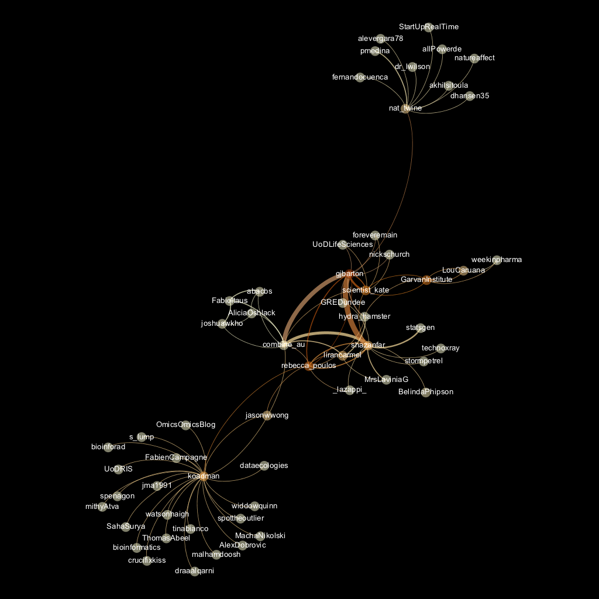

```{r setup, include=FALSE}
knitr::opts_chunk$set(echo = FALSE, message = FALSE, warning = FALSE)
library(rtweet)
library(dplyr)
library(tidyr)
library(ggplot2)
library(lubridate)
library(knitr)
library(wordcloud)
library(tidytext)
library(igraph)

theme_set(theme_light())
sbrs17 <- readRDS("../../data/sbrs17.rds")
```

# Introduction
An analysis of tweets from the Sydney Bioinformatics Research Symposium 2017. `r nrow(sbrs17)` were collected using the `rtweet` R package:

```{r search-twitter, eval=FALSE, echo=TRUE}
library(rtweet)
sbrs17 <- search_tweets("#sbrs17 OR #sbrs2017", 1000)
```

# Timeline
## Tweets by day
```{r tweets-by-day}
sbrs17 %>% 
  mutate(date = as_date(created_at, tz = "Australia/Melbourne")) %>% 
  group_by(date) %>% 
  summarise(count = n()) %>% 
  ggplot(aes(date, count)) + geom_col(fill = "skyblue3") +  
    labs(x = "Date", y = "Tweets", title = "#sbrs 2017 tweets per day") + 
    theme(axis.text = element_text(size = 12), axis.title = element_text(size = 12))
```

## Tweets by day and time
```{r tweets-by-day-hour}
sbrs17 %>% 
  mutate(datetime = as_datetime(created_at, tz = "Australia/Melbourne"), hour = hour(datetime)) %>% 
  group_by(date = as_date(datetime), hour) %>% 
  summarise(count = n()) %>% 
#  filter(date > as_date("2017-02-11"), date < as_date("2017-02-15")) %>% 
  ggplot(aes(hour, count)) + geom_col(fill = "skyblue3") + facet_grid(date ~ .) + 
    labs(x = "Hour", y = "Tweets", title = "#sbrs 2017 tweets by time of day") + 
    theme(axis.text = element_text(size = 12), axis.title = element_text(size = 12))
```

# Users
## Top tweeters
```{r tweets-top-users}
sbrs17 %>% 
  group_by(screen_name) %>% 
  summarise(count = n()) %>% 
  filter(count >= 2) %>% 
  ggplot(aes(reorder(screen_name, count), count)) + geom_col(fill = "skyblue3") + coord_flip() + 
    labs(x = "Screen Name", y = "Tweets", title = "#sbrs 2017 tweets by user", subtitle = "users with > 1 tweets") + 
    theme(axis.text = element_text(size = 12), axis.title = element_text(size = 12))
```

## Sources
```{r tweets-top-sources}
sbrs17 %>% 
  group_by(source) %>% 
  summarise(count = n()) %>% 
  filter(count >= 2) %>% 
  ggplot(aes(reorder(source, count), count)) + geom_col(fill = "skyblue3") + coord_flip() + 
    labs(x = "Source", y = "Tweets", title = "#sbrs 2017 tweets by source", subtitle = "sources with > 1 tweets") + 
    theme(axis.text = element_text(size = 12), axis.title = element_text(size = 12))
```

# Networks
## Replies
The "replies network", composed from users who reply directly to one another, was very small for SBRS 17 and was not analysed further.

```{r reply-network, eval=FALSE}
sbrs_replies <- sbrs %>% 
  filter(!is.na(in_reply_to_status_screen_name)) %>% 
  select(screen_name, in_reply_to_status_screen_name) %>% 
  graph.data.frame(directed = TRUE)

V(sbrs_replies)$label <- V(sbrs_replies)$name
V(sbrs_replies)$id    <- V(sbrs_replies)$name

write_graph(sbrs_replies, file = "../../data/sbrs_replies.graphml", format = "graphml")
```


## Mentions
The "mentions network", where users mention other users in their tweets, was constructed as per the code in the accompanying `Rmd` file. The resulting `graphml` file was visualised using Gephi (0.9.1). Nodes and edges are coloured by pagerank value.

```{r mentions-network, eval=FALSE}
sbrs_mentions <- sbrs %>% 
  filter(!is.na(mentions_screen_name)) %>% 
  select(screen_name, mentions_screen_name) %>% 
  mutate(mentions_screen_name = strsplit(mentions_screen_name, " ")) %>% 
  unnest(mentions_screen_name) %>% 
  graph.data.frame()

V(sbrs_mentions)$label <- V(sbrs_mentions)$name
V(sbrs_mentions)$id    <- V(sbrs_mentions)$name

write_graph(sbrs_mentions, file = "sbrs_mentions.graphml", format = "graphml")
```



# Retweets
## Retweet proportion
```{r is-retweet}
sbrs17 %>% 
  group_by(is_retweet) %>% 
  summarise(count = n()) %>% 
  ggplot(aes(is_retweet, count)) + geom_col(fill = "skyblue3") + 
    labs(x = "Is retweet", y = "Tweets", title = "#sbrs 2017 tweets by retweet status") + 
    theme(axis.text = element_text(size = 12), axis.title = element_text(size = 12))
```

## Retweet count
```{r retweet-count}
sbrs17 %>% 
  ggplot(aes(retweet_count)) + geom_histogram(bins = max(sbrs17$retweet_count), fill = "skyblue3") +
    labs(x = "Retweet count", y = "Tweets", title = "#sbrs 2017 distribution of retweets per tweet") + 
    theme(axis.text = element_text(size = 12), axis.title = element_text(size = 12))
```

## Top retweets
```{r most-retweeted}
sbrs17 %>% 
  filter(is.na(retweet_status_id)) %>% 
  select(screen_name, text, retweet_count) %>% 
  arrange(desc(retweet_count)) %>% 
  distinct() %>%
  slice(1:10) %>% 
  kable()
```

# Favourites
## Favourite proportion
```{r has-favorite}
sbrs17 %>% 
  mutate(has_favorite = ifelse(favorite_count > 0, TRUE, FALSE)) %>% 
  count(has_favorite) %>%
  ggplot(aes(has_favorite, n)) + geom_col(fill = "skyblue3") + 
    labs(x = "Has favorite", y = "Tweets", title = "#sbrs 2017 tweets by favorited status") + 
    theme(axis.text = element_text(size = 12), axis.title = element_text(size = 12))
```

## Favourite count
```{r favorite-count}
sbrs17 %>% 
  ggplot(aes(favorite_count)) + geom_histogram(bins = max(sbrs17$favorite_count), fill = "skyblue3") +
    labs(x = "Favorite count", y = "Tweets", title = "#sbrs 2017 distribution of favorites per tweet") + 
    theme(axis.text = element_text(size = 12), axis.title = element_text(size = 12))
```

## Top favourites
```{r most-favorited}
sbrs17 %>% 
  select(screen_name, text, favorite_count) %>% 
  arrange(desc(favorite_count)) %>% 
  distinct() %>%
  slice(1:10) %>% 
  kable()
```

# Quotes
## Quote proportion
```{r is-quote}
sbrs17 %>% 
  group_by(is_quote_status) %>% 
  summarise(count = n()) %>% 
  ggplot(aes(is_quote_status, count)) + geom_col(fill = "skyblue3") + 
    labs(x = "Is quote", y = "Tweets", title = "#sbrs 2017 tweets by quote status") + 
    theme(axis.text = element_text(size = 12), axis.title = element_text(size = 12))
```

## Quote count
```{r quotes-count}
sbrs17 %>% 
  filter(!is.na(quote_status_id)) %>% 
  count(quote_status_id) %>% 
  ggplot(aes(n)) + geom_histogram(bins = 10, fill = "skyblue3") +
    labs(x = "Quote count", y = "Tweets", title = "#sbrs 2017 distribution of quotes per tweet") + 
    scale_x_continuous(limits = c(0, 10), breaks = seq(0, 10, 2)) + 
    theme(axis.text = element_text(size = 12), axis.title = element_text(size = 12))
```

## Top quotes
```{r most-quoted}
sbrs17 %>% 
  filter(!is.na(quote_status_id)) %>% 
  count(quote_status_id) %>% 
  filter(n > 1) %>% 
  arrange(desc(n)) %>% 
#  slice(1:10) %>% 
  inner_join(select(sbrs17, screen_name, quote_status_id, is_retweet, text)) %>% 
  filter(is_retweet == FALSE) %>% 
  select(screen_name, text, quote_count = n) %>%
  distinct() %>%
  slice(1:10) %>%
  kable()
```

# Media
## Media count
```{r has-media}
sbrs17 %>% 
  mutate(has_media = !is.na(media_id)) %>% 
  group_by(has_media) %>% 
  summarise(count = n()) %>% 
  ggplot(aes(has_media, count)) + geom_col(fill = "skyblue3") + 
    labs(x = "Has media", y = "Tweets", title = "#sbrs 2017 tweets by media status") + 
    theme(axis.text = element_text(size = 12), axis.title = element_text(size = 12))
```

## Top media
```{r liked-media}
sbrs17_media <- sbrs17 %>% 
  filter(!is.na(media_id)) %>% 
  arrange(desc(favorite_count)) %>%
  filter(favorite_count > 0)

sbrs17_media %>%
  slice(1:10) %>% 
  select(screen_name, text, favorite_count) %>%
  kable()
```

### Most liked media image


# Tweet text
The 100 words used 3 or more times.

```{r count-words}
data("stop_words")

sbrs17 %>% 
  filter(is_retweet == FALSE) %>% 
  unnest_tokens(word, text) %>% 
  select(word) %>% 
  filter(!word %in% c("sbrs17", "sbrs2017", "sbrs"), 
         word != "https", 
         word != "t.co", 
         !word %in% tolower(sbrs17$screen_name), 
         !grepl("^\\d+$", word)) %>% 
  anti_join(stop_words) %>% 
  count(word) %>% 
  with(wordcloud(word, n, max.words = 100, min.freq = 3, colors = brewer.pal(9, "BuPu")))
```

