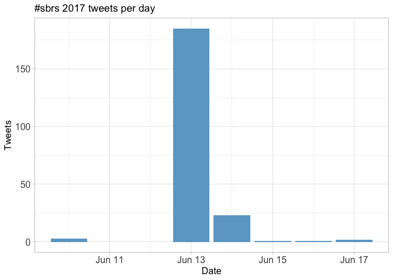
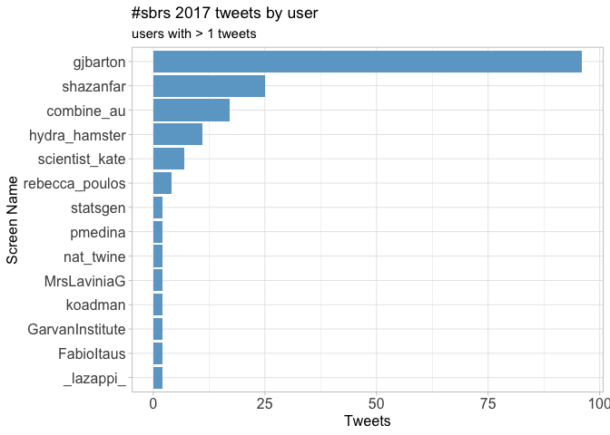
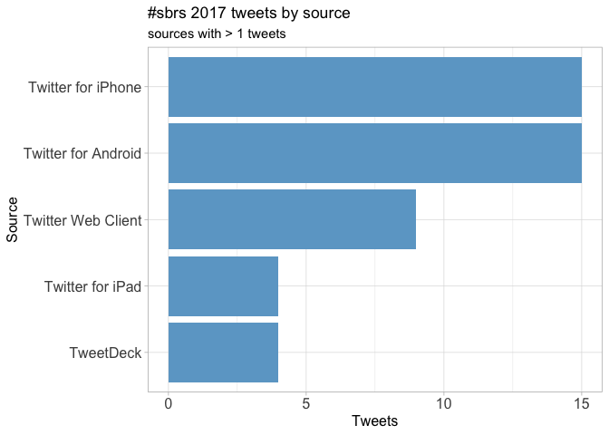
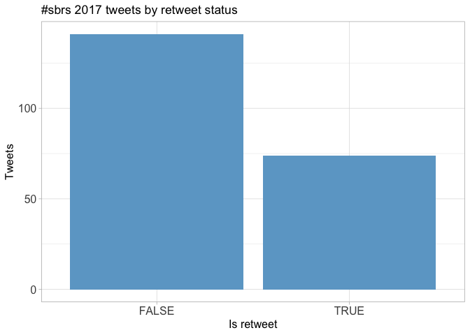
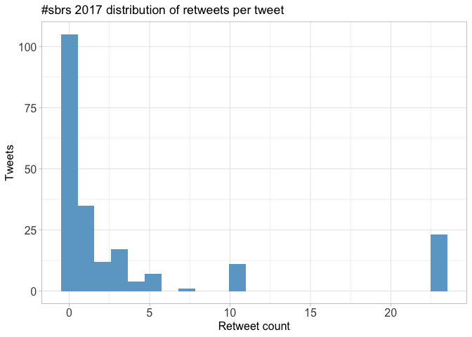
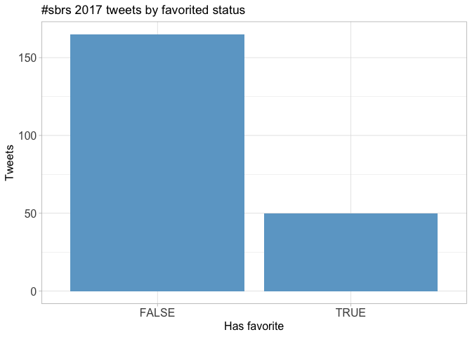
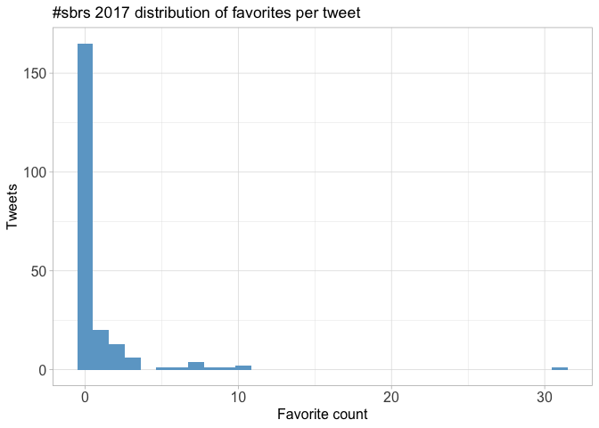
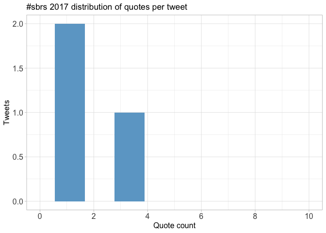
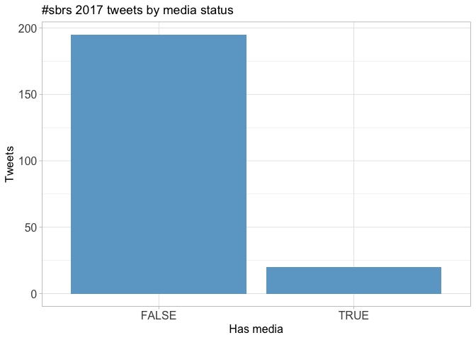
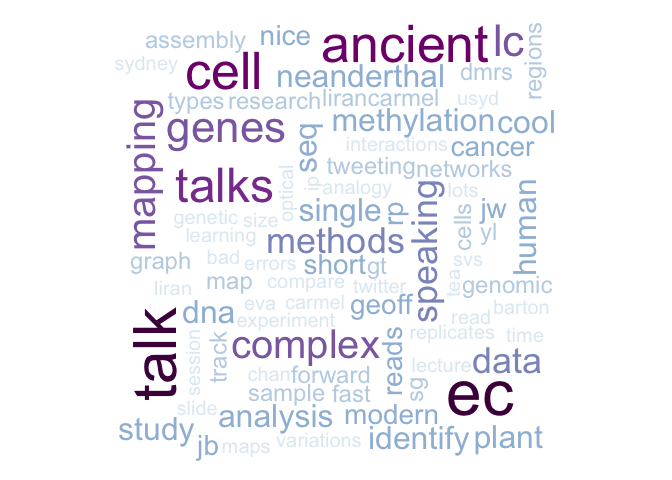

Twitter Coverage of the Sydney Bioinformatics Research Symposium 2017
================
Neil Saunders
2018-07-16 22:51:54

Introduction
============

An analysis of tweets from the Sydney Bioinformatics Research Symposium 2017. 215 tweets were collected using the `rtweet` R package:

``` r
library(rtweet)
sbrs17 <- search_tweets("#sbrs17 OR #sbrs2017", 1000)
```

Timeline
========

Tweets by day
-------------



Tweets by day and time
----------------------


Users
=====

Top tweeters
------------



Sources
-------



Networks
========

Replies
-------

The "replies network", composed from users who reply directly to one another, was very small for SBRS 17 and was not analysed further.

Mentions
--------

The "mentions network", where users mention other users in their tweets, was constructed as per the code in the accompanying `Rmd` file. The resulting `graphml` file was visualised using Gephi (0.9.1). Nodes and edges are coloured by pagerank value.


Retweets
========

Retweet proportion
------------------



Retweet count
-------------



Top retweets
------------

<table style="width:90%;">
<colgroup>
<col width="23%" />
<col width="45%" />
<col width="20%" />
</colgroup>
<thead>
<tr class="header">
<th align="left">screen_name</th>
<th align="left">text</th>
<th align="right">retweet_count</th>
</tr>
</thead>
<tbody>
<tr class="odd">
<td align="left">koadman</td>
<td align="left">Bioinformatics research as defined by Geoff Barton. Peer reviewed journal publications just one of many outputs… <a href="https://t.co/zKZA6yLPPF" class="uri">https://t.co/zKZA6yLPPF</a></td>
<td align="right">23</td>
</tr>
<tr class="even">
<td align="left">nat_twine</td>
<td align="left">Fast forward presentations at #sbrs2017 #BigData #machinelearning applications for #ALS at #CSIRO <a href="https://t.co/vTMfG94xmY" class="uri">https://t.co/vTMfG94xmY</a></td>
<td align="right">10</td>
</tr>
<tr class="odd">
<td align="left">shazanfar</td>
<td align="left">Love how <span class="citation">@gjbarton</span> has concrete recommendations for designing RNA-Seq exps. 1: Do at least 6 biological replicates! Yes! #sbrs17 #sbrs2017</td>
<td align="right">7</td>
</tr>
<tr class="even">
<td align="left">scientist_kate</td>
<td align="left">Geoff Barton - Closing invited lecture: lessons from a 48 replicate RNAseq experiment #sbrs2017 <span class="citation">@gjbarton</span> <a href="https://t.co/Sznnpj1iZ3" class="uri">https://t.co/Sznnpj1iZ3</a></td>
<td align="right">5</td>
</tr>
<tr class="odd">
<td align="left">gjbarton</td>
<td align="left">VariantSpark big data + machine learning. I really did talk too small. lovely mix of methods and applications in this meeting. #sbrs2017</td>
<td align="right">5</td>
</tr>
<tr class="even">
<td align="left">shazanfar</td>
<td align="left">In this session at #sbrs2017 #sbrs17 I'll be speaking about this work on single cell data analysis of neurons <a href="https://t.co/GFSrwlvoxl" class="uri">https://t.co/GFSrwlvoxl</a></td>
<td align="right">3</td>
</tr>
<tr class="odd">
<td align="left">gjbarton</td>
<td align="left">Ohhhh! Technical variation talk!! qPCR is not a gold standard. consensus modelling across different techniques on same sample. #sbrs2017</td>
<td align="right">3</td>
</tr>
<tr class="even">
<td align="left">rebecca_poulos</td>
<td align="left">Exciting research at #sbrs17! Ancient DNA, plant genomics, complex genomic rearrangements, and more. Now onto fast forward talks #sbrs2017</td>
<td align="right">3</td>
</tr>
<tr class="odd">
<td align="left">shazanfar</td>
<td align="left">#sbrs17 Gene ORGANizer linking disease genes to organs <span class="citation">@lirancarmel</span> <a href="https://t.co/Sju8WSDW1a" class="uri">https://t.co/Sju8WSDW1a</a></td>
<td align="right">3</td>
</tr>
<tr class="even">
<td align="left">shazanfar</td>
<td align="left">#SBRS17 Sydney Bioinformatics Research Symposium program available here <a href="https://t.co/z4Vno7yQfv" class="uri">https://t.co/z4Vno7yQfv</a></td>
<td align="right">3</td>
</tr>
</tbody>
</table>

Favourites
==========

Favourite proportion
--------------------



Favourite count
---------------



Top favourites
--------------

<table style="width:92%;">
<colgroup>
<col width="23%" />
<col width="45%" />
<col width="22%" />
</colgroup>
<thead>
<tr class="header">
<th align="left">screen_name</th>
<th align="left">text</th>
<th align="right">favorite_count</th>
</tr>
</thead>
<tbody>
<tr class="odd">
<td align="left">koadman</td>
<td align="left">Bioinformatics research as defined by Geoff Barton. Peer reviewed journal publications just one of many outputs… <a href="https://t.co/zKZA6yLPPF" class="uri">https://t.co/zKZA6yLPPF</a></td>
<td align="right">31</td>
</tr>
<tr class="even">
<td align="left">shazanfar</td>
<td align="left">Love how <span class="citation">@gjbarton</span> has concrete recommendations for designing RNA-Seq exps. 1: Do at least 6 biological replicates! Yes! #sbrs17 #sbrs2017</td>
<td align="right">10</td>
</tr>
<tr class="odd">
<td align="left">nat_twine</td>
<td align="left">Fast forward presentations at #sbrs2017 #BigData #machinelearning applications for #ALS at #CSIRO <a href="https://t.co/vTMfG94xmY" class="uri">https://t.co/vTMfG94xmY</a></td>
<td align="right">10</td>
</tr>
<tr class="even">
<td align="left">gjbarton</td>
<td align="left">I think the strong biology-led talks at a bioinformatics meeting just shows how bioinformatics is integral to modern biology. #sbrs2017</td>
<td align="right">9</td>
</tr>
<tr class="odd">
<td align="left">jasonwwong</td>
<td align="left">Great talk by <span class="citation">@rebecca_poulos</span> on patterns of genome-wide CpG methylation mutations in cancer #sbrs2017 Paper here:… <a href="https://t.co/fKFJjsElR8" class="uri">https://t.co/fKFJjsElR8</a></td>
<td align="right">8</td>
</tr>
<tr class="even">
<td align="left">statsgen</td>
<td align="left">Over 50 abstracts submitted, only 8 talks - one of them by <span class="citation">@shazanfar</span> ! Nice job <span class="citation">@shazanfar</span> ! #sbrs2017 <a href="https://t.co/H8DiQhCMDw" class="uri">https://t.co/H8DiQhCMDw</a></td>
<td align="right">7</td>
</tr>
<tr class="odd">
<td align="left">scientist_kate</td>
<td align="left">Geoff Barton - Closing invited lecture: lessons from a 48 replicate RNAseq experiment #sbrs2017 <span class="citation">@gjbarton</span> <a href="https://t.co/Sznnpj1iZ3" class="uri">https://t.co/Sznnpj1iZ3</a></td>
<td align="right">7</td>
</tr>
<tr class="even">
<td align="left">shazanfar</td>
<td align="left">In this session at #sbrs2017 #sbrs17 I'll be speaking about this work on single cell data analysis of neurons <a href="https://t.co/GFSrwlvoxl" class="uri">https://t.co/GFSrwlvoxl</a></td>
<td align="right">7</td>
</tr>
<tr class="odd">
<td align="left">rebecca_poulos</td>
<td align="left">Exciting research at #sbrs17! Ancient DNA, plant genomics, complex genomic rearrangements, and more. Now onto fast forward talks #sbrs2017</td>
<td align="right">7</td>
</tr>
<tr class="even">
<td align="left">shazanfar</td>
<td align="left">GB: <span class="citation">@gjbarton</span> showing the interplay between analysis, techniques and applications occurring within bioinformatics r… <a href="https://t.co/QcJsVLlNrt" class="uri">https://t.co/QcJsVLlNrt</a></td>
<td align="right">6</td>
</tr>
</tbody>
</table>

Quotes
======

Quote proportion
----------------


Quote count
-----------



Top quotes
----------

<table style="width:82%;">
<colgroup>
<col width="19%" />
<col width="44%" />
<col width="18%" />
</colgroup>
<thead>
<tr class="header">
<th align="left">screen_name</th>
<th align="left">text</th>
<th align="right">quote_count</th>
</tr>
</thead>
<tbody>
<tr class="odd">
<td align="left">LouCaruana</td>
<td align="left">Scientists and #biotech experts from <span class="citation">@GarvanInstitute</span> are seeking to tackle major diseases like the ebola virus.… <a href="https://t.co/4pGvQEc8JH" class="uri">https://t.co/4pGvQEc8JH</a></td>
<td align="right">3</td>
</tr>
</tbody>
</table>

Media
=====

Media count
-----------



Top media
---------

<table style="width:92%;">
<colgroup>
<col width="23%" />
<col width="45%" />
<col width="22%" />
</colgroup>
<thead>
<tr class="header">
<th align="left">screen_name</th>
<th align="left">text</th>
<th align="right">favorite_count</th>
</tr>
</thead>
<tbody>
<tr class="odd">
<td align="left">nat_twine</td>
<td align="left">Fast forward presentations at #sbrs2017 #BigData #machinelearning applications for #ALS at #CSIRO <a href="https://t.co/vTMfG94xmY" class="uri">https://t.co/vTMfG94xmY</a></td>
<td align="right">10</td>
</tr>
<tr class="even">
<td align="left">statsgen</td>
<td align="left">Over 50 abstracts submitted, only 8 talks - one of them by <span class="citation">@shazanfar</span> ! Nice job <span class="citation">@shazanfar</span> ! #sbrs2017 <a href="https://t.co/H8DiQhCMDw" class="uri">https://t.co/H8DiQhCMDw</a></td>
<td align="right">7</td>
</tr>
<tr class="odd">
<td align="left">scientist_kate</td>
<td align="left">Geoff Barton - Closing invited lecture: lessons from a 48 replicate RNAseq experiment #sbrs2017 <span class="citation">@gjbarton</span> <a href="https://t.co/Sznnpj1iZ3" class="uri">https://t.co/Sznnpj1iZ3</a></td>
<td align="right">7</td>
</tr>
<tr class="even">
<td align="left">scientist_kate</td>
<td align="left">Katherine Jackson from <span class="citation">@GarvanInstitute</span> at #SBRS2017 <a href="https://t.co/axDmupxoh3" class="uri">https://t.co/axDmupxoh3</a></td>
<td align="right">3</td>
</tr>
<tr class="odd">
<td align="left">hydra_hamster</td>
<td align="left">Optical mapping for detecting complex genomic rearrangement - now that's cool! Eva Chan <span class="citation">@GarvanInstitute</span> #SBRS17 <a href="https://t.co/m32RDq3WrV" class="uri">https://t.co/m32RDq3WrV</a></td>
<td align="right">3</td>
</tr>
<tr class="even">
<td align="left">hydra_hamster</td>
<td align="left">Impressive list of software <span class="citation">@gjbarton</span> is involved in bringing to the rest of us! #sbrs17 <a href="https://t.co/exsnWqw51M" class="uri">https://t.co/exsnWqw51M</a></td>
<td align="right">2</td>
</tr>
<tr class="odd">
<td align="left">shazanfar</td>
<td align="left">#sbrs17 DMRs between ancient neanderthal and modern human maps to face + throat + vocal cord organs <span class="citation">@lirancarmel</span> <a href="https://t.co/KpysFCGxFt" class="uri">https://t.co/KpysFCGxFt</a></td>
<td align="right">2</td>
</tr>
<tr class="even">
<td align="left">scientist_kate</td>
<td align="left">Sydney Bioinformatics Research Symposium is kicking off with Dr Liran Carmel on ancient Epigenomes #SBRS2017 <a href="https://t.co/cdApgglOJn" class="uri">https://t.co/cdApgglOJn</a></td>
<td align="right">2</td>
</tr>
<tr class="odd">
<td align="left">nat_twine</td>
<td align="left"><span class="citation">@gjbarton</span> closing up #sbrs2017 meeting with his work at Dundee university <a href="https://t.co/Yk7iY76vFS" class="uri">https://t.co/Yk7iY76vFS</a></td>
<td align="right">1</td>
</tr>
</tbody>
</table>

### Most liked media image


Tweet text
==========

The 100 words used 3 or more times.


