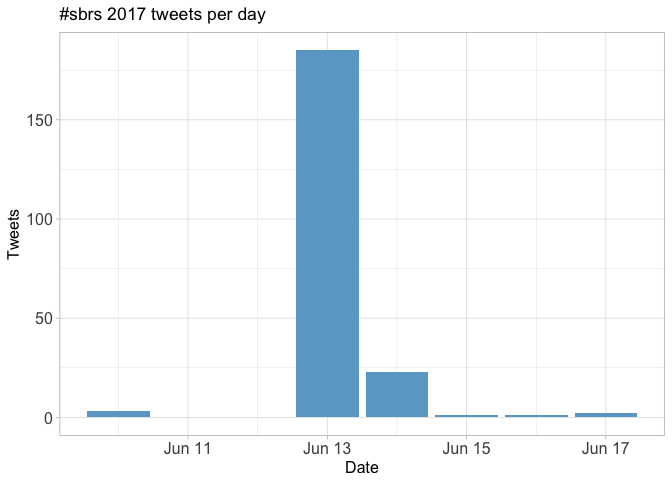
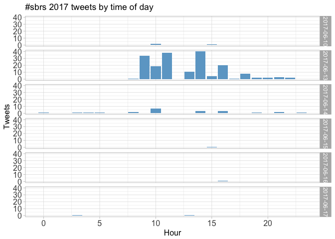
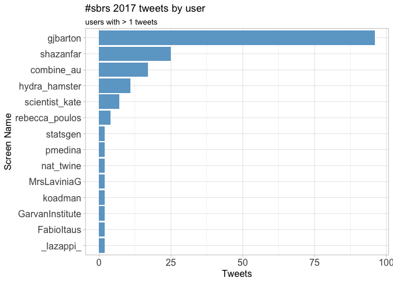
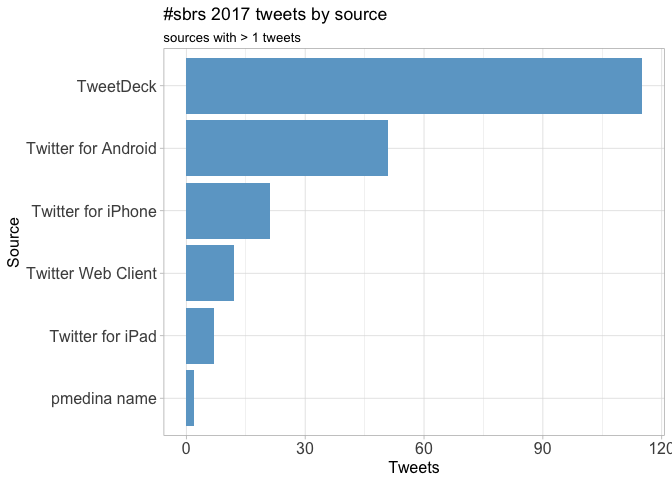
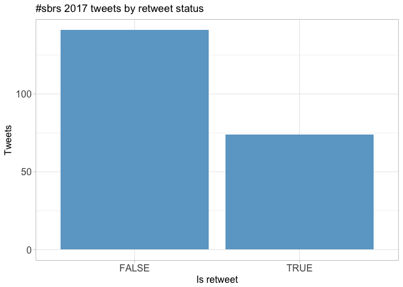
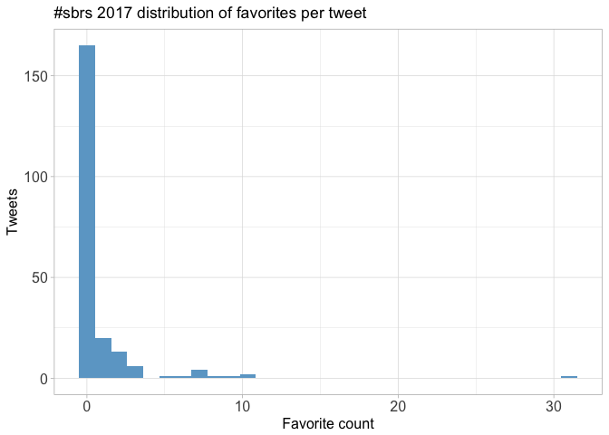
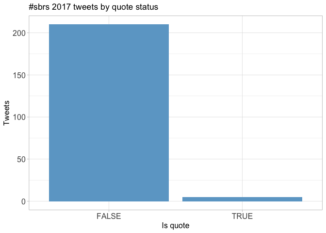
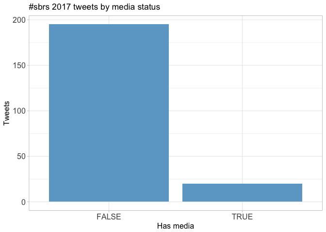
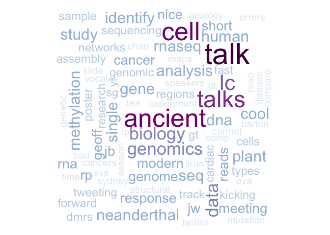

# Twitter Coverage of the Sydney Bioinformatics Research Symposium 2017
Neil Saunders  
`r Sys.time()`  


# Introduction
An analysis of tweets from the Sydney Bioinformatics Research Symposium 2017. 215 were collected using the `rtweet` R package:


```r
library(rtweet)
sbrs17 <- search_tweets("#sbrs17 OR #sbrs2017", 1000)
```

# Timeline
## Tweets by day
<!-- -->

## Tweets by day and time
<!-- -->

# Users
## Top tweeters
<!-- -->

## Sources
<!-- -->

# Networks
## Replies
The "replies network", composed from users who reply directly to one another, was very small for SBRS 17 and was not analysed further.


## Mentions
The "mentions network", where users mention other users in their tweets, was constructed as per the code in the accompanying `Rmd` file. The resulting `graphml` file was visualised using Gephi (0.9.1). Nodes and edges are coloured by pagerank value.


# Retweets
## Retweet proportion
<!-- -->

## Retweet count
<!-- -->

## Top retweets

screen_name      text                                                                                                                                            retweet_count
---------------  ---------------------------------------------------------------------------------------------------------------------------------------------  --------------
koadman          Bioinformatics research as defined by Geoff Barton. Peer reviewed journal publications just one of many outputs… https://t.co/zKZA6yLPPF                   23
nat_twine        Fast forward presentations at #sbrs2017 #BigData #machinelearning applications for #ALS at #CSIRO https://t.co/vTMfG94xmY                                  10
shazanfar        Love how @gjbarton has concrete recommendations for designing RNA-Seq exps. 1: Do at least 6 biological replicates! Yes! #sbrs17 #sbrs2017                  7
scientist_kate   Geoff Barton - Closing invited lecture: lessons from a 48 replicate RNAseq experiment #sbrs2017 @gjbarton https://t.co/Sznnpj1iZ3                           5
gjbarton         VariantSpark  big data + machine learning.  I really did talk too small.  lovely mix of methods and applications in this meeting.  #sbrs2017                5
shazanfar        In this session at #sbrs2017 #sbrs17 I'll be speaking about this work on single cell data analysis of neurons https://t.co/GFSrwlvoxl                       3
gjbarton         Ohhhh!  Technical variation talk!! qPCR is not a gold standard. consensus modelling across different techniques on same sample.  #sbrs2017                  3
rebecca_poulos   Exciting research at #sbrs17! Ancient DNA, plant genomics, complex genomic rearrangements, and more. Now onto fast forward talks #sbrs2017                  3
shazanfar        #sbrs17 Gene ORGANizer linking disease genes to organs @lirancarmel https://t.co/Sju8WSDW1a                                                                 3
shazanfar        #SBRS17 Sydney Bioinformatics Research Symposium program available here https://t.co/z4Vno7yQfv                                                             3

# Favourites
## Favourite proportion
<!-- -->

## Favourite count
<!-- -->

## Top favourites

screen_name      text                                                                                                                                            favorite_count
---------------  ---------------------------------------------------------------------------------------------------------------------------------------------  ---------------
koadman          Bioinformatics research as defined by Geoff Barton. Peer reviewed journal publications just one of many outputs… https://t.co/zKZA6yLPPF                    31
shazanfar        Love how @gjbarton has concrete recommendations for designing RNA-Seq exps. 1: Do at least 6 biological replicates! Yes! #sbrs17 #sbrs2017                  10
nat_twine        Fast forward presentations at #sbrs2017 #BigData #machinelearning applications for #ALS at #CSIRO https://t.co/vTMfG94xmY                                   10
gjbarton         I think the strong biology-led talks at a bioinformatics meeting just shows how bioinformatics is integral to modern biology.  #sbrs2017                     9
jasonwwong       Great talk by @rebecca_poulos on patterns of genome-wide CpG methylation mutations in cancer #sbrs2017 Paper here:… https://t.co/fKFJjsElR8                  8
statsgen         Over 50 abstracts submitted, only 8 talks - one of them by @shazanfar ! Nice job @shazanfar ! #sbrs2017 https://t.co/H8DiQhCMDw                              7
scientist_kate   Geoff Barton - Closing invited lecture: lessons from a 48 replicate RNAseq experiment #sbrs2017 @gjbarton https://t.co/Sznnpj1iZ3                            7
shazanfar        In this session at #sbrs2017 #sbrs17 I'll be speaking about this work on single cell data analysis of neurons https://t.co/GFSrwlvoxl                        7
rebecca_poulos   Exciting research at #sbrs17! Ancient DNA, plant genomics, complex genomic rearrangements, and more. Now onto fast forward talks #sbrs2017                   7
shazanfar        GB: @gjbarton showing the interplay between analysis, techniques and applications occurring within bioinformatics r… https://t.co/QcJsVLlNrt                 6

# Quotes
## Quote proportion
<!-- -->

## Quote count
<!-- -->

## Top quotes

screen_name   text                                                                                                                                         quote_count
------------  ------------------------------------------------------------------------------------------------------------------------------------------  ------------
LouCaruana    Scientists and #biotech experts from @GarvanInstitute are seeking to tackle major diseases like the ebola virus.… https://t.co/4pGvQEc8JH              3

# Media
## Media count
<!-- -->

## Top media

screen_name      text                                                                                                                                        favorite_count
---------------  -----------------------------------------------------------------------------------------------------------------------------------------  ---------------
nat_twine        Fast forward presentations at #sbrs2017 #BigData #machinelearning applications for #ALS at #CSIRO https://t.co/vTMfG94xmY                               10
statsgen         Over 50 abstracts submitted, only 8 talks - one of them by @shazanfar ! Nice job @shazanfar ! #sbrs2017 https://t.co/H8DiQhCMDw                          7
scientist_kate   Geoff Barton - Closing invited lecture: lessons from a 48 replicate RNAseq experiment #sbrs2017 @gjbarton https://t.co/Sznnpj1iZ3                        7
scientist_kate   Katherine Jackson from @GarvanInstitute at #SBRS2017 https://t.co/axDmupxoh3                                                                             3
hydra_hamster    Optical mapping for detecting complex genomic rearrangement - now that's cool! Eva Chan @GarvanInstitute #SBRS17 https://t.co/m32RDq3WrV                 3
hydra_hamster    Impressive list of software @gjbarton is involved in bringing to the rest of us! #sbrs17 https://t.co/exsnWqw51M                                         2
shazanfar        #sbrs17 DMRs between ancient neanderthal and modern human maps to face + throat + vocal cord organs @lirancarmel https://t.co/KpysFCGxFt                 2
scientist_kate   Sydney Bioinformatics Research Symposium is kicking off with Dr Liran Carmel on ancient Epigenomes #SBRS2017 https://t.co/cdApgglOJn                     2
nat_twine        @gjbarton closing up #sbrs2017 meeting with his work at Dundee university https://t.co/Yk7iY76vFS                                                        1

### Most liked media image


# Tweet text
The 100 words used 3 or more times.

<!-- -->

