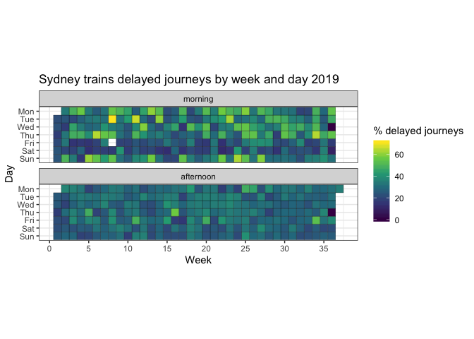
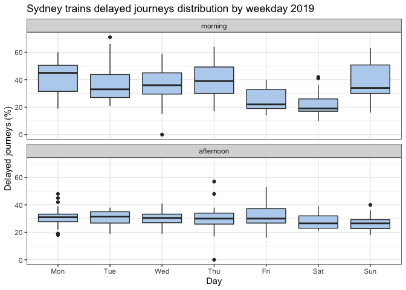
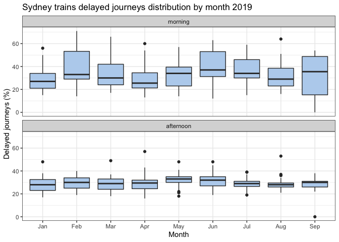
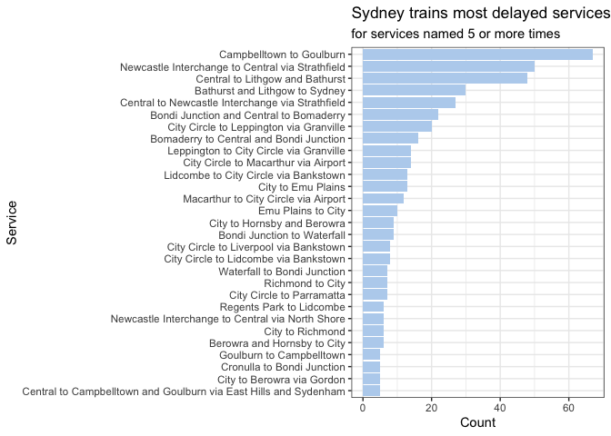
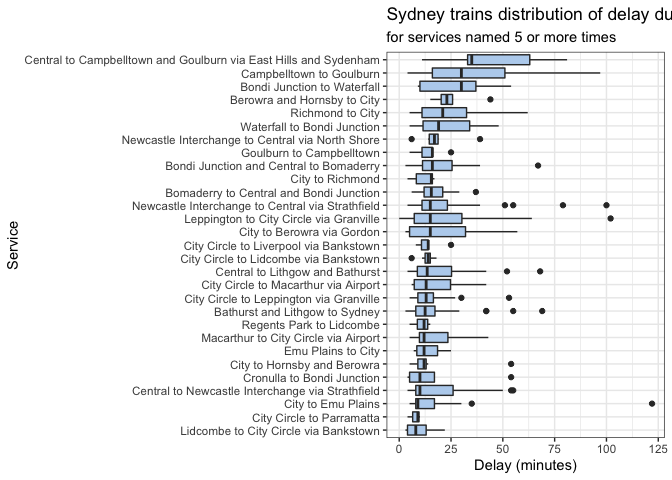

Data mining from Twitter posts: Sydney train delays
================
Neil Saunders
2019-09-10 20:03:32

# Introduction

The [@sydstats](https://twitter.com/sydstats) Twitter account uses the
[Transport for NSW Open Data
API](https://opendata.transport.nsw.gov.au/) to generate daily
information about delays on the Sydney train network.

Summaries are posted to Twitter in a text format which is sufficiently
consistent to be easily parsed for analysis and visualisation.

# Getting the data

Using the `rtweet` package:

``` r
library(rtweet)
sydstats <- get_timeline("SydStats", n = 3200)
```

The Twitter data can be processed into two datasets. The first dataset
contains the year, month, week, day of week, percent of journeys delayed
and whether the journeys were during the morning (07:00-09:00) or
afternoon (16:00-18:30) peak times.

First 6
rows:

| dtstart             | dtend               | ystart | mstart | wstart | dstart | delayed | peak      |
| :------------------ | :------------------ | -----: | -----: | -----: | :----- | ------: | :-------- |
| 2019-09-09 16:00:00 | 2019-09-09 18:30:00 |   2019 |      9 |     37 | Mon    |      35 | afternoon |
| 2019-09-08 07:00:00 | 2019-09-08 09:00:00 |   2019 |      9 |     36 | Sun    |      31 | morning   |
| 2019-09-08 16:00:00 | 2019-09-08 18:30:00 |   2019 |      9 |     36 | Sun    |      26 | afternoon |
| 2019-09-07 07:00:00 | 2019-09-07 09:00:00 |   2019 |      9 |     36 | Sat    |      10 | morning   |
| 2019-09-07 16:00:00 | 2019-09-07 18:30:00 |   2019 |      9 |     36 | Sat    |      22 | afternoon |
| 2019-09-06 07:00:00 | 2019-09-06 09:00:00 |   2019 |      9 |     36 | Fri    |      17 | morning   |

The second dataset contains the date, longest delay time, service time
and service name.

First 6
rows:

| created\_at         | Date       | Delay | dtime | service                                          |
| :------------------ | :--------- | ----: | :---- | :----------------------------------------------- |
| 2019-09-09 08:38:49 | 2019-09-09 |    55 | 16:58 | Central to Newcastle Interchange via North Shore |
| 2019-09-08 23:08:05 | 2019-09-08 |    25 | 05:23 | Central to Lithgow and Bathurst                  |
| 2019-09-08 08:35:40 | 2019-09-08 |     5 | 15:35 | Richmond to City                                 |
| 2019-09-07 23:05:07 | 2019-09-07 |     3 | 06:15 | Bondi Junction and Central to Bomaderry          |
| 2019-09-07 08:35:51 | 2019-09-07 |     5 | 18:16 | Regents Park to Lidcombe                         |
| 2019-09-06 23:05:12 | 2019-09-06 |     5 | 08:39 | Campbelltown to Goulburn                         |

# Visualisation

## Delayed journeys by day

First, visualise the percentage of delayed journeys in 2019 by week, day
of week and peak period. This is in effect a simplified calendar heat
map, without month names.

We can see that:

  - there are more delays in the morning compared with the afternoon
  - there are more morning delays Monday - Thursday than Friday
  - there are more morning delays on Sunday than Saturday

As there is often weekend trackwork, perhaps there are just less
journeys overall on Saturday ?

<!-- -->

## Delayed journeys by day of week

Next we examine the distribution of delays by day.

This confirms that Monday morning is the worst time to travel, with
delays to 45% or more of journeys on half of all Monday morning peak
periods.

The median percentage of trips delayed falls on Tuesdays, rises again
and then falls to its lowest value on Fridays.

<!-- -->

## Delayed journeys by month

The distribution of morning delays by month shows an interesting
cyclical pattern, peaking in February and June and dropping off again in
January, April and August.

The peaks coincide with months after school holidays - could that be
related?

<!-- -->

## Longest delayed journeys by service

We count each time a service is named as the most delayed and plot the
count for services that occur 5 or more times.

<!-- -->

Then we plot the distribution of delay duration for those services,
ordered by median delay duration.

<!-- -->

# Summary

  - expect delays
      - on Monday mornings
      - after school holidays
      - in the south-west and north-west
  - even plain text can be useful if given a bit of structure
