Twitter Coverage of the useR Conference 2018
================
Neil Saunders
2018-07-16 21:46:04

Introduction
============

An analysis of tweets from the useR 2018 meeting. 5967 tweets were collected using the `rtweet` R package:

``` r
library(rtweet)
user2018 <- search_tweets("#useR2018", 10000)
```

Timeline
========

Tweets by day
-------------

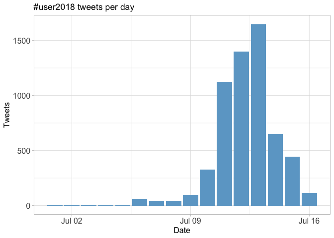

Tweets by day and time
----------------------

Filtered for dates July 10-15, Brisbane time. 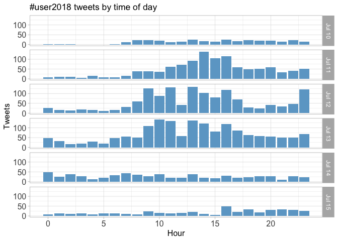

Users
=====

Top tweeters
------------

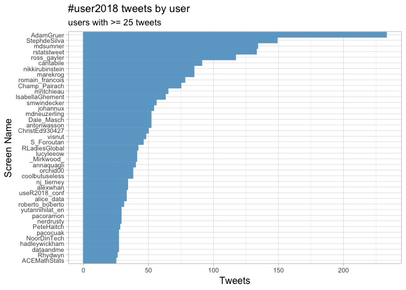

Sources
-------

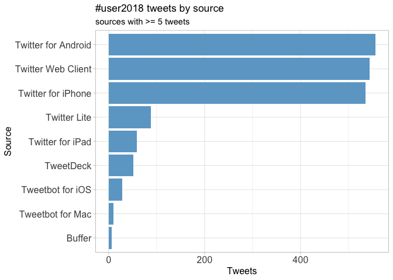

Networks
========

Replies
-------

The "replies network", composed from users who reply directly to one another.

Better to view the original PNG file in the `data` directory.

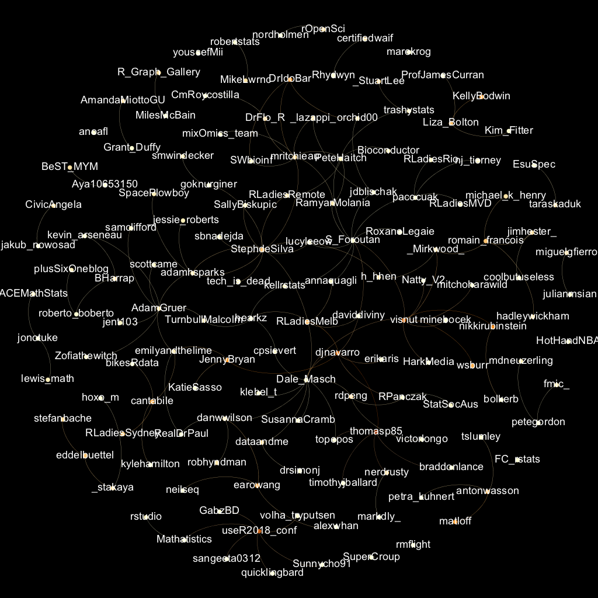

Mentions
--------

The "mentions network", where users mention other users in their tweets. Filtered for K-core &gt;= 3.

Better to view the original PNG file in the `data` directory.

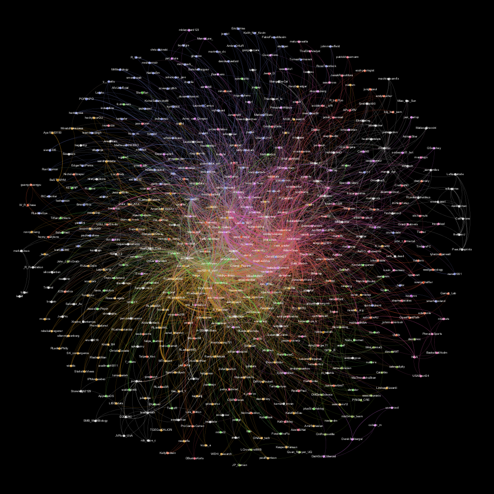

Retweets
========

Retweet proportion
------------------

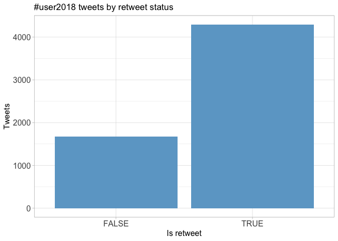

Retweet count
-------------

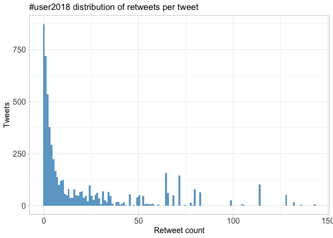

Top retweets
------------

<table>
<thead>
<tr>
<th style="text-align:left;">
screen\_name
</th>
<th style="text-align:left;">
text
</th>
<th style="text-align:right;">
retweet\_count
</th>
</tr>
</thead>
<tbody>
<tr>
<td style="text-align:left;">
useR2018\_conf
</td>
<td style="text-align:left;">
All of the \#useR2018 presentations (unless specifically requested not), including tutorials are being recorded. These will be available at some point after the meeting, we think at this channel <https://t.co/lq6E2XnXP9>

Live streaming is a challenge, hope to attempt one keynote.
</td>
<td style="text-align:right;">
114
</td>
</tr>
<tr>
<td style="text-align:left;">
drob
</td>
<td style="text-align:left;">
It's official: @thomasp85 has taken over gganimate!

This is a complete rewrite for a better grammar of animated graphics, which he'll be keynoting about next week at \#UseR2018

Thanks to everyone who has used & contributed to gganimate; I'm excited for its future! \#rstats <https://t.co/w0sfxlyzhU>
</td>
<td style="text-align:right;">
80
</td>
</tr>
<tr>
<td style="text-align:left;">
rdpeng
</td>
<td style="text-align:left;">
Here is the video for my keynote from \#useR2018 on teaching R to new users. <https://t.co/KUrG097D7D>
</td>
<td style="text-align:right;">
72
</td>
</tr>
<tr>
<td style="text-align:left;">
jdblischak
</td>
<td style="text-align:left;">
Here are the slides for my \#useR2018 presentation on my \#rstats package \#workflowr for reproducible research <https://t.co/O2yZ7RemN6>
</td>
<td style="text-align:right;">
71
</td>
</tr>
<tr>
<td style="text-align:left;">
MilesMcBain
</td>
<td style="text-align:left;">
\#user2018 vids have already started filtering into the R consortium YouTube! \#rstats <https://t.co/29mjkMCXS4>
</td>
<td style="text-align:right;">
65
</td>
</tr>
<tr>
<td style="text-align:left;">
rdpeng
</td>
<td style="text-align:left;">
This hex sticker wall is amazing! \#useR2018 <https://t.co/F7CphYzjU4>
</td>
<td style="text-align:right;">
64
</td>
</tr>
<tr>
<td style="text-align:left;">
simplystats
</td>
<td style="text-align:left;">
Teaching R to New Users - From tapply to the Tidyverse (from \#useR2018) <https://t.co/o2lGJafZ7K>
</td>
<td style="text-align:right;">
64
</td>
</tr>
<tr>
<td style="text-align:left;">
JennyBryan
</td>
<td style="text-align:left;">
Code Smells and Feels ^^ my keynote talk at \#useR2018 Materials at: <https://t.co/e7dZRMZuSL> It was a great honour to speak and the Brisbane crew upheld the fine tradition of fun and informative useR! meetings 🎉 <https://t.co/2XkJ64NgsM>
</td>
<td style="text-align:right;">
50
</td>
</tr>
<tr>
<td style="text-align:left;">
kellrstats
</td>
<td style="text-align:left;">
Slides from my \#useR2018 session talk: "tinkering in the cloud" with R and Google App Engine 🛠️🔥 <https://t.co/wu1IITI1f6> \#rstats
</td>
<td style="text-align:right;">
49
</td>
</tr>
<tr>
<td style="text-align:left;">
mitchoharawild
</td>
<td style="text-align:left;">
The \#useR2018 \#hexwall has been revealed! Read about how it was created in \#rstats on this blog post: <https://t.co/krYYOQ3N84>

A huge thanks to everyone who has submitted stickers and provided feedback. I hope you enjoy the end result as much as I have had creating it! 🎉 <https://t.co/GnG9m2cZme>
</td>
<td style="text-align:right;">
45
</td>
</tr>
</tbody>
</table>
Favourites
==========

Favourite proportion
--------------------

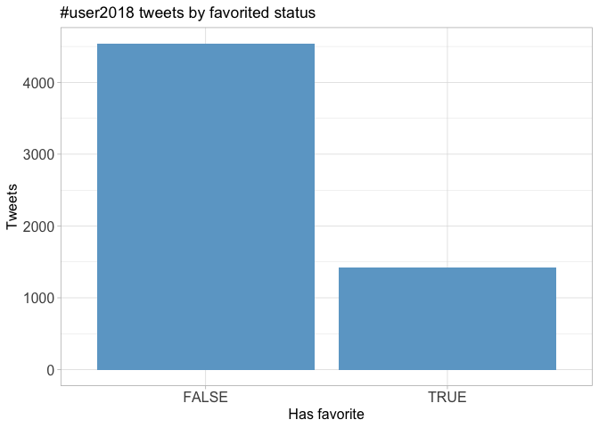

Favourite count
---------------

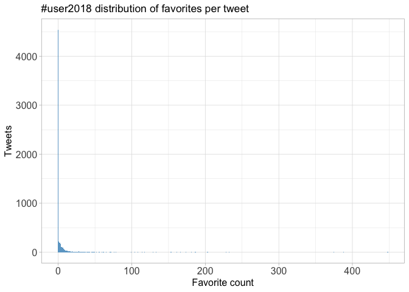

Top favourites
--------------

<table>
<thead>
<tr>
<th style="text-align:left;">
screen\_name
</th>
<th style="text-align:left;">
text
</th>
<th style="text-align:right;">
favorite\_count
</th>
</tr>
</thead>
<tbody>
<tr>
<td style="text-align:left;">
drob
</td>
<td style="text-align:left;">
It's official: @thomasp85 has taken over gganimate!

This is a complete rewrite for a better grammar of animated graphics, which he'll be keynoting about next week at \#UseR2018

Thanks to everyone who has used & contributed to gganimate; I'm excited for its future! \#rstats <https://t.co/w0sfxlyzhU>
</td>
<td style="text-align:right;">
448
</td>
</tr>
<tr>
<td style="text-align:left;">
rdpeng
</td>
<td style="text-align:left;">
This hex sticker wall is amazing! \#useR2018 <https://t.co/F7CphYzjU4>
</td>
<td style="text-align:right;">
388
</td>
</tr>
<tr>
<td style="text-align:left;">
antonwasson
</td>
<td style="text-align:left;">
BARISTA: What are you doing today? ME: I’m at an \#rstats conference \#useR2018. B: Oh I love R, I just moved from SPSS and Stata! ☺️ \#futureisbright
</td>
<td style="text-align:right;">
375
</td>
</tr>
<tr>
<td style="text-align:left;">
rdpeng
</td>
<td style="text-align:left;">
Here is the video for my keynote from \#useR2018 on teaching R to new users. <https://t.co/KUrG097D7D>
</td>
<td style="text-align:right;">
233
</td>
</tr>
<tr>
<td style="text-align:left;">
useR2018\_conf
</td>
<td style="text-align:left;">
All of the \#useR2018 presentations (unless specifically requested not), including tutorials are being recorded. These will be available at some point after the meeting, we think at this channel <https://t.co/lq6E2XnXP9>

Live streaming is a challenge, hope to attempt one keynote.
</td>
<td style="text-align:right;">
229
</td>
</tr>
<tr>
<td style="text-align:left;">
simplystats
</td>
<td style="text-align:left;">
Teaching R to New Users - From tapply to the Tidyverse (from \#useR2018) <https://t.co/o2lGJafZ7K>
</td>
<td style="text-align:right;">
203
</td>
</tr>
<tr>
<td style="text-align:left;">
mitchoharawild
</td>
<td style="text-align:left;">
The \#useR2018 \#hexwall has been revealed! Read about how it was created in \#rstats on this blog post: <https://t.co/krYYOQ3N84>

A huge thanks to everyone who has submitted stickers and provided feedback. I hope you enjoy the end result as much as I have had creating it! 🎉 <https://t.co/GnG9m2cZme>
</td>
<td style="text-align:right;">
202
</td>
</tr>
<tr>
<td style="text-align:left;">
MilesMcBain
</td>
<td style="text-align:left;">
\#user2018 vids have already started filtering into the R consortium YouTube! \#rstats <https://t.co/29mjkMCXS4>
</td>
<td style="text-align:right;">
186
</td>
</tr>
<tr>
<td style="text-align:left;">
kellrstats
</td>
<td style="text-align:left;">
Slides from my \#useR2018 session talk: "tinkering in the cloud" with R and Google App Engine 🛠️🔥 <https://t.co/wu1IITI1f6> \#rstats
</td>
<td style="text-align:right;">
181
</td>
</tr>
<tr>
<td style="text-align:left;">
JennyBryan
</td>
<td style="text-align:left;">
Code Smells and Feels ^^ my keynote talk at \#useR2018 Materials at: <https://t.co/e7dZRMZuSL> It was a great honour to speak and the Brisbane crew upheld the fine tradition of fun and informative useR! meetings 🎉 <https://t.co/2XkJ64NgsM>
</td>
<td style="text-align:right;">
173
</td>
</tr>
</tbody>
</table>
Quotes
======

Quote proportion
----------------

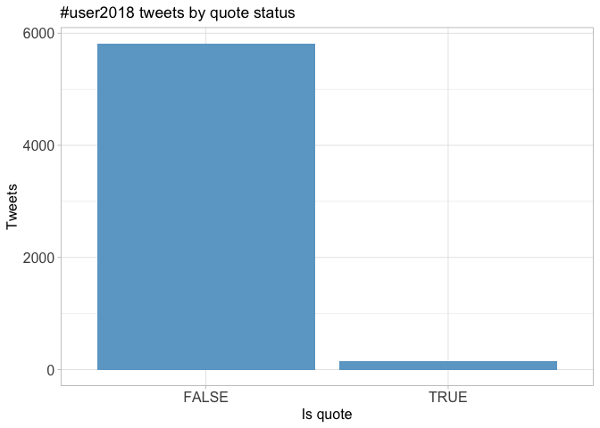

Quote count
-----------

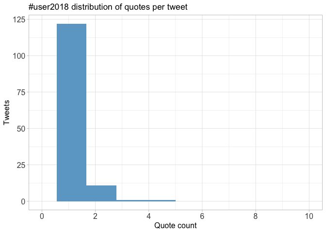

Top quotes
----------

<table>
<thead>
<tr>
<th style="text-align:left;">
screen\_name
</th>
<th style="text-align:left;">
text
</th>
<th style="text-align:right;">
quote\_count
</th>
</tr>
</thead>
<tbody>
<tr>
<td style="text-align:left;">
roberto\_boberto
</td>
<td style="text-align:left;">
@plusSixOneblog if you look closely look at WA you can see \#fitzRoy \#useR2018 <https://t.co/hkrVLsEljb>
</td>
<td style="text-align:right;">
5
</td>
</tr>
<tr>
<td style="text-align:left;">
monkmanmh
</td>
<td style="text-align:left;">
bcmaps! \#useR2018 \#rstats @stephhazlitt @andyteucher @big\_bad\_sam @ecohydrologist <https://t.co/5EjCKM7LEZ>
</td>
<td style="text-align:right;">
5
</td>
</tr>
<tr>
<td style="text-align:left;">
big\_bad\_sam
</td>
<td style="text-align:left;">
tidyhydat has some great neighbours on the \#useR2018 \#hexwall <https://t.co/gehKaU6j2a>
</td>
<td style="text-align:right;">
5
</td>
</tr>
<tr>
<td style="text-align:left;">
drsimonj
</td>
<td style="text-align:left;">
corrr made the \#useR2018 hex wall 🎉

Perfect time to share that v 0.3.0 has been submitted to CRAN. Lots of new updates/features to come with special thanks to @theotheredgar, including ability to correlate() data frames with a SQL back-end.

More at <https://t.co/lM8X2fTTqM> <https://t.co/7KzTPbfN0W>
</td>
<td style="text-align:right;">
5
</td>
</tr>
<tr>
<td style="text-align:left;">
malco\_barrett
</td>
<td style="text-align:left;">
*sound of \#useR2018 FOMO intensifying* <https://t.co/Y6U8vqSQZc>
</td>
<td style="text-align:right;">
5
</td>
</tr>
<tr>
<td style="text-align:left;">
AdamGruer
</td>
<td style="text-align:left;">
rjs was an absolute highlight for me at \#UseR2018 . Thanks Jackson Kwok🆒✅🙌🏼👌 <https://t.co/HdKcrS7QIA>
</td>
<td style="text-align:right;">
3
</td>
</tr>
<tr>
<td style="text-align:left;">
Surgisse
</td>
<td style="text-align:left;">
Possibly the best talk I've seen so far at \#useR2018! \#rjs \#rstats <https://t.co/1i8O93MlIk>
</td>
<td style="text-align:right;">
3
</td>
</tr>
<tr>
<td style="text-align:left;">
scottcame
</td>
<td style="text-align:left;">
A simple but powerful use of JavaScript and web sockets. Look forward to seeing where this goes. \#useR2018 <https://t.co/kXa2zRcMcy>
</td>
<td style="text-align:right;">
3
</td>
</tr>
<tr>
<td style="text-align:left;">
dataandme
</td>
<td style="text-align:left;">
If anyone wants to volunteer as "annoying videographer uncle" (gender doesn't matter- the trope is just 👨📹), I would so so love to periscope into the \#useR2018 poster session!! 😇 🙏 (cc @kellrstats @nj\_tierney @cantabile) <https://t.co/6kzlLxxos7>
</td>
<td style="text-align:right;">
2
</td>
</tr>
<tr>
<td style="text-align:left;">
statsgen
</td>
<td style="text-align:left;">
Gosh this looks so good. \#user2018 folks please don't forget to tweet and keep people who couldn't make it (i.e. me 😢) in loop! <https://t.co/XcnsZxMPVJ>
</td>
<td style="text-align:right;">
2
</td>
</tr>
</tbody>
</table>
Media
=====

Media count
-----------

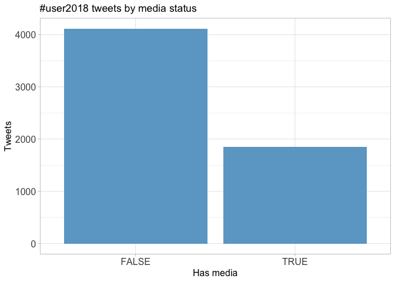

Top media
---------

<table>
<thead>
<tr>
<th style="text-align:left;">
screen\_name
</th>
<th style="text-align:left;">
text
</th>
<th style="text-align:right;">
favorite\_count
</th>
</tr>
</thead>
<tbody>
<tr>
<td style="text-align:left;">
drob
</td>
<td style="text-align:left;">
It's official: @thomasp85 has taken over gganimate!

This is a complete rewrite for a better grammar of animated graphics, which he'll be keynoting about next week at \#UseR2018

Thanks to everyone who has used & contributed to gganimate; I'm excited for its future! \#rstats <https://t.co/w0sfxlyzhU>
</td>
<td style="text-align:right;">
448
</td>
</tr>
<tr>
<td style="text-align:left;">
rdpeng
</td>
<td style="text-align:left;">
This hex sticker wall is amazing! \#useR2018 <https://t.co/F7CphYzjU4>
</td>
<td style="text-align:right;">
388
</td>
</tr>
<tr>
<td style="text-align:left;">
mitchoharawild
</td>
<td style="text-align:left;">
The \#useR2018 \#hexwall has been revealed! Read about how it was created in \#rstats on this blog post: <https://t.co/krYYOQ3N84>

A huge thanks to everyone who has submitted stickers and provided feedback. I hope you enjoy the end result as much as I have had creating it! 🎉 <https://t.co/GnG9m2cZme>
</td>
<td style="text-align:right;">
202
</td>
</tr>
<tr>
<td style="text-align:left;">
JennyBryan
</td>
<td style="text-align:left;">
Code Smells and Feels ^^ my keynote talk at \#useR2018 Materials at: <https://t.co/e7dZRMZuSL> It was a great honour to speak and the Brisbane crew upheld the fine tradition of fun and informative useR! meetings 🎉 <https://t.co/2XkJ64NgsM>
</td>
<td style="text-align:right;">
173
</td>
</tr>
<tr>
<td style="text-align:left;">
visnut
</td>
<td style="text-align:left;">
Banner reveal \#useR2018 \#hexwall with some of the package maintainer <https://t.co/Axx945XgqK>
</td>
<td style="text-align:right;">
161
</td>
</tr>
<tr>
<td style="text-align:left;">
RLadiesMelb
</td>
<td style="text-align:left;">
Here are amazing \#RLadies from around the world having dinner after an excellent day at @useR2018\_conf @RLadiesGlobal @RLadiesBrisbane @RLadiesSydney @RLadiesIstanbul @RLadiesIzmir @RLadiesAKL @RLadiesDC @RLadiesRemote @RLadiesMVD \#rladies \#useR2018 \#rstat <https://t.co/aZoSuAU0Gi>
</td>
<td style="text-align:right;">
153
</td>
</tr>
<tr>
<td style="text-align:left;">
MilesMcBain
</td>
<td style="text-align:left;">
Purrr style timeseries specific mappers in @earowang's 'tsibble' melting my face right now. \#rstats \#user2018 <https://t.co/RG1bqMiFCH>
</td>
<td style="text-align:right;">
133
</td>
</tr>
<tr>
<td style="text-align:left;">
JennyBryan
</td>
<td style="text-align:left;">
I heartily endorse the glue package, which @jimhester\_ just presented at \#useR2018. I even learned a new nifty thing (width argument of glue\_collapse()). <https://t.co/0AAFd6n7Tm>
</td>
<td style="text-align:right;">
129
</td>
</tr>
<tr>
<td style="text-align:left;">
JennyBryan
</td>
<td style="text-align:left;">
Roger Peng’s \#useR2018 keynote this morning resonates with me, as another long time user/developer/instructor. Useful, opinionated take on where we are now in \#rstats and how we got here. @rdpeng <https://t.co/bOLSoaFupd> <https://t.co/ejc9yFYGVA>
</td>
<td style="text-align:right;">
117
</td>
</tr>
<tr>
<td style="text-align:left;">
romain\_francois
</td>
<td style="text-align:left;">
\#useR2018 \#hexwall is real, and is sphextacular. <https://t.co/r8SkwUrmaT>
</td>
<td style="text-align:right;">
114
</td>
</tr>
</tbody>
</table>
### Most liked media image


Tweet text
==========

The 100 words used 3 or more times.

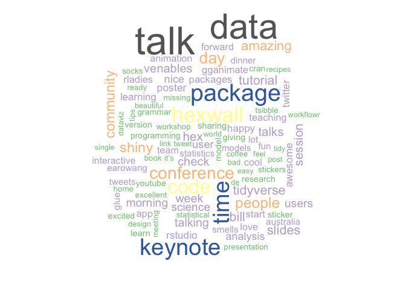
