Twitter Coverage of the useR Conference 2019
================
Neil Saunders
2019-07-15 20:13:30

# Introduction

An analysis of tweets from the useR 2019 meeting. 8318 tweets were
collected using the `rtweet` R package:

``` r
library(rtweet)
user2019 <- search_tweets("#useR2019", 18000)
```

# Timeline

## Tweets by day

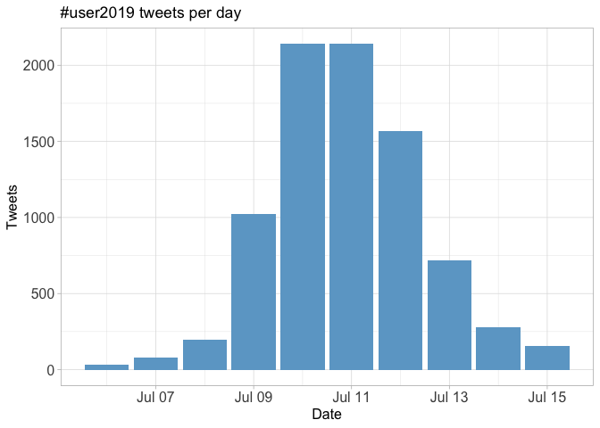<!-- -->

## Tweets by day and time

Filtered for dates July 9-12, Toulouse time.
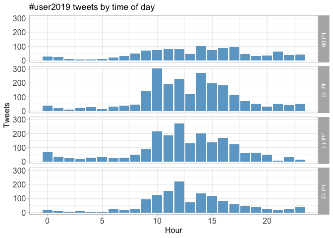<!-- -->

# Users

## Top tweeters

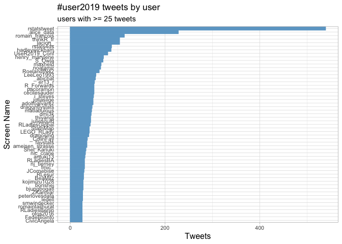<!-- -->

## Sources

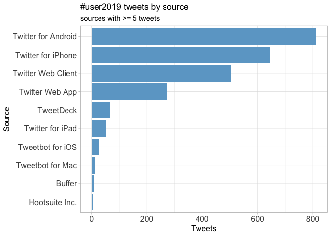<!-- -->

# Networks

## Replies

The “replies network”, composed from users who reply directly to one
another.

Better to view the original PNG file in the `data` directory.

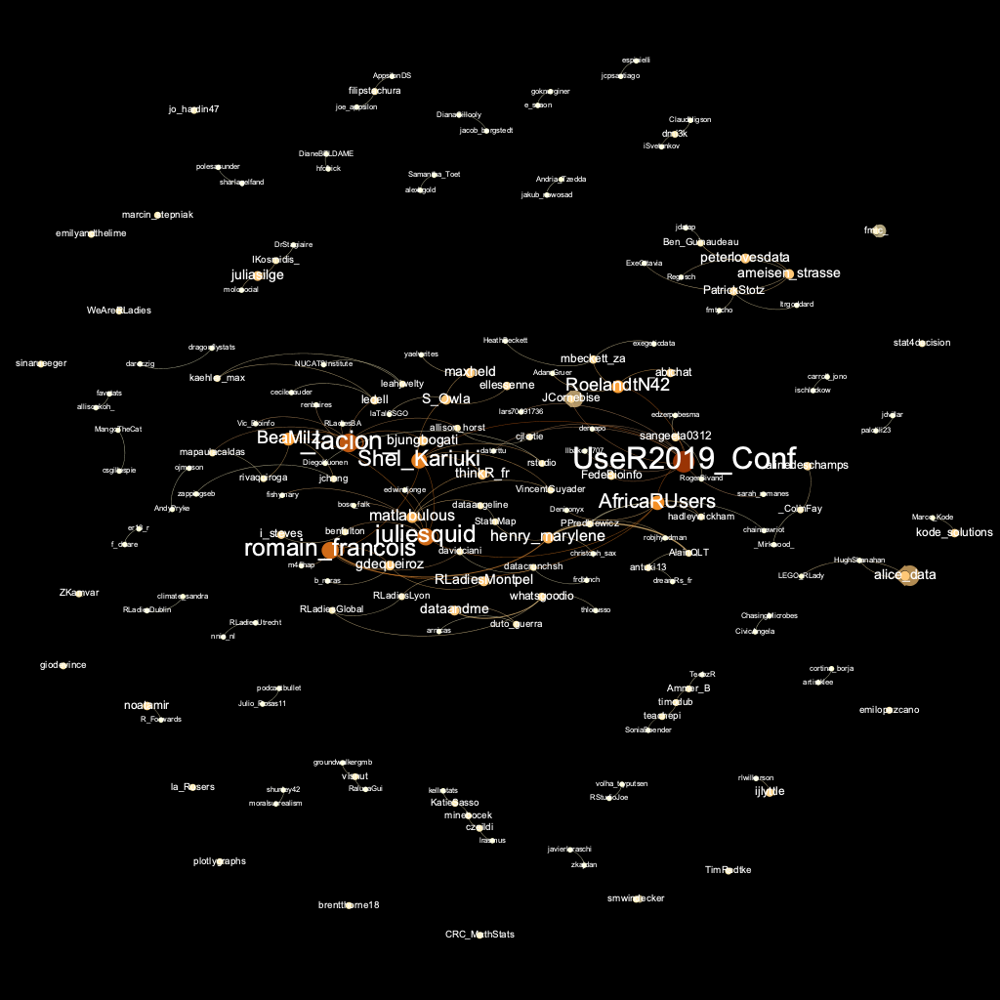

## Mentions

The “mentions network”, where users mention other users in their tweets.
Filtered for K-core \>= 4.

Better to view the original PNG file in the `data` directory. Perhaps
not much to be gleaned from this
:)

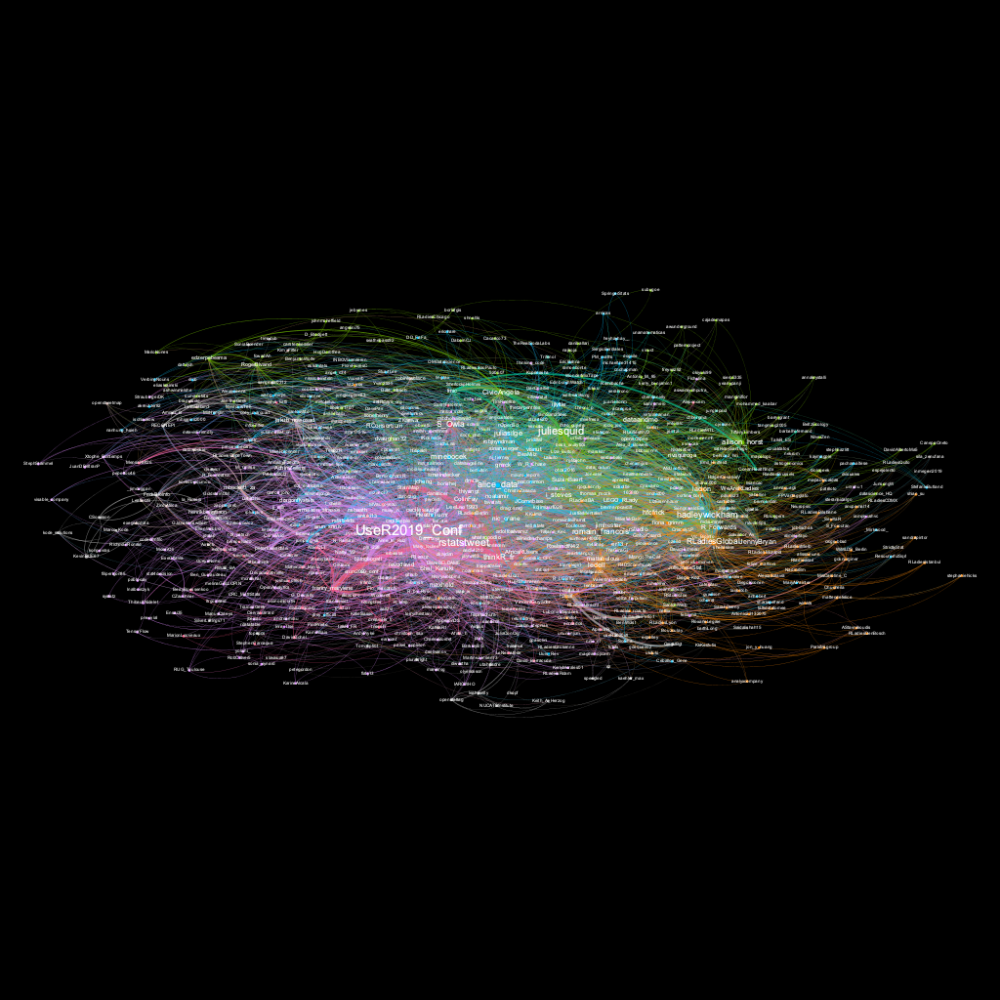

# Retweets

## Retweet proportion

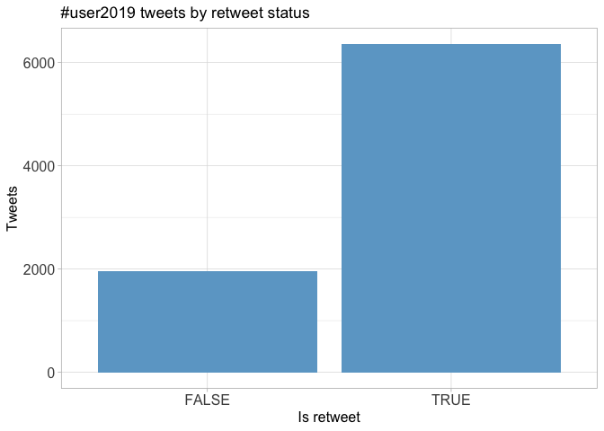<!-- -->

## Retweet count

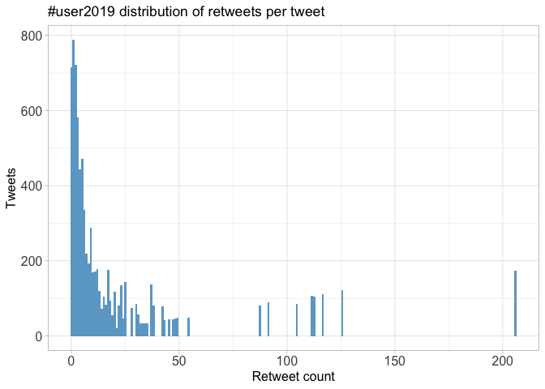<!-- -->

## Top retweets

| screen\_name   | text                                                                                                                                                                                                                                                                                                               | retweet\_count |
| :------------- | :----------------------------------------------------------------------------------------------------------------------------------------------------------------------------------------------------------------------------------------------------------------------------------------------------------------- | -------------: |
| S\_Owla        | If you want to catch up on the \#useR2019 tutorials you missed, materials for at least 14 out of 18 are already available\! I started collecting them here: <https://t.co/n9mm6AkHsy> If you find any more please add them/let me know\! :) @UseR2019\_Conf                                                        |            206 |
| SuzanBaert     | I love @juliesquid non-elitist and more inclusive definition of data science. 👏👏👏“Data science is not just about AI or machine learning. It is the discipline of turning raw data into understanding.” \#UseR2019 <https://t.co/wY3Q1WzMWK>                                                                        |            126 |
| UseR2019\_Conf | All the keynote lectures were available live on @RConsortium \#YouTube channel here: <https://t.co/otDzmY2UND> Very soon, you’ll find the edited version (with video). keep posted\! \#rstats \#useR2019 <https://t.co/q6FsqsDI61>                                                                                 |            117 |
| grrrck         | If you’re stuck at home with a bad case of \#UseR2019 FOMO (like me\!) you can use this Shiny dashboard I made to keep up with the online conversation\! \#rstats 🥐🦄📊<https://t.co/YbHyJtHY7U>                                                                                                                     |            113 |
| RLadiesGlobal  | Hello from \#RLadies at \#UseR2019\! 👋 <https://t.co/lpOD9M3sJd>                                                                                                                                                                                                                                                   |            112 |
| hadleywickham  | Code from my tidyr talk at \#user2019: <https://t.co/GGaOGOLt8X>. RStudio cloud instance if you want to try it out without installing dev packages locally: <https://t.co/HzDhZum8C4> \#rstats                                                                                                                     |            105 |
| dataandme      | 😍 @juliesquid’s keynote begins with the most gorgeous opening slide ever (👩‍🎨 @allison\_horst, obvi) 📽 slides: <https://t.co/DBuA0Jt2Q4> 📺 livestream: <https://t.co/qMp6alQnDV> \#useR2019 \#rstats <https://t.co/8Q1LmyQghO>                                                                                     |             91 |
| CivicAngela    | Wow, these spatial data space-time cubes in the stars \#rspatial package are REALLY cool - you can go between vector and raster data, and use data over multiple bands/multiple stations/over time\! \#user2019 <https://t.co/IpX3xig0cr(20’_+_10’_exercises)> <https://t.co/IWghWXtGk7> <https://t.co/A8Amvbf4zh> |             87 |
| jimhester\_    | vroom \#rstats 📦, because life is too short to read slow\! 🏎️💨 slides 📽️ from my \#useR2019 talk available at <https://t.co/3h6b2m7lQO>                                                                                                                                                                            |             54 |
| robjhyndman    | I’ll be talking about our new feasts \#rstats package for tidy time series analysis at \#useR2019 tomorrow📦📈. 11:48am in Ariane. Abstract and slides at <https://t.co/jXbLBqNUyW>. <https://t.co/W2YmzQtTij>                                                                                                       |             49 |

# Favourites

## Favourite proportion

<!-- -->

## Favourite count

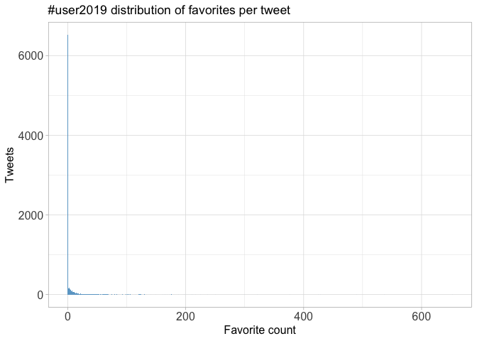<!-- -->

## Top favourites

| screen\_name   | text                                                                                                                                                                                                                                                                                                               | favorite\_count |
| :------------- | :----------------------------------------------------------------------------------------------------------------------------------------------------------------------------------------------------------------------------------------------------------------------------------------------------------------- | --------------: |
| S\_Owla        | If you want to catch up on the \#useR2019 tutorials you missed, materials for at least 14 out of 18 are already available\! I started collecting them here: <https://t.co/n9mm6AkHsy> If you find any more please add them/let me know\! :) @UseR2019\_Conf                                                        |             652 |
| RLadiesGlobal  | Hello from \#RLadies at \#UseR2019\! 👋 <https://t.co/lpOD9M3sJd>                                                                                                                                                                                                                                                   |             537 |
| grrrck         | If you’re stuck at home with a bad case of \#UseR2019 FOMO (like me\!) you can use this Shiny dashboard I made to keep up with the online conversation\! \#rstats 🥐🦄📊<https://t.co/YbHyJtHY7U>                                                                                                                     |             490 |
| SuzanBaert     | I love @juliesquid non-elitist and more inclusive definition of data science. 👏👏👏“Data science is not just about AI or machine learning. It is the discipline of turning raw data into understanding.” \#UseR2019 <https://t.co/wY3Q1WzMWK>                                                                        |             429 |
| hadleywickham  | Code from my tidyr talk at \#user2019: <https://t.co/GGaOGOLt8X>. RStudio cloud instance if you want to try it out without installing dev packages locally: <https://t.co/HzDhZum8C4> \#rstats                                                                                                                     |             425 |
| dataandme      | 😍 @juliesquid’s keynote begins with the most gorgeous opening slide ever (👩‍🎨 @allison\_horst, obvi) 📽 slides: <https://t.co/DBuA0Jt2Q4> 📺 livestream: <https://t.co/qMp6alQnDV> \#useR2019 \#rstats <https://t.co/8Q1LmyQghO>                                                                                     |             377 |
| CivicAngela    | Wow, these spatial data space-time cubes in the stars \#rspatial package are REALLY cool - you can go between vector and raster data, and use data over multiple bands/multiple stations/over time\! \#user2019 <https://t.co/IpX3xig0cr(20’_+_10’_exercises)> <https://t.co/IWghWXtGk7> <https://t.co/A8Amvbf4zh> |             321 |
| UseR2019\_Conf | All the keynote lectures were available live on @RConsortium \#YouTube channel here: <https://t.co/otDzmY2UND> Very soon, you’ll find the edited version (with video). keep posted\! \#rstats \#useR2019 <https://t.co/q6FsqsDI61>                                                                                 |             299 |
| JennyBryan     | How I apparently ruined spread and gather for @hadleywickham: I admitted I found gather “easy”, like squeezing toothpaste out of the tube, whereas spread has always felt more like trying to put it back in. \#useR2019                                                                                           |             250 |
| ijlyttle       | Hey \#useR2019, at the Thursday afternoon visualization session (14h18, de Saint Exupéry), I’ll be talking about the vegawidget project - using Vega-Lite from R. Hope to see you there\! <https://t.co/08npNywcXM>                                                                                                |             237 |

# Quotes

## Quote proportion

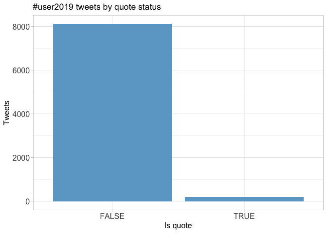<!-- -->

## Quote count

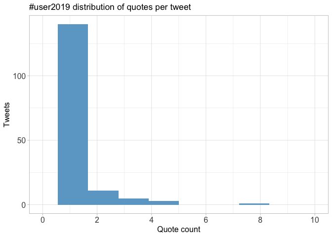<!-- -->

## Top quotes

| screen\_name    | text                                                                                                                                                                                                                                                                                                | quote\_count |
| :-------------- | :-------------------------------------------------------------------------------------------------------------------------------------------------------------------------------------------------------------------------------------------------------------------------------------------------- | -----------: |
| *lacion*        | My first \#RLadies 📸 with members from 🌍🌎🌏 Soooo happy and soooo grateful 💜💜💜 \#useR2019 <https://t.co/OqsPFUHwW4>                                                                                                                                                                                  |            8 |
| rlwilkerson     | Loved meeting some of the @RLadiesGlobal at \#useR2019 today\! <https://t.co/tUBgUsY3cQ>                                                                                                                                                                                                            |            8 |
| sheilasaia      | A friendly reminder to add your name to the @RLadiesGlobal directory (<https://t.co/zTcY2Ut7vU>) and join our slack (<https://t.co/S7dr4YxwTM>) so you can keep in touch with all your new \#useR2019 R-Lady friends\! 😊💜 \#rladies4eva \#rstats \#datascience @pageinini <https://t.co/4JKjGg3Mqs> |            8 |
| angcustodio     | R-ladies 💜 \#Rladies \#UseR2019 <https://t.co/JqDiJh5FAc>                                                                                                                                                                                                                                           |            8 |
| Serifatolageshi | Tweet from R-Ladies Global (@RLadiesGlobal) R-Ladies Global (@RLadiesGlobal) Tweeted: Hello from \#RLadies at \#UseR2019\! 👋 <https://t.co/aeqsb6vE7J> <https://t.co/5twgcZpBus>                                                                                                                    |            8 |
| RLadiesChicago  | We are repping Chicago at \#UseR2019\! Say hi\! 👋🏼 @CivicAngela @manginiflor <https://t.co/qnj5LzViZ2>                                                                                                                                                                                              |            8 |
| RLadiesLyon     | Happy to represent at \#useR2019\! @Flo\_research @SciSha <https://t.co/jjqX1GEssP>                                                                                                                                                                                                                 |            8 |
| RLadiesLancs    | Fantastic gathering of \#RLadies at \#useR2019 <https://t.co/ACdacXs4f4>                                                                                                                                                                                                                            |            8 |
| bass\_analytics | RT @grrrck \#useR2019 \#rstats <https://t.co/eOiWYfw6pj>                                                                                                                                                                                                                                            |            4 |
| WeAreRLadies    | 🐦💬Want to keep on top of everything happening in the \#user2019 twitterverse? Have a look at @grrrck Shiny dashboard: <https://t.co/OgopFTQXVR>                                                                                                                                                     |            4 |

# Media

## Media count

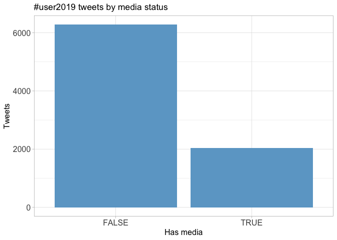<!-- -->

## Top media

| screen\_name     | text                                                                                                                                                                                                                                                                                                               | favorite\_count |
| :--------------- | :----------------------------------------------------------------------------------------------------------------------------------------------------------------------------------------------------------------------------------------------------------------------------------------------------------------- | --------------: |
| RLadiesGlobal    | Hello from \#RLadies at \#UseR2019\! 👋 <https://t.co/lpOD9M3sJd>                                                                                                                                                                                                                                                   |             537 |
| SuzanBaert       | I love @juliesquid non-elitist and more inclusive definition of data science. 👏👏👏“Data science is not just about AI or machine learning. It is the discipline of turning raw data into understanding.” \#UseR2019 <https://t.co/wY3Q1WzMWK>                                                                        |             429 |
| dataandme        | 😍 @juliesquid’s keynote begins with the most gorgeous opening slide ever (👩‍🎨 @allison\_horst, obvi) 📽 slides: <https://t.co/DBuA0Jt2Q4> 📺 livestream: <https://t.co/qMp6alQnDV> \#useR2019 \#rstats <https://t.co/8Q1LmyQghO>                                                                                     |             377 |
| CivicAngela      | Wow, these spatial data space-time cubes in the stars \#rspatial package are REALLY cool - you can go between vector and raster data, and use data over multiple bands/multiple stations/over time\! \#user2019 <https://t.co/IpX3xig0cr(20’_+_10’_exercises)> <https://t.co/IWghWXtGk7> <https://t.co/A8Amvbf4zh> |             321 |
| UseR2019\_Conf   | All the keynote lectures were available live on @RConsortium \#YouTube channel here: <https://t.co/otDzmY2UND> Very soon, you’ll find the edited version (with video). keep posted\! \#rstats \#useR2019 <https://t.co/q6FsqsDI61>                                                                                 |             299 |
| ijlyttle         | Hey \#useR2019, at the Thursday afternoon visualization session (14h18, de Saint Exupéry), I’ll be talking about the vegawidget project - using Vega-Lite from R. Hope to see you there\! <https://t.co/08npNywcXM>                                                                                                |             237 |
| romain\_francois | It was a pleasure and so random to translate the speach from the mayor of @Toulouse at the \#useR2019 welcome reception. <https://t.co/YYLv68MXYM>                                                                                                                                                                 |             216 |
| maxheld          | Here’s why I fell in love with the \#rstats community again during @UseR2019\_Conf \#useR2019: it’s inclusive *and* technical, it’s weird and quirky *and* it’s all about building great things. It’s proof that you can be *both* things. I think I found my tribe. 😍 <https://t.co/c6YSlNXLGX>                   |             209 |
| robjhyndman      | I’ll be talking about our new feasts \#rstats package for tidy time series analysis at \#useR2019 tomorrow📦📈. 11:48am in Ariane. Abstract and slides at <https://t.co/jXbLBqNUyW>. <https://t.co/W2YmzQtTij>                                                                                                       |             197 |
| minebocek        | Excited to talk about my (probably perpetually under development) Data Science in a Box project at \#useR2019 shortly. If you use these resources, I hope you’ll let me know / provide feedback\! 🔗 <https://t.co/QOMsOR1CO6> 🖥 <https://t.co/wwV3Hlsccb> 📝 <https://t.co/msaFpgDqk2> <https://t.co/RbkAgmzvrW>    |             175 |

### Most liked media image


# Tweet text

The 100 words used 3 or more times.

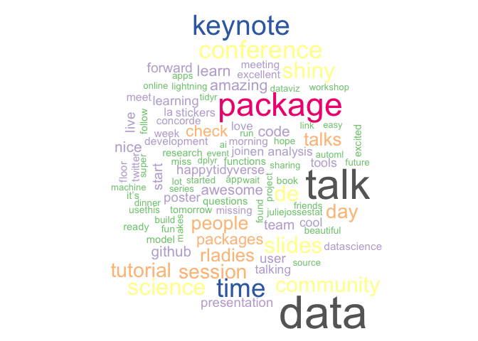<!-- -->
