Twitter Coverage of the VIZBI Meeting 2017
================
Neil Saunders
2018-07-16 22:53:53

Introduction
============

An analysis of tweets from the VIZBI 2017 meeting. 889 tweets were collected using the `rtweet` R package:

``` r
library(rtweet)
vizbi17 <- search_tweets("vizbi", 2000)
```

Timeline
========

Tweets by day
-------------

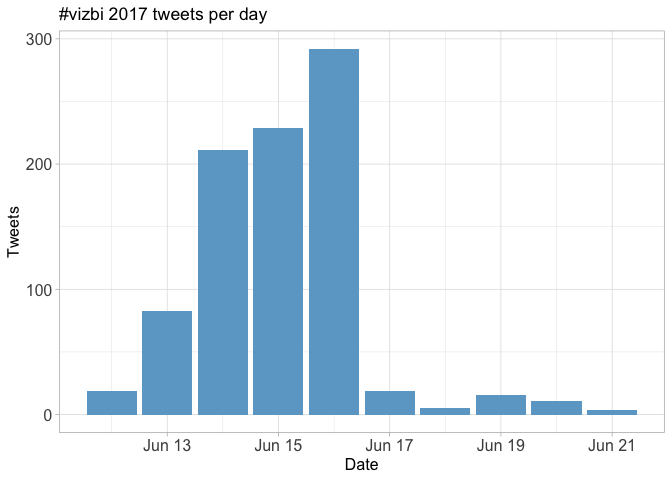

Tweets by day and time
----------------------

Filtered for dates between June 13-17. 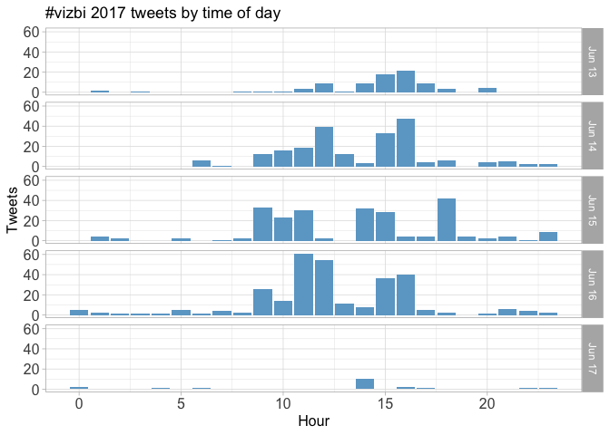

Users
=====

Top tweeters
------------

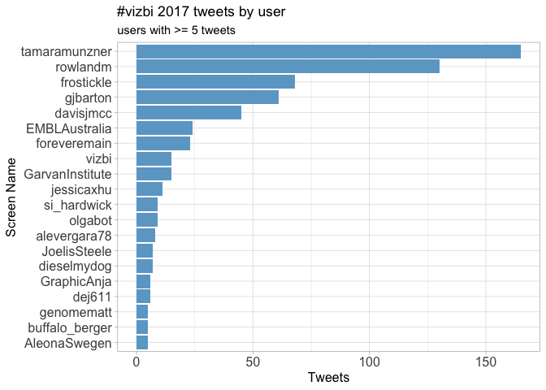

Sources
-------

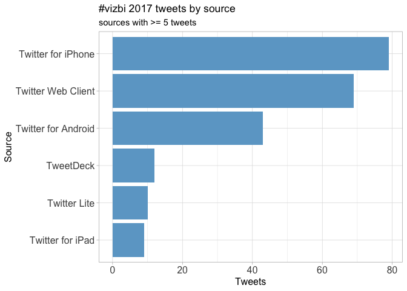

Networks
========

Replies
-------

The "replies network", composed from users who reply directly to one another, was very small for VIZBI 17 and was not analysed further.

Mentions
--------

The "mentions network", where users mention other users in their tweets, was constructed as per the code in the accompanying `Rmd` file. The resulting `graphml` file was visualised using Gephi (0.9.1). Nodes and edges are coloured by pagerank value.

Better to view the original PNG file in the `data` directory.


Retweets
========

Retweet proportion
------------------

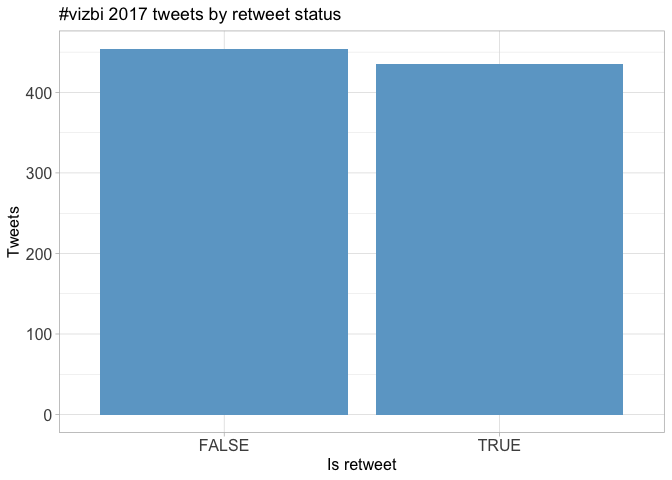

Retweet count
-------------

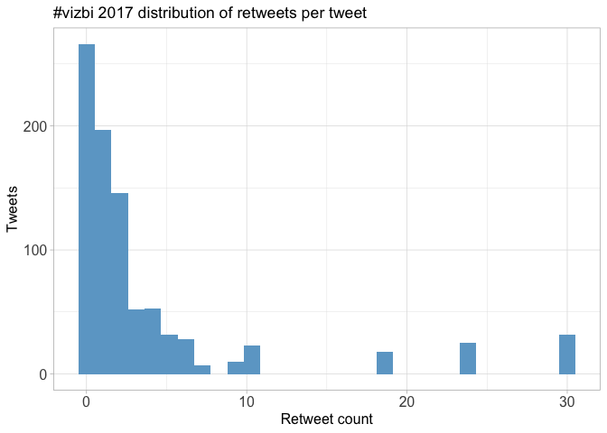

Top retweets
------------

<table style="width:89%;">
<colgroup>
<col width="22%" />
<col width="45%" />
<col width="20%" />
</colgroup>
<thead>
<tr class="header">
<th align="left">screen_name</th>
<th align="left">text</th>
<th align="right">retweet_count</th>
</tr>
</thead>
<tbody>
<tr class="odd">
<td align="left">gjbarton</td>
<td align="left">Jane Richardson autographs a giant print of one of her early ribbon drawings. #vizbi #Vizbi2017 <a href="https://t.co/WK8udnGrUP" class="uri">https://t.co/WK8udnGrUP</a></td>
<td align="right">30</td>
</tr>
<tr class="even">
<td align="left">asrmoin</td>
<td align="left">Put my #VIZBI talk about Web Molecular Graphics online <a href="https://t.co/51412rqrZK" class="uri">https://t.co/51412rqrZK</a> <a href="https://t.co/Uwzo32oASR" class="uri">https://t.co/Uwzo32oASR</a></td>
<td align="right">24</td>
</tr>
<tr class="odd">
<td align="left">frostickle</td>
<td align="left">Using virtual reality for medical research and clinical applications!!! #VIZBI <a href="https://t.co/iXX4WNF8cF" class="uri">https://t.co/iXX4WNF8cF</a></td>
<td align="right">19</td>
</tr>
<tr class="even">
<td align="left">EMBLAustralia</td>
<td align="left">Jane Richardson just told #VIZBI that she isn't an artist, in defiance of the evidence. #WomenInSTEM #pioneer <a href="https://t.co/tKkXVrEsAA" class="uri">https://t.co/tKkXVrEsAA</a></td>
<td align="right">10</td>
</tr>
<tr class="odd">
<td align="left">frostickle</td>
<td align="left">Expectations vs Reality <span class="citation">@d_r_powell</span> with the difference between an ideal Sashimi plot &amp; what we actually get… <a href="https://t.co/u4yBZyGXjO" class="uri">https://t.co/u4yBZyGXjO</a></td>
<td align="right">10</td>
</tr>
<tr class="even">
<td align="left">davisjmcc</td>
<td align="left">Slides from my #vizbi talk on visualising single-cell transcriptomes: <a href="https://t.co/z70qjGglKc" class="uri">https://t.co/z70qjGglKc</a> cc <span class="citation">@tamaramunzner</span> <span class="citation">@arnicas</span></td>
<td align="right">9</td>
</tr>
<tr class="odd">
<td align="left">tamaramunzner</td>
<td align="left">My #vizbi keynote starts in a minute, slides posted at <a href="https://t.co/UNNrbRiSka" class="uri">https://t.co/UNNrbRiSka</a></td>
<td align="right">7</td>
</tr>
<tr class="even">
<td align="left">tamaramunzner</td>
<td align="left">Cellular networks from <span class="citation">@larsjuhljensen</span> #vizbi To avoid hairball ridiculome, must choose to show only the important!… <a href="https://t.co/HxLHC8sQ0E" class="uri">https://t.co/HxLHC8sQ0E</a></td>
<td align="right">6</td>
</tr>
<tr class="odd">
<td align="left">EMBLAustralia</td>
<td align="left">Recognise this molecule type? Tomorrow #VIZBI hears from Jane Richardson, who created the ribbon diagram. #hero… <a href="https://t.co/mNS8sKSZMk" class="uri">https://t.co/mNS8sKSZMk</a></td>
<td align="right">6</td>
</tr>
<tr class="even">
<td align="left">tamaramunzner</td>
<td align="left">#vizbi Keim Sentiment highlighting over time of front pages, interesting evolution! <a href="https://t.co/vpia10abkT" class="uri">https://t.co/vpia10abkT</a></td>
<td align="right">6</td>
</tr>
</tbody>
</table>

Favourites
==========

Favourite proportion
--------------------

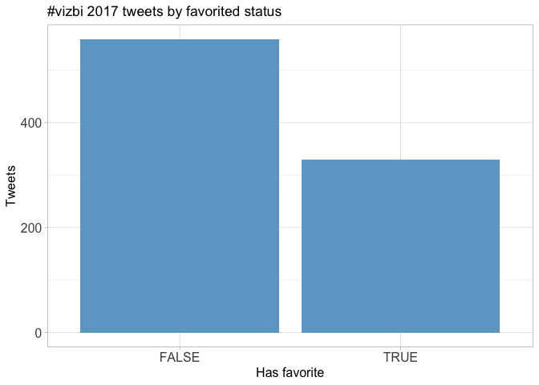

Favourite count
---------------

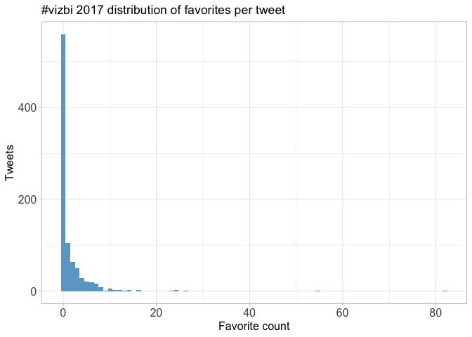

Top favourites
--------------

<table style="width:90%;">
<colgroup>
<col width="22%" />
<col width="45%" />
<col width="22%" />
</colgroup>
<thead>
<tr class="header">
<th align="left">screen_name</th>
<th align="left">text</th>
<th align="right">favorite_count</th>
</tr>
</thead>
<tbody>
<tr class="odd">
<td align="left">gjbarton</td>
<td align="left">Jane Richardson autographs a giant print of one of her early ribbon drawings. #vizbi #Vizbi2017 <a href="https://t.co/WK8udnGrUP" class="uri">https://t.co/WK8udnGrUP</a></td>
<td align="right">82</td>
</tr>
<tr class="even">
<td align="left">asrmoin</td>
<td align="left">Put my #VIZBI talk about Web Molecular Graphics online <a href="https://t.co/51412rqrZK" class="uri">https://t.co/51412rqrZK</a> <a href="https://t.co/Uwzo32oASR" class="uri">https://t.co/Uwzo32oASR</a></td>
<td align="right">55</td>
</tr>
<tr class="odd">
<td align="left">frostickle</td>
<td align="left">Using virtual reality for medical research and clinical applications!!! #VIZBI <a href="https://t.co/iXX4WNF8cF" class="uri">https://t.co/iXX4WNF8cF</a></td>
<td align="right">26</td>
</tr>
<tr class="even">
<td align="left">tamaramunzner</td>
<td align="left">#vizbi #masterclass talk from Julian Heinrich (<a href="https://t.co/yxmJCfSnRk" class="uri">https://t.co/yxmJCfSnRk</a>) has R scripts to reproduce all plots shown <a href="https://t.co/sXn0Llesij" class="uri">https://t.co/sXn0Llesij</a></td>
<td align="right">24</td>
</tr>
<tr class="odd">
<td align="left">tamaramunzner</td>
<td align="left">Just landed in Sydney, looking forward to #vizbi! Tue masterclass slides <a href="https://t.co/YaJe6chizg" class="uri">https://t.co/YaJe6chizg</a>, Fri keynote slides <a href="https://t.co/UNNrbRiSka" class="uri">https://t.co/UNNrbRiSka</a></td>
<td align="right">24</td>
</tr>
<tr class="even">
<td align="left">EMBLAustralia</td>
<td align="left">Jane Richardson just told #VIZBI that she isn't an artist, in defiance of the evidence. #WomenInSTEM #pioneer <a href="https://t.co/tKkXVrEsAA" class="uri">https://t.co/tKkXVrEsAA</a></td>
<td align="right">23</td>
</tr>
<tr class="odd">
<td align="left">tamaramunzner</td>
<td align="left">My #vizbi keynote starts in a minute, slides posted at <a href="https://t.co/UNNrbRiSka" class="uri">https://t.co/UNNrbRiSka</a></td>
<td align="right">16</td>
</tr>
<tr class="even">
<td align="left">frostickle</td>
<td align="left">Expectations vs Reality <span class="citation">@d_r_powell</span> with the difference between an ideal Sashimi plot &amp; what we actually get… <a href="https://t.co/u4yBZyGXjO" class="uri">https://t.co/u4yBZyGXjO</a></td>
<td align="right">16</td>
</tr>
<tr class="odd">
<td align="left">davisjmcc</td>
<td align="left">Slides from my #vizbi talk on visualising single-cell transcriptomes: <a href="https://t.co/z70qjGglKc" class="uri">https://t.co/z70qjGglKc</a> cc <span class="citation">@tamaramunzner</span> <span class="citation">@arnicas</span></td>
<td align="right">14</td>
</tr>
<tr class="even">
<td align="left">tamaramunzner</td>
<td align="left">Christian Stolte on visual design at #vizbi <a href="https://t.co/oqxeWWfBDH" class="uri">https://t.co/oqxeWWfBDH</a></td>
<td align="right">14</td>
</tr>
</tbody>
</table>

Quotes
======

Quote proportion
----------------

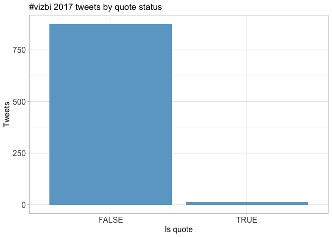

Quote count
-----------


Top quotes
----------

<table style="width:83%;">
<colgroup>
<col width="19%" />
<col width="45%" />
<col width="18%" />
</colgroup>
<thead>
<tr class="header">
<th align="left">screen_name</th>
<th align="left">text</th>
<th align="right">quote_count</th>
</tr>
</thead>
<tbody>
<tr class="odd">
<td align="left">davisjmcc</td>
<td align="left">I spoke about scmap and the Hemberg Lab's efforts to map scRNAseq data to reference cell types on Wed. Check out pr… <a href="https://t.co/0ri7vo6OoS" class="uri">https://t.co/0ri7vo6OoS</a></td>
<td align="right">4</td>
</tr>
<tr class="even">
<td align="left">rowlandm</td>
<td align="left">Great talk from <span class="citation">@tamaramunzner</span> - spirit of agile and ITIL with all the best bits kept and other processes added on!… <a href="https://t.co/RILKERftWd" class="uri">https://t.co/RILKERftWd</a></td>
<td align="right">3</td>
</tr>
<tr class="odd">
<td align="left">si_hardwick</td>
<td align="left">#Vizbi is the only science conference I've been to where keynote speakers are asked to autograph their work 🤓 <a href="https://t.co/0B9IegH4RW" class="uri">https://t.co/0B9IegH4RW</a></td>
<td align="right">2</td>
</tr>
</tbody>
</table>

Media
=====

Media count
-----------

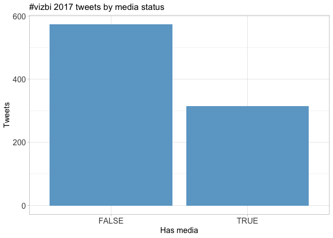

Top media
---------

<table style="width:90%;">
<colgroup>
<col width="22%" />
<col width="45%" />
<col width="22%" />
</colgroup>
<thead>
<tr class="header">
<th align="left">screen_name</th>
<th align="left">text</th>
<th align="right">favorite_count</th>
</tr>
</thead>
<tbody>
<tr class="odd">
<td align="left">gjbarton</td>
<td align="left">Jane Richardson autographs a giant print of one of her early ribbon drawings. #vizbi #Vizbi2017 <a href="https://t.co/WK8udnGrUP" class="uri">https://t.co/WK8udnGrUP</a></td>
<td align="right">82</td>
</tr>
<tr class="even">
<td align="left">asrmoin</td>
<td align="left">Put my #VIZBI talk about Web Molecular Graphics online <a href="https://t.co/51412rqrZK" class="uri">https://t.co/51412rqrZK</a> <a href="https://t.co/Uwzo32oASR" class="uri">https://t.co/Uwzo32oASR</a></td>
<td align="right">55</td>
</tr>
<tr class="odd">
<td align="left">frostickle</td>
<td align="left">Using virtual reality for medical research and clinical applications!!! #VIZBI <a href="https://t.co/iXX4WNF8cF" class="uri">https://t.co/iXX4WNF8cF</a></td>
<td align="right">26</td>
</tr>
<tr class="even">
<td align="left">EMBLAustralia</td>
<td align="left">Jane Richardson just told #VIZBI that she isn't an artist, in defiance of the evidence. #WomenInSTEM #pioneer <a href="https://t.co/tKkXVrEsAA" class="uri">https://t.co/tKkXVrEsAA</a></td>
<td align="right">23</td>
</tr>
<tr class="odd">
<td align="left">tamaramunzner</td>
<td align="left">Christian Stolte on visual design at #vizbi <a href="https://t.co/oqxeWWfBDH" class="uri">https://t.co/oqxeWWfBDH</a></td>
<td align="right">14</td>
</tr>
<tr class="even">
<td align="left">tamaramunzner</td>
<td align="left">#vizbi Keim Voronoi diagram of free kicks likelihood <a href="https://t.co/5Kf8SOVma5" class="uri">https://t.co/5Kf8SOVma5</a></td>
<td align="right">11</td>
</tr>
<tr class="odd">
<td align="left">vizbi</td>
<td align="left">Our first speaker of the day is Jane Richardson who developed ribbon diagrams! #VIZBI <a href="https://t.co/UA8djfg0Mt" class="uri">https://t.co/UA8djfg0Mt</a></td>
<td align="right">10</td>
</tr>
<tr class="even">
<td align="left">tamaramunzner</td>
<td align="left">#vizbi Wed kickoff keynote from Daniel Keim: Abilities of humans and computers <a href="https://t.co/p9gOjaG0ZJ" class="uri">https://t.co/p9gOjaG0ZJ</a></td>
<td align="right">8</td>
</tr>
<tr class="odd">
<td align="left">vizbi</td>
<td align="left">Virtual Reality: The Challenges of Visualising Invisible Worlds by <span class="citation">@johninnerpixel</span> from <span class="citation">@UNSW</span> #VIZBI <a href="https://t.co/TNdRq9x72X" class="uri">https://t.co/TNdRq9x72X</a></td>
<td align="right">7</td>
</tr>
<tr class="even">
<td align="left">vizbi</td>
<td align="left">Drew Berry from <span class="citation">@WEHI_research</span> giving today's keynote on Communicating Science Visually #VIZBI #DataViz <a href="https://t.co/veujQcDHa1" class="uri">https://t.co/veujQcDHa1</a></td>
<td align="right">7</td>
</tr>
</tbody>
</table>

### Most liked media image


Tweet text
==========

The 100 words used 3 or more times.

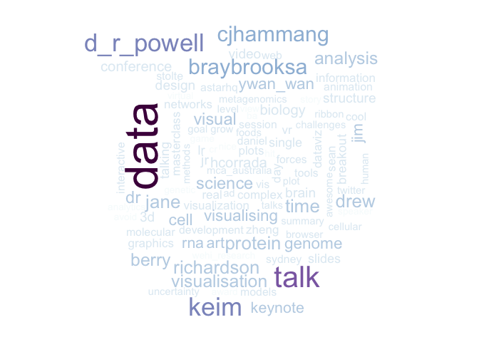
