# Twitter Coverage of the VIZBI Meeting 2017
Neil Saunders  
`r Sys.time()`  


# Introduction
An analysis of tweets from the VIZBI 2017 meeting. 889 tweets were collected using the `rtweet` R package:


```r
library(rtweet)
vizbi17 <- search_tweets("vizbi", 2000)
```

# Timeline
## Tweets by day
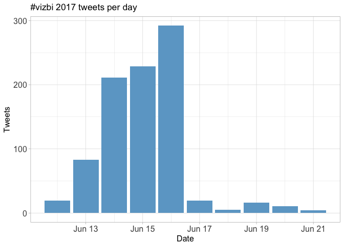<!-- -->

## Tweets by day and time
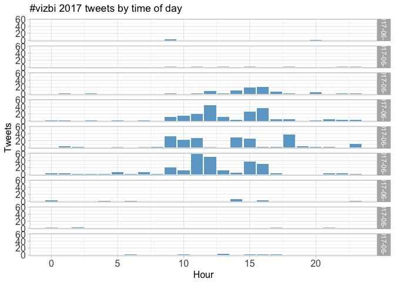<!-- -->

# Users
## Top tweeters
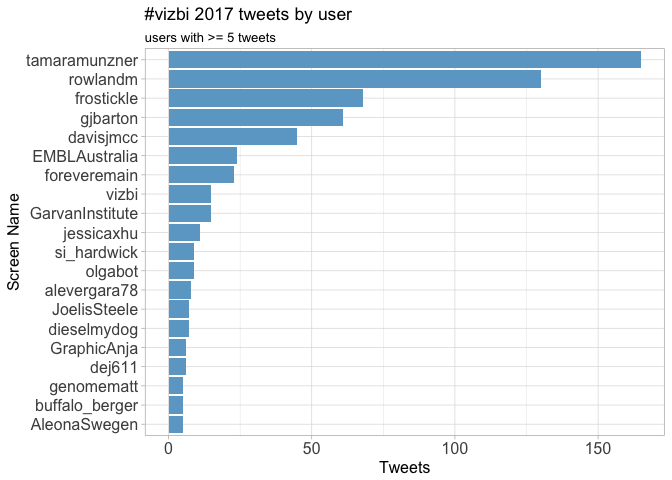<!-- -->

## Sources
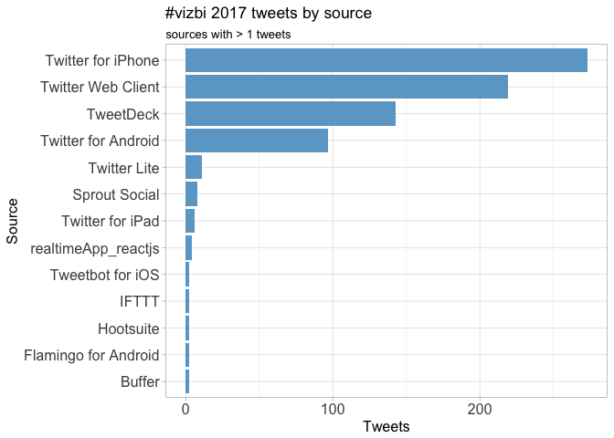<!-- -->

# Networks
## Replies
The "replies network", composed from users who reply directly to one another, was very small for SBRS 17 and was not analysed further.


## Mentions
The "mentions network", where users mention other users in their tweets, was constructed as per the code in the accompanying `Rmd` file. The resulting `graphml` file was visualised using Gephi (0.9.1). Nodes and edges are coloured by pagerank value.

Better to view the original PNG file in the `data` directory.


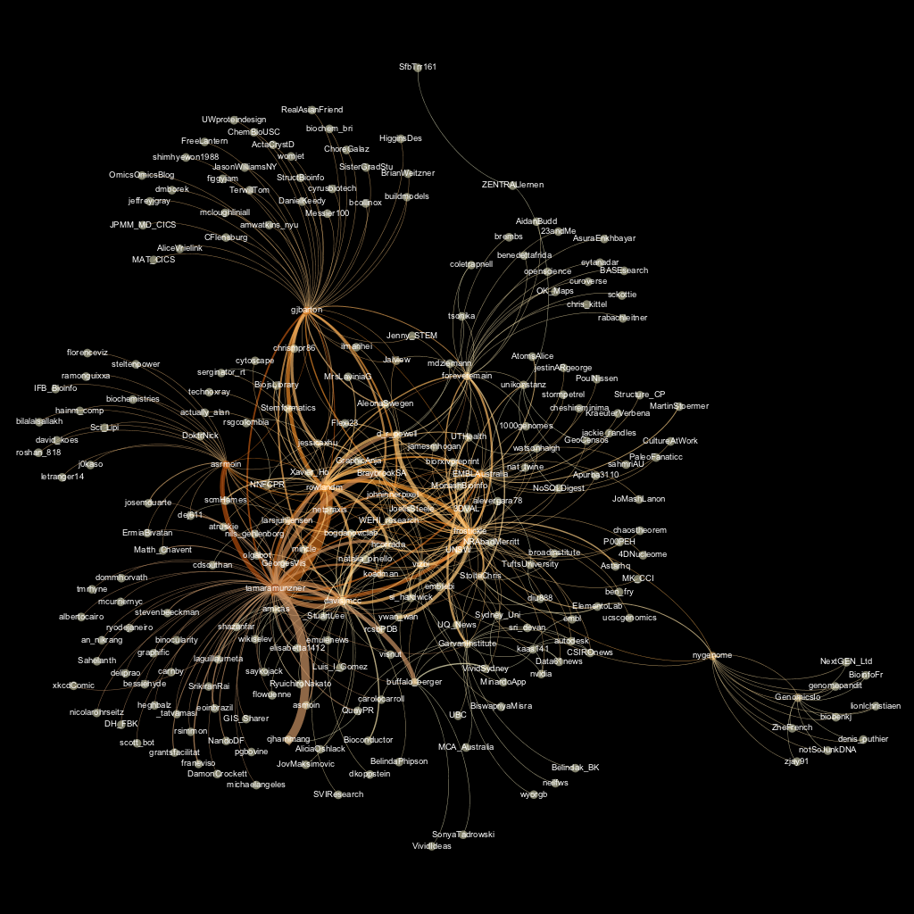

# Retweets
## Retweet proportion
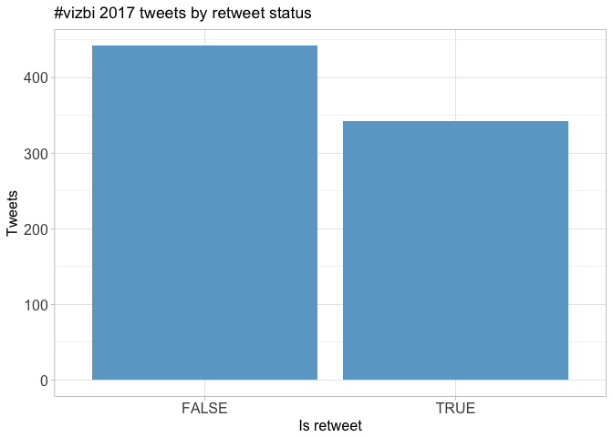<!-- -->

## Retweet count
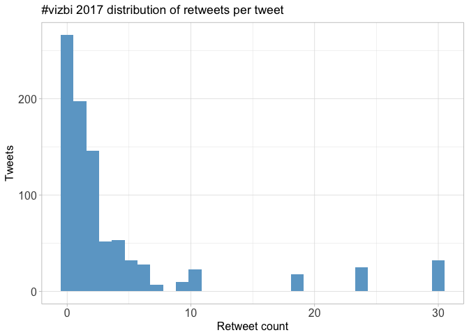<!-- -->

## Top retweets
<table>
 <thead>
  <tr>
   <th style="text-align:left;"> screen_name </th>
   <th style="text-align:left;"> text </th>
   <th style="text-align:right;"> retweet_count </th>
  </tr>
 </thead>
<tbody>
  <tr>
   <td style="text-align:left;"> gjbarton </td>
   <td style="text-align:left;"> Jane Richardson autographs a giant print of one of her early ribbon drawings.  #vizbi #Vizbi2017 https://t.co/WK8udnGrUP </td>
   <td style="text-align:right;"> 30 </td>
  </tr>
  <tr>
   <td style="text-align:left;"> asrmoin </td>
   <td style="text-align:left;"> Put my #VIZBI talk about Web Molecular Graphics online https://t.co/51412rqrZK https://t.co/Uwzo32oASR </td>
   <td style="text-align:right;"> 24 </td>
  </tr>
  <tr>
   <td style="text-align:left;"> frostickle </td>
   <td style="text-align:left;"> Using virtual reality for medical research and clinical applications!!! #VIZBI https://t.co/iXX4WNF8cF </td>
   <td style="text-align:right;"> 19 </td>
  </tr>
  <tr>
   <td style="text-align:left;"> EMBLAustralia </td>
   <td style="text-align:left;"> Jane Richardson just told #VIZBI that she isn't an artist, in defiance of the evidence. #WomenInSTEM #pioneer https://t.co/tKkXVrEsAA </td>
   <td style="text-align:right;"> 10 </td>
  </tr>
  <tr>
   <td style="text-align:left;"> frostickle </td>
   <td style="text-align:left;"> Expectations vs Reality
@d_r_powell with the difference between an ideal Sashimi plot &amp;amp; what we actually get… https://t.co/u4yBZyGXjO </td>
   <td style="text-align:right;"> 10 </td>
  </tr>
  <tr>
   <td style="text-align:left;"> davisjmcc </td>
   <td style="text-align:left;"> Slides from my #vizbi talk on visualising single-cell transcriptomes: https://t.co/z70qjGglKc cc @tamaramunzner @arnicas </td>
   <td style="text-align:right;"> 9 </td>
  </tr>
  <tr>
   <td style="text-align:left;"> tamaramunzner </td>
   <td style="text-align:left;"> My #vizbi keynote starts in a minute, slides posted at https://t.co/UNNrbRiSka </td>
   <td style="text-align:right;"> 7 </td>
  </tr>
  <tr>
   <td style="text-align:left;"> tamaramunzner </td>
   <td style="text-align:left;"> Cellular networks from @larsjuhljensen #vizbi To avoid hairball ridiculome, must choose to show only the important!… https://t.co/HxLHC8sQ0E </td>
   <td style="text-align:right;"> 6 </td>
  </tr>
  <tr>
   <td style="text-align:left;"> EMBLAustralia </td>
   <td style="text-align:left;"> Recognise this molecule type? Tomorrow #VIZBI hears from Jane Richardson, who created the ribbon diagram. #hero… https://t.co/mNS8sKSZMk </td>
   <td style="text-align:right;"> 6 </td>
  </tr>
  <tr>
   <td style="text-align:left;"> tamaramunzner </td>
   <td style="text-align:left;"> #vizbi Keim Sentiment highlighting over time of front pages, interesting evolution! https://t.co/vpia10abkT </td>
   <td style="text-align:right;"> 6 </td>
  </tr>
</tbody>
</table>

# Favourites
## Favourite proportion
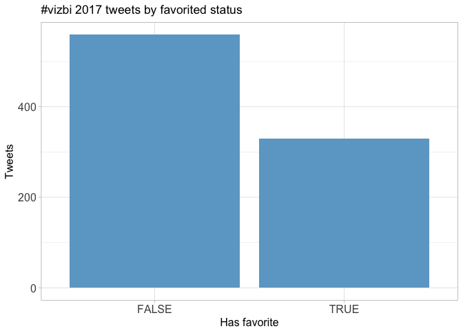<!-- -->

## Favourite count
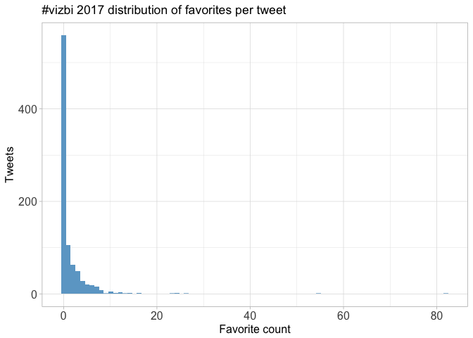<!-- -->

## Top favourites
<table>
 <thead>
  <tr>
   <th style="text-align:left;"> screen_name </th>
   <th style="text-align:left;"> text </th>
   <th style="text-align:right;"> favorite_count </th>
  </tr>
 </thead>
<tbody>
  <tr>
   <td style="text-align:left;"> gjbarton </td>
   <td style="text-align:left;"> Jane Richardson autographs a giant print of one of her early ribbon drawings.  #vizbi #Vizbi2017 https://t.co/WK8udnGrUP </td>
   <td style="text-align:right;"> 82 </td>
  </tr>
  <tr>
   <td style="text-align:left;"> asrmoin </td>
   <td style="text-align:left;"> Put my #VIZBI talk about Web Molecular Graphics online https://t.co/51412rqrZK https://t.co/Uwzo32oASR </td>
   <td style="text-align:right;"> 55 </td>
  </tr>
  <tr>
   <td style="text-align:left;"> frostickle </td>
   <td style="text-align:left;"> Using virtual reality for medical research and clinical applications!!! #VIZBI https://t.co/iXX4WNF8cF </td>
   <td style="text-align:right;"> 26 </td>
  </tr>
  <tr>
   <td style="text-align:left;"> tamaramunzner </td>
   <td style="text-align:left;"> #vizbi #masterclass talk from Julian Heinrich (https://t.co/yxmJCfSnRk) has R scripts to reproduce all plots shown https://t.co/sXn0Llesij </td>
   <td style="text-align:right;"> 24 </td>
  </tr>
  <tr>
   <td style="text-align:left;"> tamaramunzner </td>
   <td style="text-align:left;"> Just landed in Sydney, looking forward to #vizbi! Tue masterclass slides https://t.co/YaJe6chizg, Fri keynote slides https://t.co/UNNrbRiSka </td>
   <td style="text-align:right;"> 24 </td>
  </tr>
  <tr>
   <td style="text-align:left;"> EMBLAustralia </td>
   <td style="text-align:left;"> Jane Richardson just told #VIZBI that she isn't an artist, in defiance of the evidence. #WomenInSTEM #pioneer https://t.co/tKkXVrEsAA </td>
   <td style="text-align:right;"> 23 </td>
  </tr>
  <tr>
   <td style="text-align:left;"> tamaramunzner </td>
   <td style="text-align:left;"> My #vizbi keynote starts in a minute, slides posted at https://t.co/UNNrbRiSka </td>
   <td style="text-align:right;"> 16 </td>
  </tr>
  <tr>
   <td style="text-align:left;"> frostickle </td>
   <td style="text-align:left;"> Expectations vs Reality
@d_r_powell with the difference between an ideal Sashimi plot &amp;amp; what we actually get… https://t.co/u4yBZyGXjO </td>
   <td style="text-align:right;"> 16 </td>
  </tr>
  <tr>
   <td style="text-align:left;"> davisjmcc </td>
   <td style="text-align:left;"> Slides from my #vizbi talk on visualising single-cell transcriptomes: https://t.co/z70qjGglKc cc @tamaramunzner @arnicas </td>
   <td style="text-align:right;"> 14 </td>
  </tr>
  <tr>
   <td style="text-align:left;"> tamaramunzner </td>
   <td style="text-align:left;"> Christian Stolte on visual design at #vizbi https://t.co/oqxeWWfBDH </td>
   <td style="text-align:right;"> 14 </td>
  </tr>
</tbody>
</table>

# Quotes
## Quote proportion
<!-- -->

## Quote count
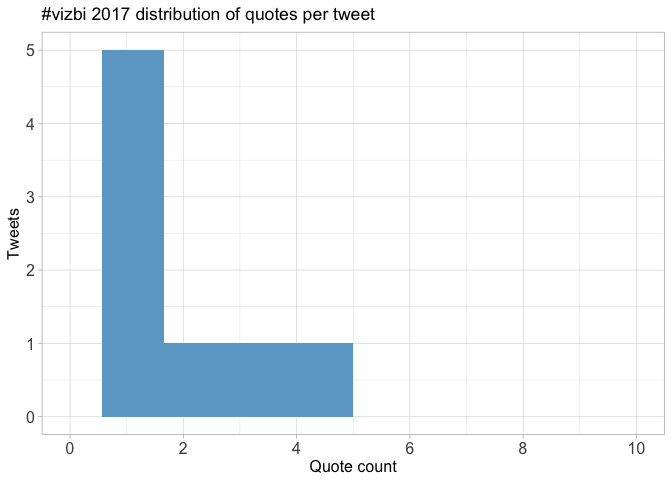<!-- -->

## Top quotes
<table>
 <thead>
  <tr>
   <th style="text-align:left;"> screen_name </th>
   <th style="text-align:left;"> text </th>
   <th style="text-align:right;"> quote_count </th>
  </tr>
 </thead>
<tbody>
  <tr>
   <td style="text-align:left;"> davisjmcc </td>
   <td style="text-align:left;"> I spoke about scmap and the Hemberg Lab's efforts to map scRNAseq data to reference cell types on Wed. Check out pr… https://t.co/0ri7vo6OoS </td>
   <td style="text-align:right;"> 4 </td>
  </tr>
  <tr>
   <td style="text-align:left;"> rowlandm </td>
   <td style="text-align:left;"> Great talk from @tamaramunzner - spirit of agile and ITIL with all the best bits kept and other processes added on!… https://t.co/RILKERftWd </td>
   <td style="text-align:right;"> 3 </td>
  </tr>
  <tr>
   <td style="text-align:left;"> si_hardwick </td>
   <td style="text-align:left;"> #Vizbi is the only science conference I've been to where keynote speakers are asked to autograph their work 🤓 https://t.co/0B9IegH4RW </td>
   <td style="text-align:right;"> 2 </td>
  </tr>
</tbody>
</table>

# Media
## Media count
<!-- -->

## Top media
<table>
 <thead>
  <tr>
   <th style="text-align:left;"> screen_name </th>
   <th style="text-align:left;"> text </th>
   <th style="text-align:right;"> favorite_count </th>
  </tr>
 </thead>
<tbody>
  <tr>
   <td style="text-align:left;"> gjbarton </td>
   <td style="text-align:left;"> Jane Richardson autographs a giant print of one of her early ribbon drawings.  #vizbi #Vizbi2017 https://t.co/WK8udnGrUP </td>
   <td style="text-align:right;"> 82 </td>
  </tr>
  <tr>
   <td style="text-align:left;"> asrmoin </td>
   <td style="text-align:left;"> Put my #VIZBI talk about Web Molecular Graphics online https://t.co/51412rqrZK https://t.co/Uwzo32oASR </td>
   <td style="text-align:right;"> 55 </td>
  </tr>
  <tr>
   <td style="text-align:left;"> frostickle </td>
   <td style="text-align:left;"> Using virtual reality for medical research and clinical applications!!! #VIZBI https://t.co/iXX4WNF8cF </td>
   <td style="text-align:right;"> 26 </td>
  </tr>
  <tr>
   <td style="text-align:left;"> EMBLAustralia </td>
   <td style="text-align:left;"> Jane Richardson just told #VIZBI that she isn't an artist, in defiance of the evidence. #WomenInSTEM #pioneer https://t.co/tKkXVrEsAA </td>
   <td style="text-align:right;"> 23 </td>
  </tr>
  <tr>
   <td style="text-align:left;"> tamaramunzner </td>
   <td style="text-align:left;"> Christian Stolte on visual design at #vizbi https://t.co/oqxeWWfBDH </td>
   <td style="text-align:right;"> 14 </td>
  </tr>
  <tr>
   <td style="text-align:left;"> tamaramunzner </td>
   <td style="text-align:left;"> #vizbi Keim Voronoi diagram of free kicks likelihood https://t.co/5Kf8SOVma5 </td>
   <td style="text-align:right;"> 11 </td>
  </tr>
  <tr>
   <td style="text-align:left;"> vizbi </td>
   <td style="text-align:left;"> Our first speaker of the day is Jane Richardson who developed ribbon diagrams! #VIZBI https://t.co/UA8djfg0Mt </td>
   <td style="text-align:right;"> 10 </td>
  </tr>
  <tr>
   <td style="text-align:left;"> tamaramunzner </td>
   <td style="text-align:left;"> #vizbi Wed kickoff keynote from Daniel Keim: Abilities of humans and computers https://t.co/p9gOjaG0ZJ </td>
   <td style="text-align:right;"> 8 </td>
  </tr>
  <tr>
   <td style="text-align:left;"> vizbi </td>
   <td style="text-align:left;"> Virtual Reality: The Challenges of Visualising Invisible Worlds by @johninnerpixel from @UNSW 

#VIZBI https://t.co/TNdRq9x72X </td>
   <td style="text-align:right;"> 7 </td>
  </tr>
  <tr>
   <td style="text-align:left;"> vizbi </td>
   <td style="text-align:left;"> Drew Berry from @WEHI_research giving today's keynote on Communicating Science Visually

#VIZBI #DataViz https://t.co/veujQcDHa1 </td>
   <td style="text-align:right;"> 7 </td>
  </tr>
</tbody>
</table>

### Most liked media image


# Tweet text
The 100 words used 3 or more times.

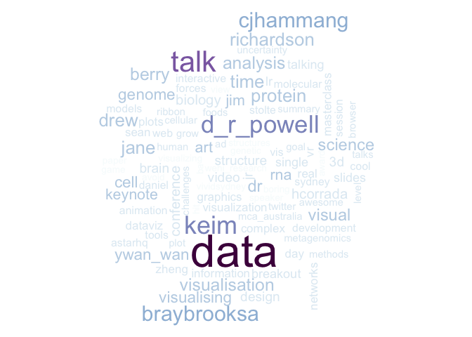<!-- -->

